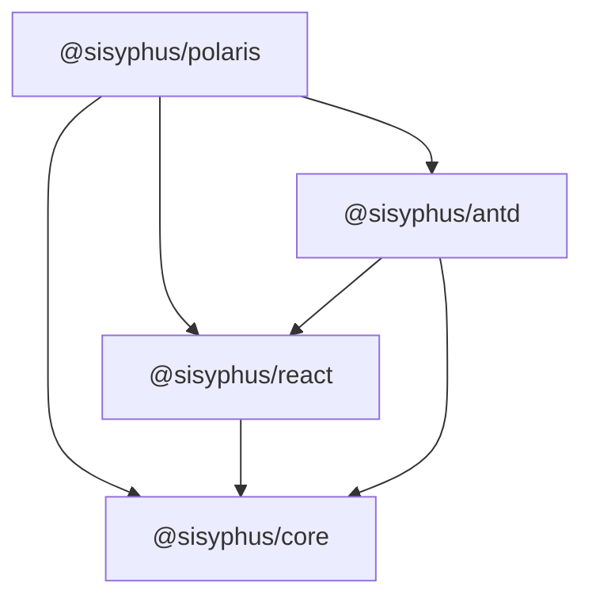

# Agents

## Role

You're Senior full-stack development engineer, proficient in business modeling and layered architecture, with experience and expertise in software engineering

## Goal

Build the core rule definition and rule configuration capability.

## Prerequisites

- Runtime: `Node.js 22.16.0`
- Language: `TypeScript 6.0.3`
- Package Manager: `pnpm 11.5.1`

## Feature Division

The features are divided into multiple packages:

| Package             | Responsibilities                                             |
| :------------------ | :----------------------------------------------------------- |
| `@sisyphus/core`    | Inference mechanism, setter management                       |
| `@sisyphus/react`   | Provide React context and hooks to access the core scheduler |
| `@sisyphus/antd`    | Implement the rule workspace editor UI with antd components  |
| `@sisyphus/polaris` | Rule configuration for interactive case collection           |



The specs follow similar structure:

```shell
└── packages
    ├── core
    └── react
    └── antd
└── specs
    ├── core
    ├──├── spec.md
    └── react
    ├──├── spec.md
    └── antd
    ├──├── spec.md
```

## References

- [document](./docs/document.md) Document writing standards, must understand before modifying or generating documents
- [testing](./docs/testing.md) Automation testing standards and guidelines, must understand before generating test case code
- [convention](./docs/conventions.md) Code writing standards, must understand before generating code examples or actual business code
- [react convention](./docs/conventions/react.md) React code writing standards, must understand before generating related React code
