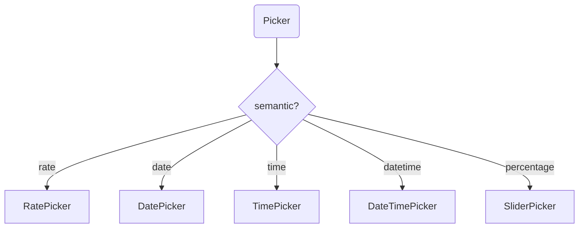

# @sisyphus/antd

## 组件映射

### Picker 组件映射

```mermaid
graph TD
    Start(Picker) --> RouteSemantic{semantic?}


    RouteSemantic -- "rate" --> RatePickerCase[RatePicker]
    RouteSemantic -- "date" --> DatePickerCase[DatePicker]
    RouteSemantic -- "time" --> TimePickerCase[TimePicker]
    RouteSemantic -- "datetime" --> DateTimePickerCase[DateTimePicker]
    RouteSemantic -- "percentage" --> SliderPickerCase[SliderPicker]
```
