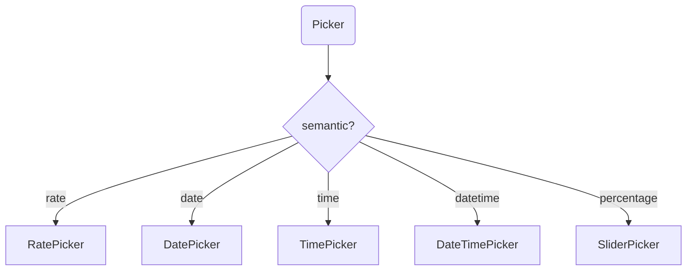

# @sisyphus/antd

## 前置依赖

- [@sisyphus/react](../react/design.md)

## 组件映射

### 表单组件到 antd 组件的映射

| 表单组件         | antd 实现                      | 说明             |
| :--------------- | :----------------------------- | :--------------- |
| `Input`          | `Input`                        | 单行输入         |
| `TextArea`       | `Input.TextArea`               | 多行输入         |
| `Switch`         | `Switch`                       | 开关             |
| `Select`         | `Select`                       | 单选             |
| `MultipleSelect` | `Select` (mode="multiple")     | 多选             |
| `Picker`         | `DatePicker` / `TimePicker` 等 | 按 semantic 映射 |
| `RangePicker`    | `DatePicker.RangePicker`       | 区间选择         |
| `RangeInput`     | `Input` (双框)                 | 区间输入         |

### Picker 组件映射（按 semantic）



## 插件实现

### createAntdPlugin

通过 `createAntdPlugin()` 创建 antd 插件，实现 `SisyphusPlugin` 协议：

```ts
import type { SisyphusPlugin } from '@sisyphus/react';

/** 创建 antd 组件渲染器插件 */
function createAntdPlugin(): SisyphusPlugin;
```

**使用方式**：

```ts
import { createSisyphusScope } from '@sisyphus/react';
import { createAntdPlugin } from '@sisyphus/antd';

const scope = createSisyphusScope({
  plugins: [createAntdPlugin()],
});
```
