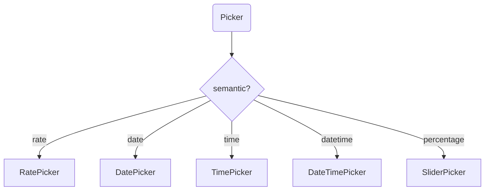

# @sisyphus/antd

## 前置依赖

- [@sisyphus/react](../react/spec.md)

## 设计规范

- 对于无法从表单组件属性推断的配置（如尺寸策略、placeholder 模板等），通过抽象配置对象 `SisyphusAntdConfig` 集中管理，由 `SisyphusAntdProvider` 注入
- 对于 `antd` 原生支持的配置内容（例如：主题、国际化），不要纳入抽象配置对象管理，由业务方自行负责

## 组件映射

### 表单组件到 antd 组件的映射

| 表单组件         | antd 实现                      | 说明             |
| :--------------- | :----------------------------- | :--------------- |
| `Input`          | `Input`                        | 单行输入         |
| `TextArea`       | `Input.TextArea`               | 多行输入         |
| `Switch`         | `Switch`                       | 开关             |
| `Select`         | `Select`                       | 单选             |
| `MultipleSelect` | `Select` (mode="multiple")     | 多选             |
| `Picker`         | `DatePicker` / `TimePicker` 等 | 按 semantic 映射 |
| `RangePicker`    | `DatePicker.RangePicker`       | 区间选择         |
| `RangeInput`     | `Input` (双框)                 | 区间输入         |

### Picker 组件映射（按 semantic）



## 属性映射

### 表单组件属性到 antd 组件属性的映射

组件映射表定义了从抽象表单组件属性（`ThresholdComponentProperties`）到具体 `antd` 组件属性的转换规则。适配器根据表单组件类型注入对应的 `antd` 组件属性。

#### Input → Input

| 表单组件属性      | antd 组件属性 |
| :---------------- | :------------ |
| `name`            | `name`        |
| `title`           | `label`       |
| `dataType`        | `type`        |
| `constraints.min` | `minLength`   |
| `constraints.max` | `maxLength`   |

**推断规则**：

- `dataType='number'` 时，`type='number'`；否则 `type='text'`
- `maxLength > 100` 时，映射为 `TextAreaProperties`

**隐式继承**：`size`, `placeholder`, `allowClear`

#### TextArea → Input.TextArea

| 表单组件属性      | antd 组件属性 |
| :---------------- | :------------ |
| `name`            | `name`        |
| `title`           | `label`       |
| `constraints.max` | `maxLength`   |

**隐式继承**：`rows: 4`, `placeholder`, `allowClear`

#### RangeInput → Input

| 表单组件属性 | antd 组件属性 |
| :----------- | :------------ |
| `name`       | `name`        |
| `title`      | `label`       |
| `dataType`   | `type`        |

**推断规则**：渲染为双框 Input 组件

**隐式继承**：`placeholder: ['最小值', '最大值']`, `allowClear`

#### Switch → Switch

| 表单组件属性 | antd 组件属性 |
| :----------- | :------------ |
| `name`       | `name`        |
| `title`      | `label`       |

**隐式继承**：`checkedChildren: '是'`, `unCheckedChildren: '否'`

#### Select → Select

| 表单组件属性 | antd 组件属性 |
| :----------- | :------------ |
| `name`       | `name`        |
| `title`      | `label`       |
| `resource`   | `options`     |

**Resource 类型映射**：

| Resource 类型                        | antd 组件属性                                                         |
| :----------------------------------- | :-------------------------------------------------------------------- |
| `StaticResource`                     | `options`（直接读取 `options.value`）                                 |
| `ElementaryDynamicResource`          | `options`（响应式）+ `loading` + `onRefresh`                          |
| `PaginatedDynamicResource`           | `options`（响应式）+ `loading` + `pagination` + `onFlip`              |
| `FilterableDynamicResource`          | `options`（响应式）+ `loading` + `onFilter`                           |
| `PaginatedFilterableDynamicResource` | `options`（响应式）+ `loading` + `pagination` + `onFilter` + `onFlip` |

**隐式继承**：`placeholder`, `allowClear`

#### MultipleSelect → Select

映射规则与 `Select` 相同，额外配置：

| antd 组件属性 | 值           |
| :------------ | :----------- |
| `mode`        | `'multiple'` |

#### Picker → DatePicker / TimePicker / RatePicker

| 表单组件属性  | antd 组件属性 |
| :------------ | :------------ |
| `name`        | `name`        |
| `title`       | `label`       |
| `semantic`    | 组件类型映射  |
| `constraints` | 组件属性      |

**Semantic 映射规则**：

| semantic     | antd 组件    | 额外属性                        |
| :----------- | :----------- | :------------------------------ |
| `rate`       | `Select`     | `showSearch: true`              |
| `date`       | `DatePicker` | -                               |
| `time`       | `TimePicker` | -                               |
| `datetime`   | `DatePicker` | `showTime: true`                |
| `percentage` | `Slider`     | `min: 0`, `max: 100`, `step: 1` |

**constraints 映射规则**：

| semantic            | constraints   | antd 组件属性 |
| :------------------ | :------------ | :------------ |
| `date` / `datetime` | `format`      | `format`      |
| `time`              | `format`      | `format`      |
| `percentage`        | `min` / `max` | `min` / `max` |
| `percentage`        | `step`        | `step`        |

#### RangePicker → DatePicker.RangePicker

| 表单组件属性 | antd 组件属性 |
| :----------- | :------------ |
| `name`       | `name`        |
| `title`      | `label`       |
| `semantic`   | 组件类型映射  |

**Semantic 映射规则**：

| semantic     | antd 组件                | 额外属性         |
| :----------- | :----------------------- | :--------------- |
| `date`       | `DatePicker.RangePicker` | -                |
| `datetime`   | `DatePicker.RangePicker` | `showTime: true` |
| `percentage` | `Slider` (range)         | `range: true`    |

#### ListBuilder - 列表构建器（组合组件）

`ListBuilder` 为逻辑组合组件，由多个基础 antd 组件组合实现。

| 组合部件   | antd 组件                                     | 说明           |
| :--------- | :-------------------------------------------- | :------------- |
| 列表容器   | `Space` + 列表项包装                          | 垂直排列列表项 |
| 列表项渲染 | 按 `item.type` 映射（见下表）                 | 列表项组件类型 |
| 添加按钮   | `Button` (type='link', icon='PlusOutlined')   | 追加列表项     |
| 移除按钮   | `Button` (type='link', icon='DeleteOutlined') | 删除当前列表项 |

**列表项组件映射**：

| item.type  | antd 组件                            | 说明     |
| :--------- | :----------------------------------- | :------- |
| `'Input'`  | `Input`                              | 单行输入 |
| `'Picker'` | 按 `item.semantic` 映射（见 Picker） | 选择器   |

**数量约束映射**：

| constraints | 按钮禁用条件                               |
| :---------- | :----------------------------------------- |
| `minItems`  | 当前列表项数量 ≤ minItems 时，禁用移除按钮 |
| `maxItems`  | 当前列表项数量 ≥ maxItems 时，禁用添加按钮 |

#### ListRangeBuilder - 区间列表构建器（组合组件）

映射规则与 `ListBuilder` 相同。

| item.type       | antd 组件                | 说明       |
| :-------------- | :----------------------- | :--------- |
| `'RangeInput'`  | `Input` (双框)           | 区间输入   |
| `'RangePicker'` | `DatePicker.RangePicker` | 区间选择器 |

### 抽象配置对象

对于无法从表单组件属性推断的配置（如全局主题、尺寸策略、placeholder 模板等），通过抽象配置对象 `SisyphusAntdConfig` 集中管理，由 `SisyphusAntdProvider` 注入。

```ts
/** antd 适配器配置 */
interface SisyphusAntdConfig {
  /** 尺寸策略，默认 'middle' */
  size?: 'small' | 'middle' | 'large';
  /** placeholder 模板 */
  placeholderTemplate?: {
    input?: string;
    select?: string;
  };
  /** Switch 的 checked/unChecked 内容 */
  switchLabels?: {
    checked?: string;
    unChecked?: string;
  };
}

/** 提供 antd 配置 */
function SisyphusAntdProvider({
  config,
  children,
}: {
  config: SisyphusAntdConfig;
  children: React.ReactNode;
}): React.ReactElement;
```

**使用示例**：

```tsx
import { SisyphusAntdProvider } from '@sisyphus/antd';

function App() {
  return (
    <SisyphusAntdProvider
      config={{
        size: 'large',
        switchLabels: { checked: '启用', unChecked: '停用' },
      }}
    >
      {children}
    </SisyphusAntdProvider>
  );
}
```

**说明**：日期/时间格式化等 `antd` 原生支持的配置，由业务方通过 `antd ConfigProvider` 自行配置，不纳入 `SisyphusAntdConfig` 管理。

## 插件实现

### createAntdPlugin

通过 `createAntdPlugin()` 创建 antd 插件，实现 `SisyphusPlugin` 协议：

```ts
import type { SisyphusPlugin } from '@sisyphus/react';

/** 创建 antd 组件渲染器插件 */
function createAntdPlugin(): SisyphusPlugin;
```

**使用方式**：

```ts
import { createSisyphusScope } from '@sisyphus/react';
import { createAntdPlugin } from '@sisyphus/antd';

const scope = createSisyphusScope({
  plugins: [createAntdPlugin()],
});
```
