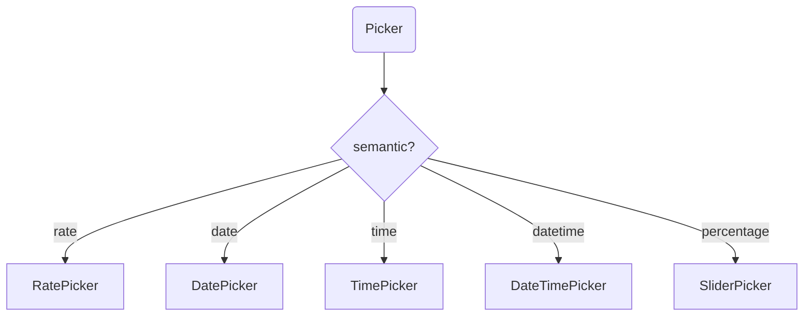

# `@sisyphus/antd`

## Prerequisites

- [@sisyphus/react](../react/spec.md)

## Design Guidelines

- For configuration that cannot be inferred from form-component properties, such as sizing strategy and `placeholder` templates, centralize it in the abstract configuration object `SisyphusAntdConfig` and inject it through `SisyphusAntdProvider`.
- For configuration natively supported by `antd` itself, such as theme and internationalization, do not include it in the abstract configuration object; the application should manage it directly.

## Business Metric

- Form controls disable browser autofill by default.

## Component Mapping

### Form Components to antd Components

| Form component   | antd implementation                                 | Description                                             |
| :--------------- | :-------------------------------------------------- | :------------------------------------------------------ |
| `Input`          | `Input`                                             | Single-line text input                                  |
| `InputNumber`    | `InputNumber`                                       | Numeric input                                           |
| `TextArea`       | `Input.TextArea`                                    | Multi-line input                                        |
| `Switch`         | `Switch`                                            | Toggle                                                  |
| `Select`         | `Select`                                            | Single select                                           |
| `MultipleSelect` | `Select` (mode="multiple")                          | Multi select                                            |
| `Picker`         | `DatePicker` / `TimePicker` etc.                    | Mapped by semantic                                      |
| `RangePicker`    | `DatePicker.RangePicker`                            | Range selection                                         |
| `RangeInput`     | `Input` (dual fields) / `InputNumber` (dual fields) | Range input, use `InputNumber` when `dataType='number'` |

### Picker Component Mapping (by semantic)



## Property Mapping

### Form Component Properties to antd Component Properties

The component mapping table defines the conversion rules from abstract form-component properties (`ThresholdComponentProperties`) to concrete `antd` component properties. The adapter injects the corresponding `antd` properties according to the form-component type.

#### Input → Input

| Form component property | antd component property |
| :---------------------- | :---------------------- |
| `name`                  | `name`                  |
| `title`                 | `label`                 |
| `constraints.min`       | `minLength`             |
| `constraints.max`       | `maxLength`             |

**Inference rule**:

- Only `dataType='string'` scenarios are handled; when `maxLength > 100`, map to `TextAreaProperties`.

**Implicit inheritance**: `size`, `placeholder`, `allowClear`

#### InputNumber → InputNumber

| Form component property | antd component property |
| :---------------------- | :---------------------- |
| `name`                  | `name`                  |
| `title`                 | `label`                 |
| `constraints.min`       | `min`                   |
| `constraints.max`       | `max`                   |
| `constraints.step`      | `step`                  |
| `constraints.precision` | `precision`             |

**Inference rule**:

- Infer `InputNumber` when `dataType='number'` + `mode='point'` + `quantity='single'`.

**Implicit inheritance**: `size`, `placeholder`

#### TextArea → Input.TextArea

| Form component property | antd component property |
| :---------------------- | :---------------------- |
| `name`                  | `name`                  |
| `title`                 | `label`                 |
| `constraints.max`       | `maxLength`             |

**Implicit inheritance**: `rows: 4`, `placeholder`, `allowClear`

#### RangeInput → Input / InputNumber

| Form component property | antd component property   |
| :---------------------- | :------------------------ |
| `name`                  | `name`                    |
| `title`                 | `label`                   |
| `dataType`              | Component selection basis |

**Inference rule**:

- Render as a dual-field `Input` component when `dataType='string'`.
- Render as a dual-field `InputNumber` component when `dataType='number'`, with constraint mapping: `min→min`, `max→max`, `step→step`, `precision→precision`.

**Implicit inheritance**: `placeholder: ['Minimum', 'Maximum']`, `allowClear`

#### Switch → Switch

| Form component property | antd component property |
| :---------------------- | :---------------------- |
| `name`                  | `name`                  |
| `title`                 | `label`                 |

**Implicit inheritance**: `checkedChildren: 'Yes'`, `unCheckedChildren: 'No'`

#### Select → Select

| Form component property | antd component property |
| :---------------------- | :---------------------- |
| `name`                  | `name`                  |
| `title`                 | `label`                 |
| `resource`              | `options`               |

**Resource type mapping**:

| Resource type                        | antd component property                                                 |
| :----------------------------------- | :---------------------------------------------------------------------- |
| `StaticResource`                     | `options` (read directly from `options.value`)                          |
| `ElementaryDynamicResource`          | `options` (reactive) + `loading` + `onRefresh`                          |
| `PaginatedDynamicResource`           | `options` (reactive) + `loading` + `pagination` + `onFlip`              |
| `FilterableDynamicResource`          | `options` (reactive) + `loading` + `onFilter`                           |
| `PaginatedFilterableDynamicResource` | `options` (reactive) + `loading` + `pagination` + `onFilter` + `onFlip` |

**Implicit inheritance**: `placeholder`, `allowClear`

#### MultipleSelect → Select

The mapping is the same as `Select`, with an additional configuration:

| antd component property | value        |
| :---------------------- | :----------- |
| `mode`                  | `'multiple'` |

#### Picker → DatePicker / TimePicker / RatePicker

| Form component property | antd component property |
| :---------------------- | :---------------------- |
| `name`                  | `name`                  |
| `title`                 | `label`                 |
| `semantic`              | Component type mapping  |
| `constraints`           | Component properties    |

**Semantic mapping rules**:

| semantic     | antd component | Additional properties           |
| :----------- | :------------- | :------------------------------ |
| `rate`       | `Select`       | `showSearch: true`              |
| `date`       | `DatePicker`   | -                               |
| `time`       | `TimePicker`   | -                               |
| `datetime`   | `DatePicker`   | `showTime: true`                |
| `percentage` | `Slider`       | `min: 0`, `max: 100`, `step: 1` |

**Constraint mapping rules**:

| semantic            | constraints   | antd component property |
| :------------------ | :------------ | :---------------------- |
| `date` / `datetime` | `format`      | `format`                |
| `time`              | `format`      | `format`                |
| `percentage`        | `min` / `max` | `min` / `max`           |
| `percentage`        | `step`        | `step`                  |

#### RangePicker → DatePicker.RangePicker

| Form component property | antd component property |
| :---------------------- | :---------------------- |
| `name`                  | `name`                  |
| `title`                 | `label`                 |
| `semantic`              | Component type mapping  |

**Semantic mapping rules**:

| semantic     | antd component           | Additional properties |
| :----------- | :----------------------- | :-------------------- |
| `date`       | `DatePicker.RangePicker` | -                     |
| `datetime`   | `DatePicker.RangePicker` | `showTime: true`      |
| `percentage` | `Slider` (range)         | `range: true`         |

#### ListBuilder - List Builder (Composite Component)

`ListBuilder` is a logical composite component implemented by combining multiple base antd components.

| Composite part      | antd component                                | Description               |
| :------------------ | :-------------------------------------------- | :------------------------ |
| List container      | `Space` + list-item wrapper                   | Vertically arranges items |
| List item rendering | mapped by `item.type` (see table below)       | Item component type       |
| Add button          | `Button` (type='link', icon='PlusOutlined')   | Append a list item        |
| Remove button       | `Button` (type='link', icon='DeleteOutlined') | Delete the current item   |

**List item component mapping**:

| item.type       | antd component            | Description                                |
| :-------------- | :------------------------ | :----------------------------------------- |
| `'Input'`       | `Input` / `InputNumber`   | Use `InputNumber` when `dataType='number'` |
| `'InputNumber'` | `InputNumber`             | Numeric input                              |
| `'Picker'`      | Mapped by `item.semantic` | Picker                                     |

**Quantity constraint mapping**:

| constraints | Button disabled condition                                    |
| :---------- | :----------------------------------------------------------- |
| `minItems`  | Disable remove button when the current item count ≤ minItems |
| `maxItems`  | Disable add button when the current item count ≥ maxItems    |

#### ListRangeBuilder - Range List Builder (Composite Component)

The mapping rules are the same as `ListBuilder`.

| item.type       | antd component                                      | Description                                |
| :-------------- | :-------------------------------------------------- | :----------------------------------------- |
| `'RangeInput'`  | `Input` (dual fields) / `InputNumber` (dual fields) | Use `InputNumber` when `dataType='number'` |
| `'RangePicker'` | `DatePicker.RangePicker`                            | Range picker                               |

### Abstract Configuration Object

For configuration that cannot be inferred from form-component properties, such as global theme, sizing strategy, and placeholder templates, centralize it in the abstract configuration object `SisyphusAntdConfig` and inject it through `SisyphusAntdProvider`.

```ts
/** antd adapter configuration */
interface SisyphusAntdConfig {
  /** Size strategy, default 'middle' */
  size?: 'small' | 'middle' | 'large';
  /** Placeholder template */
  placeholderTemplate?: {
    input?: string;
    select?: string;
  };
  /** Checked / unchecked text for Switch */
  switchLabels?: {
    checked?: string;
    unChecked?: string;
  };
  /** AtomicRule row layout configuration */
  atomicRuleLayout?: {
    /** flex value for the name column, default '180px' */
    name?: string;
    /** flex value for the operator column, default '140px' */
    operator?: string;
    /** flex value for the threshold column, default 'auto' */
    threshold?: string;
    /** flex value for the action column, default 'none' */
    action?: string;
    /** column gap, default 8 */
    gutter?: number;
  };
}

/** Provide antd configuration */
function SisyphusAntdProvider({
  config,
  children,
}: {
  config: SisyphusAntdConfig;
  children: React.ReactNode;
}): React.ReactElement;
```

**Usage example**:

```tsx
import { SisyphusAntdProvider } from '@sisyphus/antd';

function App() {
  return (
    <SisyphusAntdProvider
      config={{
        size: 'large',
        switchLabels: { checked: 'Enabled', unChecked: 'Disabled' },
        atomicRuleLayout: {
          name: '200px',
          operator: '160px',
          threshold: 'auto',
          gutter: 12,
        },
      }}
    >
      {children}
    </SisyphusAntdProvider>
  );
}
```

`AtomicRuleView` uses a `Grid` layout, implemented with antd `Row` + `Col`. The `flex` value for each column is configured through `SisyphusAntdConfig.atomicRuleLayout`, with an equivalent implementation as follows:

```tsx
<Row gutter={gutter} align="middle" wrap={false}>
  <Col flex={layout.name}></Col>
  <Col flex={layout.operator}></Col>
  <Col flex={layout.threshold}></Col>
  <Col flex={layout.action}></Col>
</Row>
```

**Note**: Native antd-supported configuration such as date/time formatting is managed directly by the application through `antd ConfigProvider` and is not included in `SisyphusAntdConfig`.

## Workspace Editor

`@sisyphus/antd` provides `RuleWorkspaceEditor` as the top-level component for the rule configuration workspace. It reads the `RuleWorkspaceScheduler` from `@sisyphus/react` context via `useSisyphusScheduler` and renders the complete workspace UI using antd components.

```ts
/** Rule workspace editor component */
function RuleWorkspaceEditor(): React.ReactElement;
```

`RuleWorkspaceEditor` must be rendered within a `SisyphusProvider` that holds the scheduler:

```tsx
import { SisyphusProvider } from '@sisyphus/react';
import { RuleWorkspaceEditor, SisyphusAntdProvider } from '@sisyphus/antd';

function App() {
  const scheduler = createRuleWorkspaceScheduler(/* ... */);

  return (
    <SisyphusProvider scheduler={scheduler}>
      <SisyphusAntdProvider config={{ size: 'large' }}>
        <RuleWorkspaceEditor />
      </SisyphusAntdProvider>
    </SisyphusProvider>
  );
}
```
