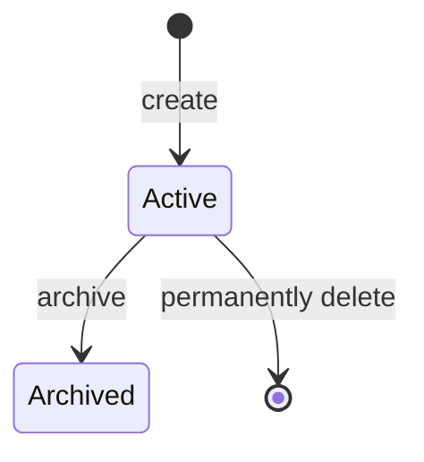

# RuleWorkspace

## Prerequisites

- [Workspace Version](./workspace-version.md)

## Definition

A Rule boundary within which [Workspace Versions](./workspace-version.md) are organized.

## Synonyms

None

## Attributes

- **Identifier**: the unique identity of a Rule Workspace.
- **Metadata**: the required name and description of a Rule Workspace.
- **State**: whether the Rule Workspace is active or archived.
- **Versions**: the Workspace Versions organized by the Rule Workspace.

## Data Model

```ts
import type { RuleWorkspaceVersion } from './workspace-version.md';

interface RuleWorkspaceMetadata {
  name: string;
  description: string;
}

type RuleWorkspaceState = 'active' | 'archived';

interface RuleWorkspace {
  identifier: string;
  metadata: RuleWorkspaceMetadata;
  state: RuleWorkspaceState;
  versions: RuleWorkspaceVersion[];
}
```

- The `identifier` is unique across active and archived Rule Workspaces.
- A workspace has required `name` metadata.
- A workspace `name` is non-empty text.
- A workspace `name` is unique across active and archived Rule Workspaces.
- A workspace `name` is at most 40 characters.
- A workspace has required `description` metadata.
- A workspace `description` is non-empty text.
- A workspace `description` is at most 120 characters.

## State Transitions



## Constraints

**Static constraints**

- There may be at most 20 active Rule Workspaces; archived workspaces do not count toward this limit.
- An archived workspace belongs to the Archive Zone, whose behavior is outside the scope of this requirement.
- A workspace identifier is read-only once created.
