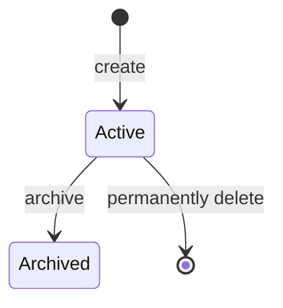

# Workspace

## Prerequisites

- [WorkspaceVersion](./workspace-version.md)

## Definition

A logical boundary to organize [Workspace Versions](./workspace-version.md).

## Synonyms

None

## Attributes

- **Identifier**: the unique identity.
- **Metadata**: the required name and description.
- **State**: the Workspace's lifecycle
- **Versions**: the **WorkspaceVersion** organized by the Workspace.

## Data Model

```ts
import type { WorkspaceVersion } from './workspace-version.md';

interface WorkspaceMetadata {
  // required, length --> [5, 40]
  name: string;
  // required, length --> [5, 120]
  description: string;
}

type WorkspaceState = 'active' | 'archived';

interface Workspace extends WorkspaceMetadata {
  identifier: string;
  state: WorkspaceState;
  versions: WorkspaceVersion[];
}
```

- The `identifier` is readonly after creation.
- The Workspace's `name` is unique across active and archived Workspace.

## State Transitions



## Constraints

- The Rule Manager can hold 20 active Workspace at most, archived workspaces do not count toward this limit.
- An archived workspace belongs to the Archive Zone, whose behavior is outside the scope of this requirement.
