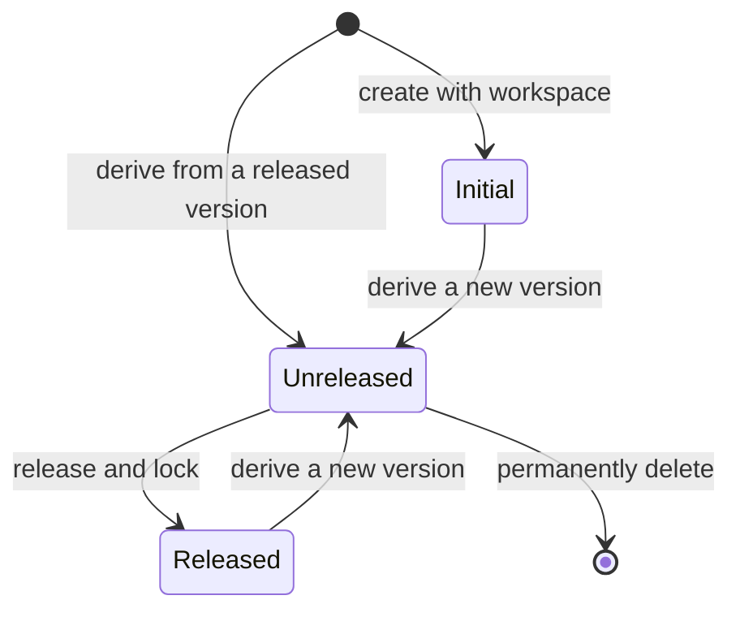

# RuleWorkspaceVersion

## Prerequisites

- [Rule Workspace](./rule-workspace.md)
- [Resource](./resource.md)
- [Rule Factor](./rule-factor.md)
- [Rule](./rule.md)

## Definition

An isolated line of change within a [Rule Workspace](./rule-workspace.md). It contains version-local [Resources](./resource.md), [Rule Factors](./rule-factor.md), and [Rules](./rule.md). Actions within one Workspace Version do not affect another Workspace Version.

## Synonyms

None

## Attributes

- **Identifier**: the unique semantic-version identity of a Workspace Version within its Rule Workspace.
- **Metadata**: the required name and description of a Workspace Version.
- **State**: whether the Workspace Version is initial, unreleased, or released.
- **Base Version Identifier**: the identity of the released Workspace Version from which a subsequent version is derived.
- **Resources**: the version-local managed Resources.
- **Rule Factors**: the version-local managed Rule Factors.
- **Rules**: the version-local managed Rules.

## Data Model

```ts
import type { RuleWorkspaceMetadata } from './rule-workspace.md';
import type { RuleWorkspaceResource } from './resource.md';
import type { RuleWorkspaceRuleFactor } from './rule-factor.md';
import type { RuleWorkspaceRule } from './rule.md';

type RuleWorkspaceVersionState = 'initial' | 'unreleased' | 'released';

interface RuleWorkspaceVersion {
  identifier: string;
  metadata: RuleWorkspaceMetadata;
  state: RuleWorkspaceVersionState;
  baseVersionIdentifier?: string;
  resources: RuleWorkspaceResource[];
  ruleFactors: RuleWorkspaceRuleFactor[];
  rules: RuleWorkspaceRule[];
}
```

- `identifier` is unique within its Rule Workspace.
- `identifier` uses `MAJOR.MINOR.PATCH` semantic-version form.
- A Workspace Version has required `name` metadata.
- A Workspace Version `name` is non-empty text.
- A Workspace Version `name` is unique within its Rule Workspace.
- A Workspace Version `name` is at most 40 characters.
- A Workspace Version has required `description` metadata.
- A Workspace Version `description` is non-empty text.
- A Workspace Version `description` is at most 120 characters.

The initial Workspace Version has no base. Each subsequent Workspace Version has exactly one released base version and begins as that version's content snapshot.

## State Transitions



A transition from `Initial` or `Released` to `Unreleased` creates a new Workspace Version; it does not change the base version.

## Constraints

**Static constraints**

- The initial Workspace Version is empty, read-only, and treated as released; it is available solely as the base for subsequent Workspace Versions and does not prevent deletion of a workspace with no non-initial released Workspace Versions.
- A Rule Workspace may have at most three unreleased Workspace Versions at one time. The initial Workspace Version does not count toward this limit.
- A Workspace Version identifier is read-only once created.
- A subsequent Workspace Version identifier must be strictly greater than its base version identifier.
