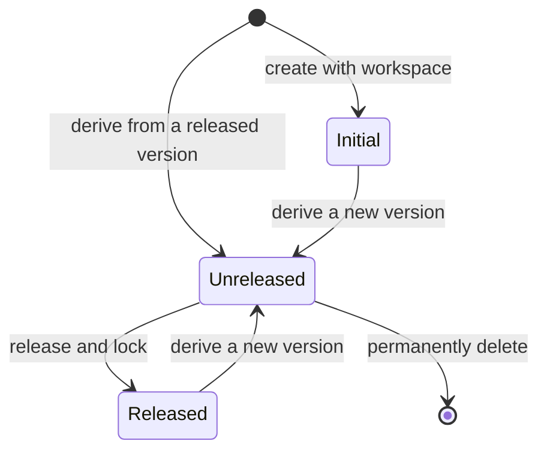

# WorkspaceVersion

## Prerequisites

- [Workspace](./rule-workspace.md)
- [Workspace Resource](./resource.md)
- [Workspace Rule Factor](./rule-factor.md)
- [Workspace Rule](./rule.md)

## Definition

An isolated line of change within a [Rule Workspace](./rule-workspace.md). It contains version-local [Resources](./resource.md), [Rule Factors](./rule-factor.md), and [Rules](./rule.md). Actions within one Workspace Version do not affect another Workspace Version.

## Synonyms

None

## Attributes

- **Identifier**: the unique semantic-version identity of a Workspace Version within its Rule Workspace.
- **Metadata**: the required name and description of a Workspace Version.
- **State**: whether the Workspace Version is initial, unreleased, or released.
- **Base Version Identifier**: the identity of the released Workspace Version from which a subsequent version is derived.

## Data Model

```ts
interface WorkspaceVersionMetadata {
  // required, length --> [5, 40]
  title: string;
  // required, length --> [5, 120]
  description: string;
}

type RuleWorkspaceVersionState = 'initial' | 'unreleased' | 'released';

interface RuleWorkspaceVersion extends WorkspaceVersionMetadata {
  identifier: string;
  // the based Workspace Version
  baseVersion?: string;
  state: RuleWorkspaceVersionState;
}
```

- The `identifier` is read-only once created.
- The `identifier` is unique within its Workspace.
- The `identifier` uses strict `MAJOR.MINOR.PATCH` semantic-version form.

## State Transitions



A transition from `Initial` or `Released` to `Unreleased` creates a new Workspace Version; it does not change the base version.

## Constraints

- The initial Workspace Version is empty, read-only, and treated as released; it is available solely as the base for subsequent Workspace Versions and does not prevent deletion of a workspace with no non-initial released Workspace Versions.
- A Rule Workspace may have at most three unreleased Workspace Versions at one time. The initial Workspace Version does not count toward this limit.
- A Workspace Version identifier is read-only once created.
- A subsequent Workspace Version identifier must be strictly greater than its base version identifier.
