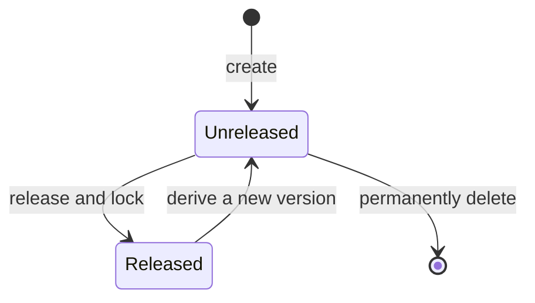

# WorkspaceVersion

## Prerequisites

- [Workspace](./rule-workspace.md)
- [Workspace Resource](./resource.md)
- [Workspace Rule Factor](./rule-factor.md)
- [Workspace Rule](./rule.md)

## Definition

An isolated line of change within a [Workspace](./rule-workspace.md). It contains version-local [Resources](./resource.md), [Rule Factors](./rule-factor.md), and [Rules](./rule.md). Actions within one Workspace Version do not affect another Workspace Version.

## Synonyms

None

## Attributes

- **Identifier**: the unique semantic-version identity of a Workspace Version within its Workspace.
- **Metadata**: the required name and description of a Workspace Version.
- **State**: whether the Workspace Version is unreleased or released.
- **Base Version Identifier**: the identity of the released Workspace Version from which a derived version is created. It is absent for an independently created version.

## Data Model

```ts
interface WorkspaceVersionMetadata {
  // required, length --> [5, 40]
  title: string;
  // required, length --> [5, 120]
  description: string;
}

type WorkspaceVersionState = 'unreleased' | 'released';

interface WorkspaceVersion extends WorkspaceVersionMetadata {
  identifier: string;
  // the released Workspace Version from which this version was derived
  baseVersion?: string;
  state: WorkspaceVersionState;
}
```

- The `identifier` is read-only once created.
- The `identifier` is unique within its Workspace.
- The `identifier` uses strict `MAJOR.MINOR.PATCH` semantic-version form.

## State Transitions



Creating or deriving a Workspace Version creates a new version; it does not change an existing version.

## Constraints

- A Rule Manager explicitly creates every Workspace Version. Creating a version produces an empty, unreleased version without a base version.
- A Workspace may have at most three unreleased Workspace Versions at one time.
- A derived Workspace Version identifier must be strictly greater than its base version identifier.
