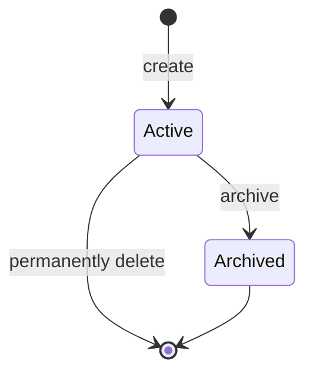

# Workspace

## Prerequisites

- [WorkspaceVersion](./workspace-version.md)

## Definition

A logical boundary to organize [Workspace Versions](./workspace-version.md).

## Synonyms

None

## Attributes

- **Identifier**: the unique identity.
- **Metadata**: the required name and description.
- **State**: the Workspace's lifecycle.
- **Times**: the audit times that record its creation and most recent change.

## Data Model

```ts
type WorkspaceState = 'active' | 'archived';

interface WorkspaceMetadata {
  // length --> [5, 40]
  name: string;
  // length --> [5, 120]
  description: string;
}

interface Workspace extends WorkspaceMetadata {
  identifier: string;
  state: WorkspaceState;
  // audit times
  createdAt: number;
  updatedAt: number;
}
```

- The `identifier` is read-only after creation.
- The Workspace's `name` is unique across active and archived Workspaces.
- The platform sets `createdAt` when it creates a Workspace and updates
  `updatedAt` whenever the Workspace changes.

### Workspace Creation

The input a Rule Manager provides to create a Workspace:

```ts
interface WorkspaceMaterial {
  // length --> [5, 40]
  name: string;
  // length --> [5, 120]
  description: string;
}
```

### Workspace Modification

The input a Rule Manager provides to update a Workspace:

```ts
interface WorkspacePatch {
  // length --> [5, 120]
  description: string;
}
```

## State Transitions



## Constraints

- A Rule Manager can hold at most 20 active Workspaces; archived Workspaces do
  not count toward this limit.
- An archived workspace belongs to the Archive Zone, whose behavior is outside the scope of this requirement.
