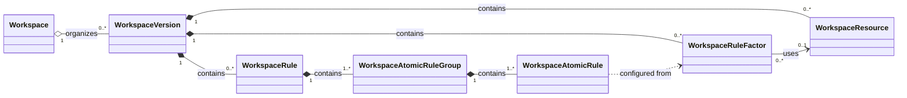
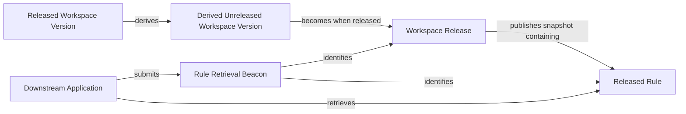
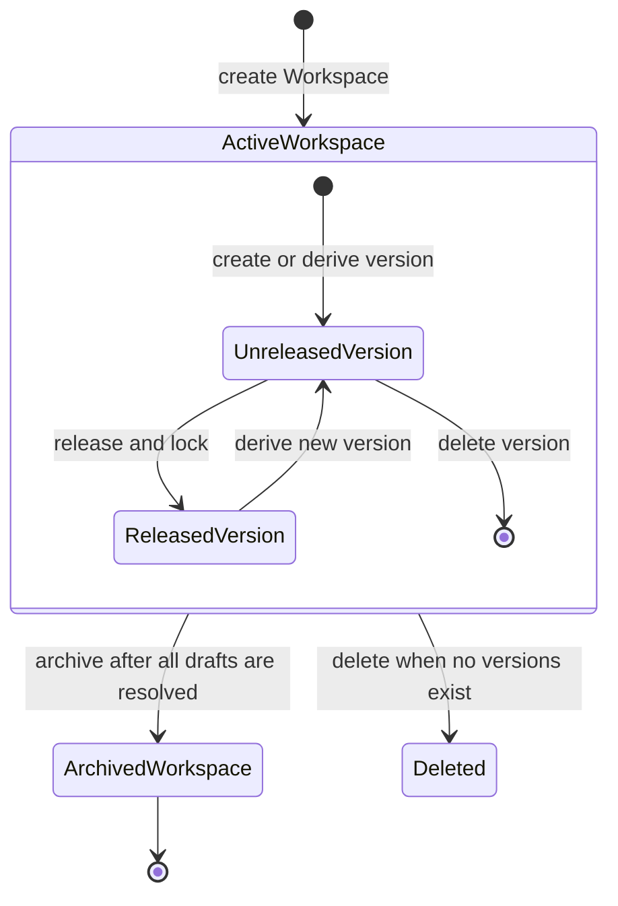

# Copernicus Concept Relationships

## Purpose

This document centralizes the relationships among the semantic concepts in the
[Copernicus requirement](./requirement.md). It is a navigation and modelling
aid, not a replacement for the canonical glossary definitions. The glossary
entry linked for each concept remains the source of truth for its definition,
attributes, state, and constraints.

Relationship names in this document use the mandatory vocabulary defined by the
[business-concept relationship ADR](../../docs/adr/unify-business-concept-relationships.md).
They describe business meaning only; they do not prescribe persistence,
deletion, or runtime-lifetime behaviour.

## Concepts in Scope

- [Workspace](./glossary/workspace.md) (`Workspace`) organizes a version history.
- [Workspace Version](./glossary/workspace-version.md) (`WorkspaceVersion`) is an isolated, version-local rule snapshot.
- [Workspace Resource](./glossary/workspace-resource.md) (`WorkspaceResource`) provides managed selectable values within one version.
- [Workspace Rule Factor](./glossary/workspace-rule-factor.md) (`WorkspaceRuleFactor`) is a managed factor used to configure an Atomic Rule.
- [Workspace Rule](./glossary/workspace-rule.md) (`WorkspaceRule`) aggregates Atomic Rule Groups.
- [Workspace Release](./glossary/workspace-release.md) (`WorkspaceRelease`) represents the publication of a released version snapshot.
- [Rule Retrieval Beacon](./glossary/rule-retrieval-beacon.md) (`RuleRetrievalBeacon`) identifies one released Rule for downstream retrieval.
- [Atomic Rule Group](../baseline/rule.md) (`WorkspaceAtomicRuleGroup`) joins Atomic Rules with logical AND.
- [Atomic Rule](../baseline/rule.md) (`WorkspaceAtomicRule`) is the smallest configured rule condition.

The [Rule Manager](./requirement.md#rule-manager) and [Downstream Application](./requirement.md#downstream-application) are actors, rather than semantic concepts. They participate in the relationships shown below but do not own the rule content.

## Structural Relationships

### Workspace → Workspace Version

**Aggregation.** One workspace organizes zero or more versions; each version
belongs to one workspace. The workspace is the organizational boundary for its
version history, and a version identifier is unique within that workspace.

### Workspace Version → Resource

**Composition.** One version contains zero or more Resources, each of which is
version-local. A Resource may be created, updated, or deleted only while its
version is unreleased; release locks the complete version snapshot.

### Workspace Version → Rule Factor

**Composition.** One version contains zero or more Rule Factors, each of which
is version-local. A Rule Factor cannot refer to a Resource outside that version
boundary.

### Workspace Version → Rule

**Composition.** One version contains zero or more Rules, each of which is
version-local. A version needs at least one Rule before it can be released, and
Rules may change only while the version is unreleased.

### Rule Factor → Resource

**Dependency.** A Rule Factor uses zero or one Resource; a Resource can serve
zero or more Rule Factors in the same version. The Resource identifier
constructs the projected Rule Factor resource. A Resource change or deletion is
refused if it would leave this dependency unsatisfied.

### Rule → Atomic Rule Group

**Composition.** Each Rule contains one or more Atomic Rule Groups, and each
group belongs to one Rule. A Rule is valid for release only when every group is
non-empty.

### Atomic Rule Group → Atomic Rule

**Composition.** Each group contains one or more Atomic Rules, and each Atomic
Rule belongs to one group. A Rule Factor can be configured at most once within
one group.

### Atomic Rule → Rule Factor

**Dependency.** An Atomic Rule is configured by consuming a Rule Factor. This
dependency exists only during configuration: the Atomic Rule retains no managed
Rule Factor reference, so later Rule Factor changes or deletion do not alter an
already configured Atomic Rule.

## Version, Publication, and Retrieval Relationships

### Derived Workspace Version → Released Workspace Version

**Derivation.** A derived version has exactly one released base, while a
released version can be the base of zero or more derived versions. The derived
version is an independent copy of the base content and identifiers, retains the
base identifier, and must have a strictly greater semantic version. An
independently created version has no base.

### Workspace Release → Released Workspace Version

**Projection.** A released version has one publication representation, and a
Workspace Release identifies one released version. The Release records the
workspace and version identifiers and publishes the complete locked snapshot.
Publication is one-time and irreversible.

### Workspace Release → Rule

**Dependency.** A Release needs the released version's Rules to publish a
usable snapshot. Release is permitted only when the version has at least one
Rule, and immediately makes those Rules available to downstream retrieval.

### Rule Retrieval Beacon → Released Rule Location

**Projection.** A Beacon identifies one workspace, one version, and one Rule.
It is the representation a Downstream Application uses to request a Rule. The
identified version must be released and the Rule must exist in that version.

### Downstream Application → Rule Retrieval Beacon

**Dependency.** A retrieval request needs one Beacon. The application submits
it and receives the final Rule definition or a simple unavailable exception.

### Downstream Application → Released Rule

**Dependency.** A successful retrieval consumes one Rule from a released
version. Retrieval neither changes managed definitions nor becomes unavailable
when the containing workspace is archived.

## Cross-Relationship Invariants

- A Workspace Version is isolated: changes to its Resources, Rule Factors, and Rules do not affect another version.
- Derivation copies the base version's Resources, Rule Factors, Rules, and identifiers, but not its metadata. Later changes do not affect the base or another derived version.
- The Resource-to-Rule-Factor dependency is version-scoped. A Rule Factor must not use a Resource in another Workspace Version.
- The Rule-Factor-to-Atomic-Rule dependency ends after configuration. It is deliberately not a persistent reference.
- Releasing converts an unreleased Workspace Version into a locked, downstream-available snapshot. A derived version must have a final Rule set different from its base before release.
- Archiving a Workspace prevents further content changes but preserves retrieval of Rules from its released Workspace Versions.

## Relationship-Driven Lifecycle Summary

The lifecycle diagram summarizes state transitions only. It does not change the relationship classifications above or imply additional lifecycle semantics for Composition or Aggregation.
