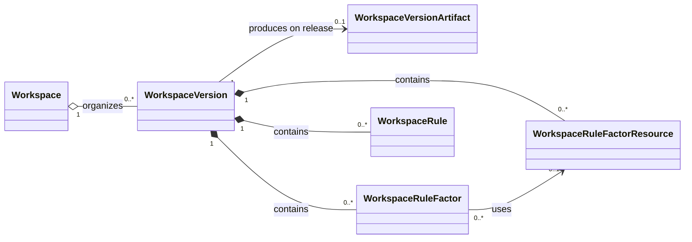
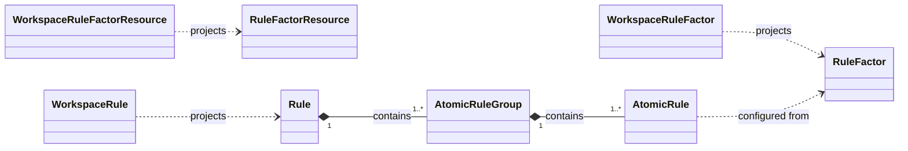
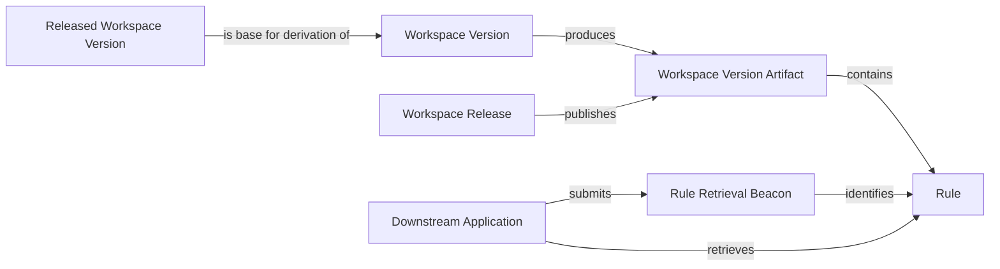

# Concept Relationships

## Purpose

This document maps the relationships among the concepts in the
[requirement](./requirement.md). It is a navigation and modelling aid, not a
replacement for the canonical glossary definitions. The linked glossary entry
remains the source of truth for each platform concept's definition, attributes,
state, and constraints.

Relationship names in this document use the mandatory vocabulary defined by the
[Relationship ADR](../../docs/adr/unify-business-concept-relationships.md).
They describe business meaning only; they do not prescribe persistence,
deletion, or runtime-lifetime behaviour.

## Naming and Consumption Boundary

`Workspace*` names identify the original, managed shape that the platform owns
inside a Workspace Version. Names without the `Workspace` prefix identify the
public shape consumed by a Rule Setter, Rule Engine, or Downstream Application.
They are related by projection where stated below; they are not interchangeable
names for the same concept.

For example, `WorkspaceRuleFactor` is the platform-managed definition, while
`RuleFactor` is the public definition projected from it. Likewise,
`WorkspaceRule` is the managed aggregate and `Rule` is its public, final
definition. `WorkspaceAtomicRule` and `WorkspaceAtomicRuleGroup` are not
separate concepts in this map: the public `AtomicRule` and `AtomicRuleGroup`
are the constituents of a public `Rule`.

## Concepts in Scope

### Platform-Managed Concepts

- [Workspace](./glossary/workspace.md) (`Workspace`) organizes version history.
- [Workspace Version](./glossary/workspace-version.md) (`WorkspaceVersion`) is
  an isolated, version-local configuration snapshot.
- [Workspace Rule Factor Resource](./glossary/workspace-rule-factor-resource.md)
  (`WorkspaceRuleFactorResource`) is a managed source of selectable values.
- [Workspace Rule Factor](./glossary/workspace-rule-factor.md)
  (`WorkspaceRuleFactor`) is a managed factor definition.
- [Workspace Rule](./glossary/workspace-rule.md) (`WorkspaceRule`) is a managed
  rule aggregate.
- [Workspace Version Artifact](./glossary/workspace-version-artifact.md)
  (`WorkspaceVersionArtifact`) is the immutable public Rule payload produced
  from a released Workspace Version.
- [Workspace Release](./glossary/workspace-release.md) (`WorkspaceRelease`) is
  the publication record for a Workspace Version Artifact.

### Public Concepts

- [Rule Factor Resource](../baseline/rule-factor.md) (`RuleFactorResource`) is
  the resource contract consumed with a Rule Factor.
- [Rule Factor](../baseline/rule-factor.md) (`RuleFactor`) is the factor
  definition consumed while configuring a Rule.
- [Rule](../baseline/rule.md) (`Rule`) is the final definition consumed by a
  Rule Engine or Downstream Application.
- [Atomic Rule Group](../baseline/rule.md) (`AtomicRuleGroup`) joins Atomic
  Rules with logical AND.
- [Atomic Rule](../baseline/rule.md) (`AtomicRule`) is the smallest configured
  rule condition.
- [Rule Retrieval Beacon](./glossary/rule-retrieval-beacon.md)
  (`RuleRetrievalBeacon`) identifies one public Rule in a released Workspace
  Version for downstream retrieval.

The [Rule Manager](./requirement.md#rule-manager), [Rule Setter](../baseline/rule-factor.md),
[Rule Engine](../baseline/rule-factor.md), and
[Downstream Application](./requirement.md#downstream-application) are actors
or consumers, rather than semantic concepts. They participate in the
relationships below but do not own the rule content.

## Platform-Managed Structural Relationships

### Workspace → Workspace Version

**Aggregation.** One Workspace organizes zero or more Workspace Versions; each
Workspace Version belongs to one Workspace. The Workspace is the organizational
boundary for its version history, and a version identifier is unique within
that Workspace.

### Workspace Version → Workspace Rule Factor Resource

**Composition.** One Workspace Version contains zero or more Workspace Rule
Factor Resources, each version-local. A Workspace Rule Factor Resource may be
created, updated, or deleted only while its version is unreleased; release
locks the complete version snapshot.

### Workspace Version → Workspace Rule Factor

**Composition.** One Workspace Version contains zero or more Workspace Rule
Factors, each version-local. A Workspace Rule Factor cannot use a Workspace
Rule Factor Resource outside that version boundary.

### Workspace Version → Workspace Rule

**Composition.** One Workspace Version contains zero or more Workspace Rules,
each version-local. A version needs at least one Workspace Rule before it can
be released, and Workspace Rules may change only while the version is
unreleased.

### Workspace Rule Factor → Workspace Rule Factor Resource

**Dependency.** A Workspace Rule Factor uses zero or one Workspace Rule Factor
Resource; a Workspace Rule Factor Resource can serve zero or more Workspace
Rule Factors in the same version. A change or deletion is refused if it would
leave this dependency unsatisfied.

## Public-Contract Projection and Rule Relationships

### Workspace Rule Factor Resource → Rule Factor Resource

**Projection.** A Workspace Rule Factor Resource projects the resource contract
used by the public Rule Factor. The managed identifier, version membership, and
lifecycle do not become part of the public resource contract.

### Workspace Rule Factor → Rule Factor

**Projection.** A Workspace Rule Factor projects the Rule Factor that a Rule
Setter consumes. When it uses a Workspace Rule Factor Resource, that projected
Rule Factor uses the corresponding projected Rule Factor Resource.

### Workspace Rule → Rule

**Projection.** A Workspace Rule projects the final Rule consumed outside the
workspace. The managed identifier, metadata, and version-local lifecycle are
not a substitute for the public Rule definition.

### Rule → Atomic Rule Group

**Composition.** Each public Rule contains one or more Atomic Rule Groups, and
each group belongs to one Rule. A Rule is valid for release only when every
group is non-empty.

### Atomic Rule Group → Atomic Rule

**Composition.** Each Atomic Rule Group contains one or more Atomic Rules, and
each Atomic Rule belongs to one group. A Rule Factor can be configured at most
once within one group.

### Atomic Rule → Rule Factor

**Dependency.** An Atomic Rule is configured by consuming a public Rule Factor.
This dependency exists only during configuration: the Atomic Rule retains no
managed Rule Factor reference, so later Workspace Rule Factor changes or
deletion do not alter an already configured Atomic Rule.

## Version, Publication, and Retrieval Relationships

### Workspace Version → Workspace Version

**Derivation.** A new, unreleased Workspace Version may be derived from one
released base Workspace Version in the same Workspace. The new version records
that base identifier, independently copies the base content and identifiers,
and has a strictly greater semantic version. A Workspace Version created
without a base has no derivation relationship.

There is no `DerivedWorkspaceVersion` entity or subtype. “Derived” describes
only the creation provenance of a Workspace Version.

### Workspace Version → Workspace Version Artifact

**Projection.** Releasing a Workspace Version produces exactly one immutable
Workspace Version Artifact. The artifact contains only the final public Rules;
the source version retains the authoring-only configuration from which those
Rules were projected.

### Workspace Release → Workspace Version Artifact

**Publication.** A Workspace Release records publication of one Workspace
Version Artifact. The release identifies the artifact through the same
Workspace and Version identifiers as its source; it does not contain the
artifact or the Rules.

### Workspace Version Artifact → Rule

**Composition.** A Workspace Version Artifact contains the final public Rules
projected from its source Workspace Version. These Rules are the only rule
content available to downstream retrieval.

### Rule Retrieval Beacon → Rule

**Projection.** A Rule Retrieval Beacon identifies one Workspace, one
Workspace Version, and one public Rule. It is the representation a Downstream
Application uses to request a Rule from the corresponding Workspace Version
Artifact. The identified version must be released and the Rule must exist in
that artifact.

### Downstream Application → Rule Retrieval Beacon

**Dependency.** A retrieval request needs one Rule Retrieval Beacon. The
application submits it and receives the final Rule definition or a simple
unavailable exception.

### Downstream Application → Rule

**Dependency.** A successful retrieval consumes one public Rule from a
Workspace Version Artifact. Retrieval neither changes managed definitions nor
becomes unavailable when the containing Workspace is archived.
