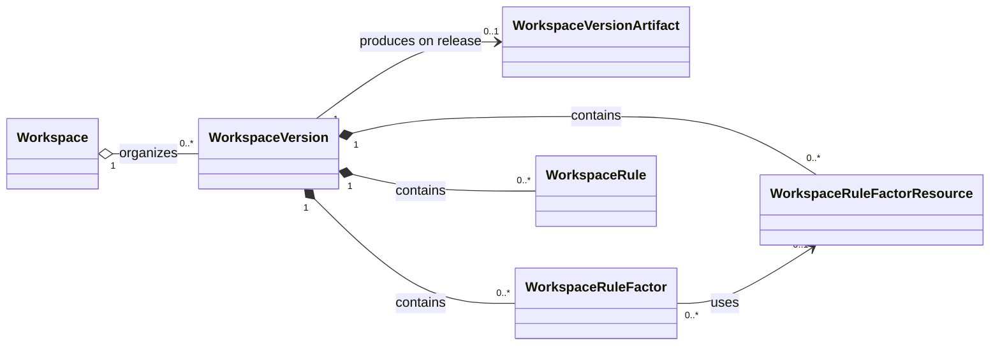
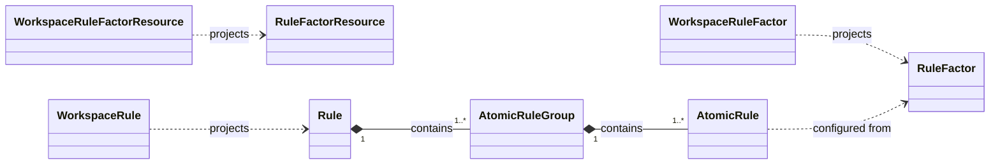
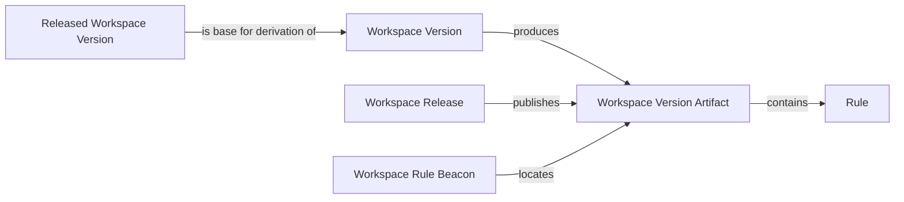

# Concept Relationships

## Purpose

This document maps the relationships among the concepts in the [requirement](./requirement.md).
It is a navigation and modelling aid, not a replacement for the canonical glossary definitions.

## Prerequisite

- [Relationship ADR](../../docs/adr/unify-business-concept-relationships.md) The mandatory vocabulary for **Relationship Name**

## Concepts in Scope

### Platform-Managed Concepts

- [Workspace](./glossary/workspace.md) (`Workspace`)
- [Workspace Version](./glossary/workspace-version.md) (`WorkspaceVersion`)
- [Workspace Rule Factor Resource](./glossary/workspace-rule-factor-resource.md)
  (`WorkspaceRuleFactorResource`)
- [Workspace Rule Factor](./glossary/workspace-rule-factor.md)
  (`WorkspaceRuleFactor`)
- [Workspace Rule](./glossary/workspace-rule.md) (`WorkspaceRule`)
- [Workspace Version Artifact](./glossary/workspace-version-artifact.md)
  (`WorkspaceVersionArtifact`)
- [Workspace Release](./glossary/workspace-release.md) (`WorkspaceRelease`)

### Public Concepts

- [Rule Factor Resource](../baseline/rule-factor.md) (`RuleFactorResource`)
- [Rule Factor](../baseline/rule-factor.md) (`RuleFactor`)
- [Rule](../baseline/rule.md) (`Rule`)
- [Atomic Rule Group](../baseline/rule.md) (`AtomicRuleGroup`)
- [Atomic Rule](../baseline/rule.md) (`AtomicRule`)
- [Workspace Rule Beacon](./glossary/workspace-rule-beacon.md)
  (`WorkspaceRuleBeacon`)

## Platform-Managed Structural Relationships

```mermaid
classDiagram
    direction LR

    class Workspace
    class WorkspaceVersion
    class WorkspaceVersionArtifact
    class WorkspaceRuleFactorResource
    class WorkspaceRuleFactor
    class WorkspaceRule

    Workspace "1" o-- "0..*" WorkspaceVersion : organizes
    WorkspaceVersion "1" *-- "0..*" WorkspaceRuleFactorResource : contains
    WorkspaceVersion "1" *-- "0..*" WorkspaceRuleFactor : contains
    WorkspaceVersion "1" *-- "0..*" WorkspaceRule : contains
    WorkspaceVersion "1" --> "0..1" WorkspaceVersionArtifact : produces on release
    WorkspaceRuleFactor "0..*" --> "0..1" WorkspaceRuleFactorResource : uses
```

### Workspace → Workspace Version

**Aggregation.** A Workspace organizes its Workspace Versions.

**Relationship constraints.**

- One Workspace organizes zero or more Workspace Versions.
- Each Workspace Version belongs to one Workspace.

### Workspace Version → Workspace Rule Factor Resource

**Composition.** A Workspace Version contains its Workspace Rule Factor Resources.

**Relationship constraints.**

- One Workspace Version contains zero or more Workspace Rule Factor Resources.
- Each Workspace Rule Factor Resources belongs to one Workspace Version.
- Each Workspace Rule Factor Resources is editable only when Workspace Version is unreleased.

### Workspace Version → Workspace Rule Factor

**Composition.** A Workspace Version contains its Workspace Rule Factors.

**Relationship constraints.**

- One Workspace Version contains zero or more Workspace Rule Factors.
- Each Workspace Rule Factors belongs to one Workspace Version in logical.

### Workspace Version → Workspace Rule

**Composition.** A Workspace Version contains its Workspace Rules.

**Relationship constraints.**

- One Workspace Version contains zero or more Workspace Rules, each local to
  that version.
- A version must contain at least one Workspace Rule before release.
- Workspace Rules may change only while the version is unreleased.

### Workspace Rule Factor → Workspace Rule Factor Resource

**Dependency.** A Workspace Rule Factor uses a Workspace Rule Factor Resource
when its configuration requires one.

**Relationship constraints.**

- A Workspace Rule Factor uses zero or one Workspace Rule Factor Resource in the same version.
- A Workspace Rule Factor Resource can serve zero or more Workspace Rule Factor in the same version.
- When Workspace Rule Factor use specific Workspace Rule Factor Resource, any changes for the Resource should guarantee the dependency relationshp satisfied.

## Public-Contract Projection and Rule Relationships

```mermaid
classDiagram
    direction LR

    class WorkspaceRuleFactorResource
    class WorkspaceRuleFactor
    class WorkspaceRule
    class RuleFactorResource
    class RuleFactor
    class Rule
    class AtomicRuleGroup
    class AtomicRule

    WorkspaceRuleFactorResource ..> RuleFactorResource : projects
    WorkspaceRuleFactor ..> RuleFactor : projects
    WorkspaceRule ..> Rule : projects
    Rule "1" *-- "1..*" AtomicRuleGroup : contains
    AtomicRuleGroup "1" *-- "1..*" AtomicRule : contains
    AtomicRule ..> RuleFactor : configured from
```

### Workspace Rule Factor Resource → Rule Factor Resource

**Projection.** A Workspace Rule Factor Resource projects the resource contract
used by a public Rule Factor.

### Workspace Rule Factor → Rule Factor

**Projection.** A Workspace Rule Factor projects a Rule Factor for Rule Setter
consumption.

### Workspace Rule → Rule

**Projection.** A Workspace Rule projects the Rule consumed outside the
Workspace.

### Rule → Atomic Rule Group

**Composition.** A Rule contains its Atomic Rule Groups.

**Relationship constraints.**

- Each Rule contains one or more Atomic Rule Groups.
- Each group belongs to one Rule.
- A Rule is valid for release only when every group is non-empty.

### Atomic Rule Group → Atomic Rule

**Composition.** An Atomic Rule Group contains its Atomic Rules.

**Relationship constraints.**

- Each Atomic Rule Group contains one or more Atomic Rules.
- Each Atomic Rule belongs to one group.
- A Rule Factor can be configured at most once within one group.

### Atomic Rule → Rule Factor

**Dependency.** An Atomic Rule is configured by consuming a public Rule Factor.

**Relationship constraints.**

- This dependency exists only during configuration. Later Workspace Rule Factor changes or deletion do not alter an already
  configured Atomic Rule.
- The Atomic Rule retains no managed Rule Factor reference.

## Version, Publication, and Retrieval Relationships

```mermaid
flowchart LR
    base[Released Workspace Version]
    version[Workspace Version]
    artifact[Workspace Version Artifact]
    release[Workspace Release]
    rule[Rule]
    beacon[Workspace Rule Beacon]

    base -->|is base for derivation of| version
    version -->|produces| artifact
    release -->|publishes| artifact
    artifact -->|contains| rule
    beacon -->|locates| artifact
```

### Workspace Version → Workspace Version

**Derivation.** A Workspace Version may be derived from a released base
Workspace Version in the same Workspace.

**Relationship constraints.**

- The Workspace Version created without a base has no derivation relationship.
- The derived semantic version is strictly greater than its base version.

### Workspace Version → Workspace Version Artifact

**Projection.** Releasing a Workspace Version projects its final public Rules
into a Workspace Version Artifact.

**Relationship constraints.**

- Workspace Version Release produces exactly one immutable artifact.
- The artifact contains only final public Rules.

### Workspace Release → Workspace Version Artifact

**Publication.** A Workspace Release records publication of a Workspace Version
Artifact.

**Relationship constraints.**

- A release identifies one artifact through the same Workspace and Version
  identifiers as its source.
- It does not contain the artifact or the Rules.

### Workspace Version Artifact → Rule

**Composition.** A Workspace Version Artifact contains the final public Rules
projected from its source Workspace Version.

**Relationship constraints.**

- The Rules are the only rule content available to downstream retrieval.
- The Rules inside Workspace Version Artifact is strictly readonly
