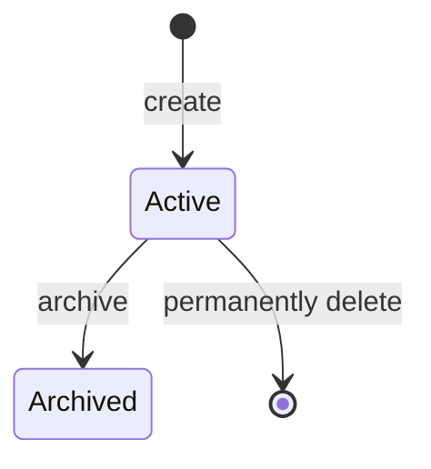
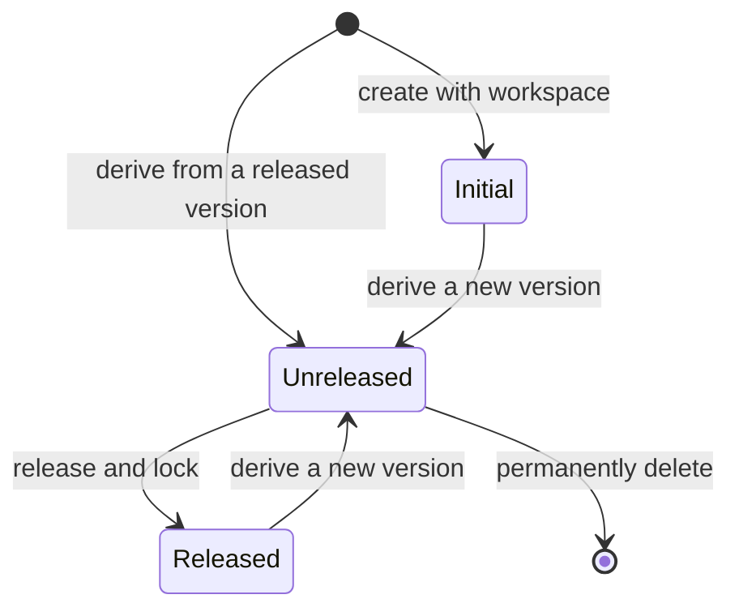
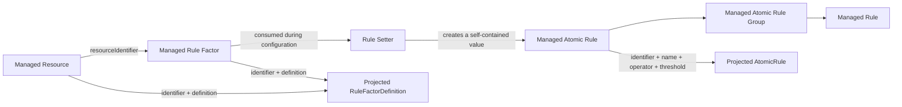
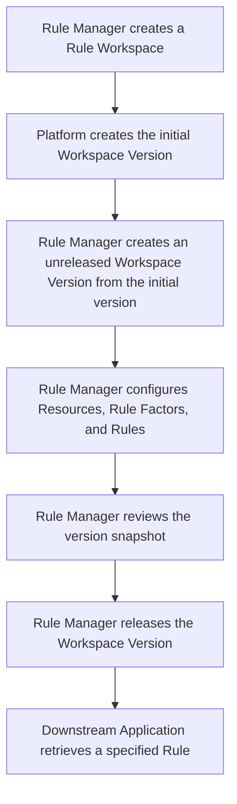
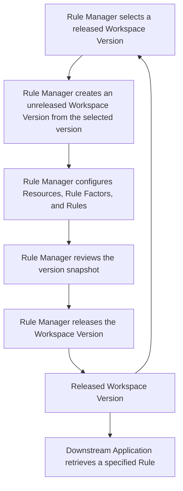

# Rule

## Goal

Enable Rule Managers to define, version, validate, and release governed rule snapshots, while allowing Downstream Applications to retrieve a specified Rule from a released Workspace Version.

## Actors and Use Cases

| Actor                  | Use cases                                                                                                   |
| :--------------------- | :---------------------------------------------------------------------------------------------------------- |
| Rule Manager           | Create, view, update, archive, and delete Rule Workspaces.                                                  |
| Rule Manager           | View archived Rule Workspaces and their released Workspace Versions.                                        |
| Rule Manager           | Create, view, update, and delete unreleased Workspace Versions within an active Rule Workspace.             |
| Rule Manager           | View released Workspace Versions within a Rule Workspace.                                                   |
| Rule Manager           | Derive an unreleased Workspace Version from a selected released Workspace Version.                          |
| Rule Manager           | Create, view, update, and delete Resources, Rule Factors, and Rules within an unreleased Workspace Version. |
| Rule Manager           | Review the complete snapshot of an unreleased Workspace Version before release.                             |
| Rule Manager           | Release an unreleased Workspace Version.                                                                    |
| Downstream Application | [Retrieve a specified Rule from a released Workspace Version.](./use-case/retrieve-released-rule.md)        |

## Semantic Concepts

### Rule Workspace

#### Definition

A Rule boundary within which Workspace Versions are organized.

#### Data Model

```ts
interface RuleWorkspaceMetadata {
  name: string;
  description: string;
}

type RuleWorkspaceState = 'active' | 'archived';

interface RuleWorkspace {
  identifier: string;
  metadata: RuleWorkspaceMetadata;
  state: RuleWorkspaceState;
  versions: RuleWorkspaceVersion[];
}
```

- The `identifier` is unique across active and archived Rule Workspaces.
- A workspace has required `name` metadata.
- A workspace `name` is non-empty text.
- A workspace `name` is unique across active and archived Rule Workspaces.
- A workspace `name` is at most 40 characters.
- A workspace has required `description` metadata.
- A workspace `description` is non-empty text.
- A workspace `description` is at most 120 characters.

#### State Transition



#### Constraints

**Static constraints**

- There may be at most 20 active Rule Workspaces; archived workspaces do not count toward this limit.
- An archived workspace belongs to the Archive Zone, whose behavior is outside the scope of this requirement.
- A workspace identifier is read-only once created.

**Behavioral constraints**

- The Rule Manager supplies workspace metadata on creation and may change it only while the workspace is active.
- A workspace may be archived only after all unreleased Workspace Versions have been permanently deleted and it contains at least one non-initial released Workspace Version. Archiving is permanent and applies only to a Rule Workspace.
- Archiving neither changes nor makes unavailable Rules from released Workspace Versions. An archived workspace remains available to Downstream Applications, but its metadata, versions, and contents cannot be changed; neither content creation nor version release or deletion is permitted.
- An active workspace may be permanently deleted only when it has neither non-initial released Workspace Versions nor unreleased Workspace Versions.

### Workspace Version

#### Definition

An isolated line of change within a Rule Workspace. It contains version-local Resources, Rule Factors, and Rules. Actions within one Workspace Version do not affect another Workspace Version.

#### Data Model

```ts
type RuleWorkspaceVersionState = 'initial' | 'unreleased' | 'released';

interface RuleWorkspaceVersion {
  identifier: string;
  metadata: RuleWorkspaceMetadata;
  state: RuleWorkspaceVersionState;
  baseVersionIdentifier?: string;
  resources: RuleWorkspaceResource[];
  ruleFactors: RuleWorkspaceRuleFactor[];
  rules: RuleWorkspaceRule[];
}
```

- `identifier` is unique within its Rule Workspace.
- `identifier` uses `MAJOR.MINOR.PATCH` semantic-version form.
- A Workspace Version has required `name` metadata.
- A Workspace Version `name` is non-empty text.
- A Workspace Version `name` is unique within its Rule Workspace.
- A Workspace Version `name` is at most 40 characters.
- A Workspace Version has required `description` metadata.
- A Workspace Version `description` is non-empty text.
- A Workspace Version `description` is at most 120 characters.

The initial Workspace Version has no base. Each subsequent Workspace Version has exactly one released base version and begins as that version's content snapshot.

#### State Transition



A transition from `Initial` or `Released` to `Unreleased` creates a new Workspace Version; it does not change the base version.

#### Constraints

**Static constraints**

- The initial Workspace Version is empty, read-only, and treated as released; it is available solely as the base for subsequent Workspace Versions and does not prevent deletion of a workspace with no non-initial released Workspace Versions.
- A Rule Workspace may have at most three unreleased Workspace Versions at one time. The initial Workspace Version does not count toward this limit.
- A Workspace Version identifier is read-only once created.
- A subsequent Workspace Version identifier must be strictly greater than its base version identifier.

**Behavioral constraints**

- The platform creates the initial Workspace Version when its Rule Workspace is created, using the identifier and metadata supplied by the Rule Manager.
- A subsequent Workspace Version may be created only from a released base. It inherits the base's Resources, Rule Factors, Rules, and their identifiers as initial content, but not the base metadata; subsequent changes do not affect the base.
- The Rule Manager supplies metadata and chooses an identifier for every subsequent Workspace Version. The platform validates its semantic-version format and uniqueness within the workspace. No further major, minor, or patch validation applies.
- Multiple unreleased Workspace Versions may be derived from the same released base. Each is validated only against its own base and may be released even if another version from that base has a higher identifier.
- The Rule Manager may view, change, or permanently delete an unreleased Workspace Version at any time. An unreleased version cannot be archived, and deleting it immediately frees an unreleased-version slot.

### Resource

#### Definition

A Resource is a version-local, managed source of selectable values. Its definition uses the resource contracts from the [Rule Factor Definition](../baseline/rule-factor.md) specification, but the Rule Workspace owns its identifier, membership, lifecycle, and the static options or dynamic capabilities configured for that version.

#### Data Model

```ts
import type {
  DynamicRuleFactorResource,
  StaticRuleFactorResource,
} from '../baseline/rule-factor.md';

type RuleWorkspaceResourceDefinition =
  Omit<StaticRuleFactorResource, 'name'> | Omit<DynamicRuleFactorResource, 'name'>;

interface RuleWorkspaceResource {
  identifier: string;
  definition: RuleWorkspaceResourceDefinition;
}
```

- `identifier` is unique among Resources in a Workspace Version.
- A static Resource definition contains its version-local option list. A dynamic Resource definition contains only the provider capabilities agreed by the external resource provider.

A Resource belongs to one Workspace Version and may be used by multiple Rule Factors in that version.

#### Constraints

**Static constraints**

- A Resource's `identifier` is the `name` exposed by its projected Rule Factor Resource. It is not a provider-specific value stored elsewhere.
- A Resource identifier is read-only once created.
- A Resource that is not associated with a Rule Factor may remain in the Workspace Version.

**Behavioral constraints**

- Creating, updating, or deleting a Resource must not leave a Rule Factor with an unsatisfied resource association; any action that would do so is refused.

### Rule Factor

#### Definition

A Rule Factor is a version-local managed definition that the Rule Setter consumes when configuring an Atomic Rule. It owns the editable semantic definition from the [Rule Factor Definition](../baseline/rule-factor.md) specification and refers to a managed Resource by identifier instead of embedding a runtime resource payload.

#### Data Model

```ts
import type { RuleFactorDefinition } from '../baseline/rule-factor.md';

type RuleWorkspaceRuleFactorDefinition = Omit<RuleFactorDefinition, 'name' | 'resource'>;

interface RuleWorkspaceRuleFactor {
  identifier: string;
  definition: RuleWorkspaceRuleFactorDefinition;
  resourceIdentifier?: string;
}
```

- `identifier` is unique among Rule Factors in a Workspace Version.
- `resourceIdentifier`, when present, must identify an existing Resource in the same Workspace Version.

A Rule Factor belongs to one Workspace Version. Its `identifier` becomes the `name` in its projected `RuleFactorDefinition`; its `definition` supplies the title, description, data type, semantic, mode, quantity, and constraints. When `resourceIdentifier` is present, the projected `resource` is constructed from the identified Resource.

#### Constraints

**Static constraints**

- `definition` must satisfy every applicable Rule Factor Definition constraint.
- A Rule Factor without `resourceIdentifier` projects without a `resource`; a Rule Factor with `resourceIdentifier` projects with exactly one resource.
- A Rule Factor identifier is read-only once created.
- A Rule Factor that is not currently needed for configuration may remain in the Workspace Version.

**Behavioral constraints**

- The Rule Setter validates an Atomic Rule against the Rule Factor it consumes while that Atomic Rule is configured.
- Creating or updating a Rule Factor must result in a valid Rule Factor projection; an invalid change is refused.
- A Rule Factor may be deleted even when the Rule Setter previously consumed it to create an Atomic Rule, because that Atomic Rule has no managed Rule Factor reference.

### Rule

#### Definition

A Rule is a version-local managed aggregate of Atomic Rule Groups. The Rule Setter creates its Atomic Rules by consuming a Rule Factor, but the resulting Atomic Rule is a self-contained rule-definition value; it does not persist a reference to that Rule Factor. A Rule may contain multiple Atomic Rule Groups; their combination, selection, and execution remain the Downstream Application's concern.

#### Data Model

```ts
import type { AtomicRule } from '../baseline/rule.md';

interface RuleWorkspaceAtomicRule extends Omit<AtomicRule, 'id'> {
  identifier: string;
}

interface RuleWorkspaceAtomicRuleGroup {
  identifier: string;
  atomicRules: RuleWorkspaceAtomicRule[];
}

interface RuleWorkspaceRule {
  identifier: string;
  atomicRuleGroups: RuleWorkspaceAtomicRuleGroup[];
}
```

- `identifier` is unique among Rules in a Workspace Version.
- A Rule Workspace Atomic Rule `identifier` is unique within its Rule Workspace Rule.
- A Rule Workspace Atomic Rule Group `identifier` is unique within its Rule Workspace Rule.

A Rule belongs to one Workspace Version. Its projected Atomic Rule uses `identifier` as `id` and copies `name`, `operator`, and `threshold`. A Rule's Atomic Rules do not identify, reference, or depend on a managed Rule Factor after the Rule Setter has created them.

#### Constraints

**Static constraints**

- Resource, Rule Factor, and Rule identifier spaces are independent.
- A Rule, Atomic Rule Group, and Atomic Rule identifier is read-only once created.
- Each Atomic Rule Group must contain at least one Atomic Rule.
- Each Atomic Rule Group must satisfy the canonical Atomic Rule constraints in the [Rule Definition](../baseline/rule.md) specification.

**Behavioral constraints**

- Changing or deleting a Rule Factor does not change an Atomic Rule that the Rule Setter previously created.
- After a Resource, Rule Factor, Rule, Atomic Rule Group, or Atomic Rule is removed from an unreleased Workspace Version, the Rule Manager may create an item of the same kind with that identifier.
- The Rule Manager may remove all Rules from an unreleased Workspace Version.

### Managed Definition Projection

The Rule Workspace stores management-oriented identifiers and version-local definitions. A released Workspace Version projects Resources and Rule Factors into the canonical contracts used by the Rule Setter, and stores the Rule Setter's completed Atomic Rules as Rule content. It does not persist a Rule-to-Rule-Factor reference after configuration.



- Resource projection sets the canonical resource `name` to `RuleWorkspaceResource.identifier` and copies its `definition`.
- Rule Factor projection sets `RuleFactorDefinition.name` to `RuleWorkspaceRuleFactor.identifier`, copies `definition`, and resolves `resourceIdentifier` into the projected resource when present.
- Atomic Rule projection sets `AtomicRule.id` to `RuleWorkspaceAtomicRule.identifier` and copies `name`, `operator`, and `threshold`; it performs no Rule Factor lookup.
- The platform validates Resource and Rule Factor projections before release. It validates Rule content independently against the canonical Rule Definition; a Workspace Version cannot be released when any managed Resource or Rule Factor reference cannot be resolved or any projected definition is invalid.

### Release

#### Definition

Release is the action that marks an unreleased Workspace Version as stable.

#### Data Model

```ts
interface RuleReleasedWorkspaceVersionSnapshot {
  workspaceIdentifier: string;
  versionIdentifier: string;
  content: RuleWorkspaceVersion;
}
```

A release identifies the complete snapshot of the Workspace Version, including its Resources, Rule Factors, and Rules.

#### Constraints

**Static constraints**

- A Workspace Version must contain at least one Rule before it can be released.
- Before release, every Resource and Rule Factor projection must be valid, and each Rule must contain at least one non-empty Atomic Rule Group.
- A derived Workspace Version's final Rule set must differ from its base version's final Rule set; a Rule Factor change alone does not change a final Rule definition.
- Release is one-time and irreversible. A locked Workspace Version cannot be modified or permanently deleted.

**Behavioral constraints**

- Adding, removing, or changing a final Rule satisfies the derived-version release-difference requirement. Changing only workspace metadata, Workspace Version metadata, internal Resources, or internal Rule Factors does not.
- Releasing locks the complete Workspace Version snapshot and immediately makes its Rules available for downstream retrieval. The platform does not notify Downstream Applications.

### Rule Retrieval

#### Definition

The interaction in which a Downstream Application requests one specified Rule from a released Workspace Version. Retrieval returns the final Rule definition.

#### Data Model

```ts
interface RuleRetrievalRequest {
  workspaceIdentifier: string;
  versionIdentifier: string;
  ruleIdentifier: string;
}
```

#### Constraints

## Workflow

### Initial Workflow



### Iteration Workflow


