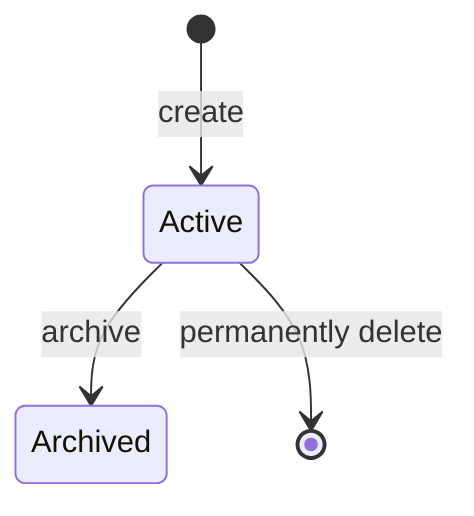
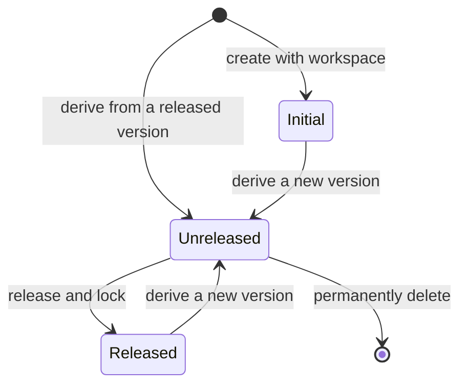
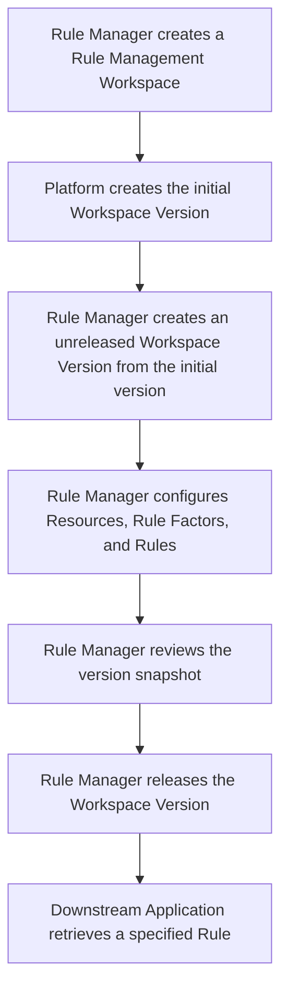
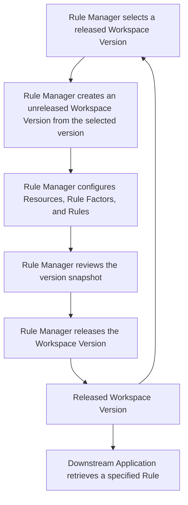

# Rule Management

## Goal

Enable Rule Managers to define, version, validate, and release governed rule snapshots, while allowing Downstream Applications to retrieve a specified Rule from a released Workspace Version.

## Actors and Use Cases

| Actor                  | Use cases                                                                                                   |
| :--------------------- | :---------------------------------------------------------------------------------------------------------- |
| Rule Manager           | Create, view, update, archive, and delete Rule Management Workspaces.                                       |
| Rule Manager           | View archived Rule Management Workspaces and their released Workspace Versions.                             |
| Rule Manager           | Create, view, update, and delete unreleased Workspace Versions within an active Rule Management Workspace.  |
| Rule Manager           | View released Workspace Versions within a Rule Management Workspace.                                        |
| Rule Manager           | Derive an unreleased Workspace Version from a selected released Workspace Version.                          |
| Rule Manager           | Create, view, update, and delete Resources, Rule Factors, and Rules within an unreleased Workspace Version. |
| Rule Manager           | Review the complete snapshot of an unreleased Workspace Version before release.                             |
| Rule Manager           | Release an unreleased Workspace Version.                                                                    |
| Downstream Application | [Retrieve a specified Rule from a released Workspace Version.](./user-case/retrieve-released-rule.md)       |

## Semantic Concepts

### Rule Management Workspace

#### Definition

A Rule Management boundary within which Workspace Versions are organized. It is distinct from the runtime rule workspace defined by the core specifications.

#### Data Model

```ts
interface WorkspaceMetadata {
  name: string;
  description: string;
}

type RuleManagementWorkspaceState = 'active' | 'archived';

interface RuleManagementWorkspace {
  identifier: string;
  metadata: WorkspaceMetadata;
  state: RuleManagementWorkspaceState;
  versions: WorkspaceVersion[];
}
```

- `identifier` is unique across active and archived Rule Management Workspaces.
- A workspace has required `name` metadata.
- A workspace `name` is non-empty text.
- A workspace `name` is unique across active and archived Rule Management Workspaces.
- A workspace `name` is at most 40 characters.
- A workspace has required `description` metadata.
- A workspace `description` is non-empty text.
- A workspace `description` is at most 120 characters.

#### State Transition



#### Constraints

**Static constraints**

- There may be at most 20 active Rule Management Workspaces; archived workspaces do not count toward this limit.
- An archived workspace belongs to the Archive Zone, whose behavior is outside the scope of this requirement.

**Behavioral constraints**

- A workspace identifier is read-only once created. The Rule Manager supplies workspace metadata on creation and may change it only while the workspace is active; an edit that duplicates a workspace name is refused.
- A workspace may be archived only after all unreleased Workspace Versions have been permanently deleted and it contains at least one non-initial released Workspace Version. Archiving is permanent and applies only to a Rule Management Workspace.
- Archiving neither changes nor makes unavailable Rules from released Workspace Versions. An archived workspace remains available to Downstream Applications, but its metadata, versions, and contents cannot be changed; neither content creation nor version release or deletion is permitted.
- An active workspace may be permanently deleted only when it has neither non-initial released Workspace Versions nor unreleased Workspace Versions.

### Workspace Version

#### Definition

An isolated line of change within a Rule Management Workspace. It contains version-local Resources, Rule Factors, and Rules. Actions within one Workspace Version do not affect another Workspace Version.

#### Data Model

```ts
type WorkspaceVersionState = 'initial' | 'unreleased' | 'released';

interface WorkspaceVersion {
  identifier: string;
  metadata: WorkspaceMetadata;
  state: WorkspaceVersionState;
  baseVersionIdentifier?: string;
  resources: WorkspaceResource[];
  ruleFactors: WorkspaceRuleFactor[];
  rules: WorkspaceRule[];
}
```

- `identifier` is unique within its Rule Management Workspace.
- `identifier` uses `MAJOR.MINOR.PATCH` semantic-version form.
- A Workspace Version has required `name` metadata.
- A Workspace Version `name` is non-empty text.
- A Workspace Version `name` is unique within its Rule Management Workspace.
- A Workspace Version `name` is at most 40 characters.
- A Workspace Version has required `description` metadata.
- A Workspace Version `description` is non-empty text.
- A Workspace Version `description` is at most 120 characters.

The initial Workspace Version has no base. Each subsequent Workspace Version has exactly one released base version and begins as that version's content snapshot.

#### State Transition



A transition from `Initial` or `Released` to `Unreleased` creates a new Workspace Version; it does not change the base version.

#### Constraints

**Static constraints**

- The initial Workspace Version is empty, read-only, and treated as released; it is available solely as the base for subsequent Workspace Versions and does not prevent deletion of a workspace with no non-initial released Workspace Versions.
- A Rule Management Workspace may have at most three unreleased Workspace Versions at one time. The initial Workspace Version does not count toward this limit.

**Behavioral constraints**

- The platform creates the initial Workspace Version when its Rule Management Workspace is created, using the identifier and metadata supplied by the Rule Manager.
- A subsequent Workspace Version may be created only from a released base. It inherits the base's Resources, Rule Factors, Rules, and their identifiers as initial content, but not the base metadata; subsequent changes do not affect the base.
- The Rule Manager supplies metadata and chooses an identifier for every subsequent Workspace Version. An identifier is read-only once created, and the platform validates its semantic-version format, uniqueness within the workspace, and, for a subsequent version, that it is strictly greater than its base identifier. No further major, minor, or patch validation applies; duplicate version-name edits are refused.
- Multiple unreleased Workspace Versions may be derived from the same released base. Each is validated only against its own base and may be released even if another version from that base has a higher identifier.
- The Rule Manager may view, change, or permanently delete an unreleased Workspace Version at any time. An unreleased version cannot be archived, and deleting it immediately frees an unreleased-version slot.

### Resource

#### Definition

The canonical resource association and semantics are owned by the [Rule Factor Definition](../baseline/rule-factor.md) specification. Rule Management owns a Resource's membership and lifecycle within one Workspace Version only.

#### Data Model

```ts
interface WorkspaceResource {
  identifier: string;
}
```

- `identifier` is unique among Resources in a Workspace Version.

A Resource belongs to one Workspace Version and may be used by multiple Rule Factors in that version.

#### Constraints

**Behavioral constraints**

- Creating, updating, or deleting a Resource must not leave an unsatisfied dependency; any action that would do so is refused.
- A Resource that is not used by a Rule may remain in the Workspace Version.

### Rule Factor

#### Definition

The canonical definition is owned by the [Rule Factor Definition](../baseline/rule-factor.md) specification. Rule Management owns a Rule Factor's membership and lifecycle within one Workspace Version only.

#### Data Model

```ts
interface WorkspaceRuleFactor {
  identifier: string;
  resourceIdentifier?: string;
}
```

- `identifier` is unique among Rule Factors in a Workspace Version.
- `resourceIdentifier`, when present, must identify an existing Resource in the same Workspace Version.

A Rule Factor belongs to one Workspace Version and may associate with a Resource in that same version.

#### Constraints

**Static constraints**

- Canonical Rule Factor constraints are strict at all times.

**Behavioral constraints**

- Every Atomic Rule must satisfy its Rule Factor's declared constraints when created or updated.
- Creating, updating, or deleting a Rule Factor must not leave an unsatisfied dependency or constraint; any action that would do so is refused.
- A Rule Factor that is not used by a Rule may remain in the Workspace Version.

### Rule

#### Definition

The canonical structure and semantics are owned by the [Rule Definition](../baseline/rule.md) specification. A Rule may contain multiple Atomic Rule Groups. Rule Management does not define how the groups' results are combined; rule selection and execution belong to the Downstream Application. Rule Management owns a Rule's membership and lifecycle within one Workspace Version only.

#### Data Model

```ts
interface WorkspaceRule {
  identifier: string;
  ruleFactorIdentifiers: string[];
}
```

- `identifier` is unique among Rules in a Workspace Version.
- Each `ruleFactorIdentifiers` value must identify an existing Rule Factor in the same Workspace Version.

A Rule belongs to one Workspace Version and may use multiple Rule Factors in that version.

#### Constraints

**Static constraints**

- Resource, Rule Factor, and Rule identifier spaces are independent.
- The same Rule Factor may be used by Atomic Rules in different Atomic Rule Groups of the same Rule.
- Identifier details are defined separately.

**Behavioral constraints**

- The Rule Manager may change a Resource, Rule Factor, or Rule identifier in an unreleased Workspace Version.
- After a Resource, Rule Factor, or Rule is removed from an unreleased Workspace Version, the Rule Manager may create an item of the same kind with that identifier.
- The Rule Manager may remove all Rules from an unreleased Workspace Version.
- A Workspace Version with no Rules cannot be released.

### Release

#### Definition

Release is the action that marks an unreleased Workspace Version as stable.

#### Data Model

```ts
interface ReleasedWorkspaceVersionSnapshot {
  workspaceIdentifier: string;
  versionIdentifier: string;
  content: WorkspaceVersion;
}
```

A release identifies the complete snapshot of the Workspace Version, including its Resources, Rule Factors, and Rules.

#### Constraints

**Static constraints**

- A Workspace Version must contain at least one Rule before it can be released.
- Before release, a Workspace Version must contain every Rule Factor required by its Rules, and each Rule must contain at least one non-empty Atomic Rule Group.
- A derived Workspace Version's final Rule set must differ from its base version's final Rule set; a Rule Factor change alone does not change a final Rule definition.
- Release is one-time and irreversible. A locked Workspace Version cannot be modified or permanently deleted.

**Behavioral constraints**

- Adding, removing, or changing a final Rule satisfies the derived-version release-difference requirement. Changing only workspace metadata, Workspace Version metadata, internal Resources, or internal Rule Factors does not.
- Releasing locks the complete Workspace Version snapshot and immediately makes its Rules available for downstream retrieval. The platform does not notify Downstream Applications.

### Rule Retrieval

#### Definition

The interaction in which a Downstream Application requests one specified Rule from a released Workspace Version. Retrieval returns the final Rule definition.

#### Data Model

```ts
interface RuleRetrievalRequest {
  workspaceIdentifier: string;
  versionIdentifier: string;
  ruleIdentifier: string;
}
```

#### Constraints

**Behavioral constraints**

- A retrieval request that does not identify a Rule in a released Workspace Version results in a simple unavailable exception.

## Workflow

### Initial Workflow



### Iteration Workflow


