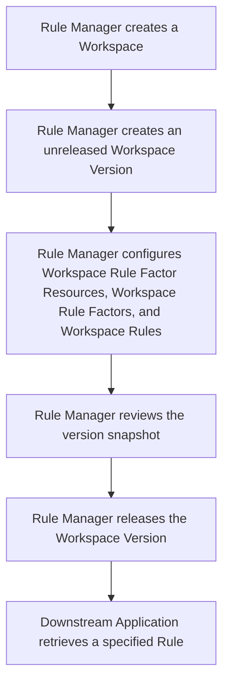
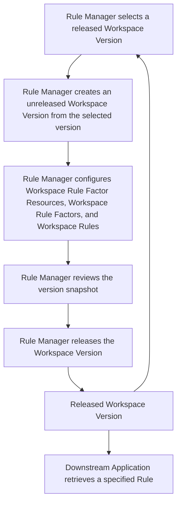

# Workspace Rule Management

## Goal

Enable Rule Managers to define, version, validate, and release governed rule snapshots, while allowing Downstream Applications to retrieve a specified Rule from a released Workspace Version.

## Actors and Use Cases

### Rule Manager

---

- [Create a Workspace](./use-case/create-rule-workspace.md)
- [View an Active Workspace](./use-case/view-rule-workspace.md)
- [View an Archived Workspace](./use-case/view-archived-rule-workspace.md)
- [Update a Workspace](./use-case/update-rule-workspace.md)
- [Archive a Workspace](./use-case/archive-rule-workspace.md)
- [Delete a Workspace](./use-case/delete-rule-workspace.md)

---

- [Create an Unreleased Workspace Version](./use-case/create-unreleased-workspace-version.md)
- [View an Unreleased Workspace Version](./use-case/view-unreleased-workspace-version.md)
- [Update an Unreleased Workspace Version](./use-case/update-unreleased-workspace-version.md)
- [Delete an Unreleased Workspace Version](./use-case/delete-unreleased-workspace-version.md)
- [View a Released Workspace Version](./use-case/view-released-workspace-version.md)
- [Derive an Unreleased Workspace Version](./use-case/derive-workspace-version.md)
- [Review an Unreleased Workspace Version](./use-case/review-unreleased-workspace-version.md)
- [Release an Unreleased Workspace Version](./use-case/release-workspace-version.md)

---

- [Create a Workspace Rule Factor Resource](./use-case/create-resource.md)
- [View a Workspace Rule Factor Resource](./use-case/view-resource.md)
- [Update a Workspace Rule Factor Resource](./use-case/update-resource.md)
- [Delete a Workspace Rule Factor Resource](./use-case/delete-resource.md)

---

- [Create a Workspace Rule Factor](./use-case/create-rule-factor.md)
- [View a Workspace Rule Factor](./use-case/view-rule-factor.md)
- [Update a Workspace Rule Factor](./use-case/update-rule-factor.md)
- [Delete a Workspace Rule Factor](./use-case/delete-rule-factor.md)

---

- [Create a Workspace Rule](./use-case/create-rule.md)
- [View a Workspace Rule](./use-case/view-rule.md)
- [Update a Workspace Rule](./use-case/update-rule.md)
- [Delete a Workspace Rule](./use-case/delete-rule.md)

---

### Downstream Application

- [Retrieve a Rule from a Released Workspace Version](./use-case/retrieve-rule-from-released-workspace-version.md)

## Semantic Concepts

Each concept has one canonical definition in the [glossary](./glossary/).

- [Workspace](./glossary/workspace.md)
- [Workspace Version](./glossary/workspace-version.md)
- [Workspace Rule Factor Resource](./glossary/workspace-rule-factor-resource.md)
- [Workspace Rule Factor](./glossary/workspace-rule-factor.md)
- [Workspace Rule](./glossary/workspace-rule.md)
- [Workspace Release](./glossary/workspace-release.md)
- [Rule Retrieval Beacon](./glossary/rule-retrieval-beacon.md)

For the classified relationships among these concepts, see

## Semantic Concepts Relationship

- [Concept Relationships](./relationships.md).

## Workflow

### First-Version Workflow

### Iteration Workflow

