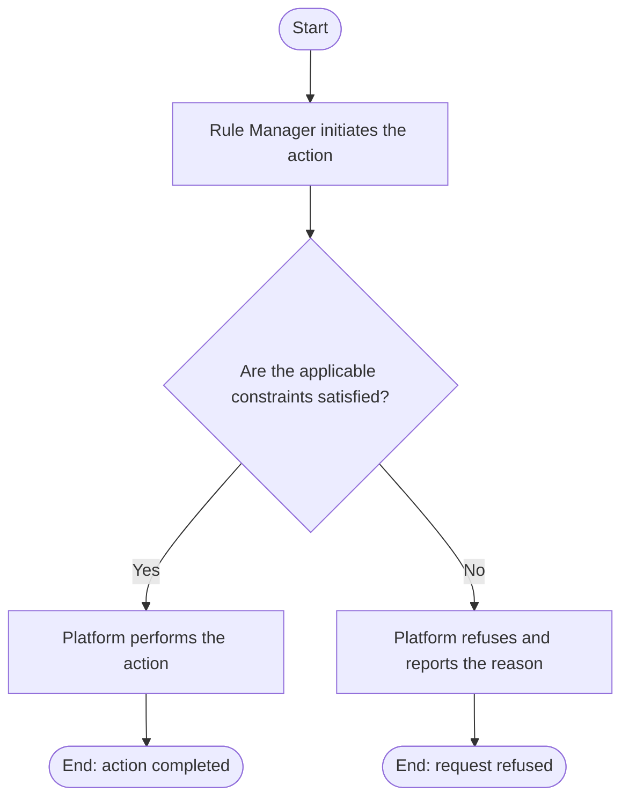

# Use Case Specification: Archive a Rule Workspace

## Revision History

| Date       | Version | Description                 | Author |
| :--------- | :------ | :-------------------------- | :----- |
| 2026-09-17 | 1.0     | Initial use-case definition | Codex  |

## 1. Use-Case Name

Archive a Rule Workspace.

## 2. Brief Description

A Rule Manager permanently archives an active Rule Workspace. The relevant concepts and constraints are defined in the [Rule requirement](../requirement.md).

## 3. Preconditions

- The specified Rule Workspace exists and is active.
- The workspace has no unreleased Workspace Versions and at least one non-initial released Workspace Version.

## 4. Postconditions

- On success, the workspace is permanently archived; released Rules remain retrievable but no workspace metadata, version, or content can change.

## 5. Flow of Events

### 5.1 Basic Flow

1. The manager requests archival.
2. The platform confirms that all unreleased versions have been deleted.
3. The platform confirms at least one non-initial released version exists.
4. The platform changes the workspace state to archived.

### 5.2 Alternative Flows

None.

### 5.3 Exception Flows

#### 5.3.1 Archival preconditions not met

The platform refuses archival when an unreleased version exists or no non-initial released version exists.

#### 5.3.2 Workspace not active

The platform refuses the request for an absent or already archived workspace.

## 6. Special Requirements

None.

## 7. Extension Points

None.
