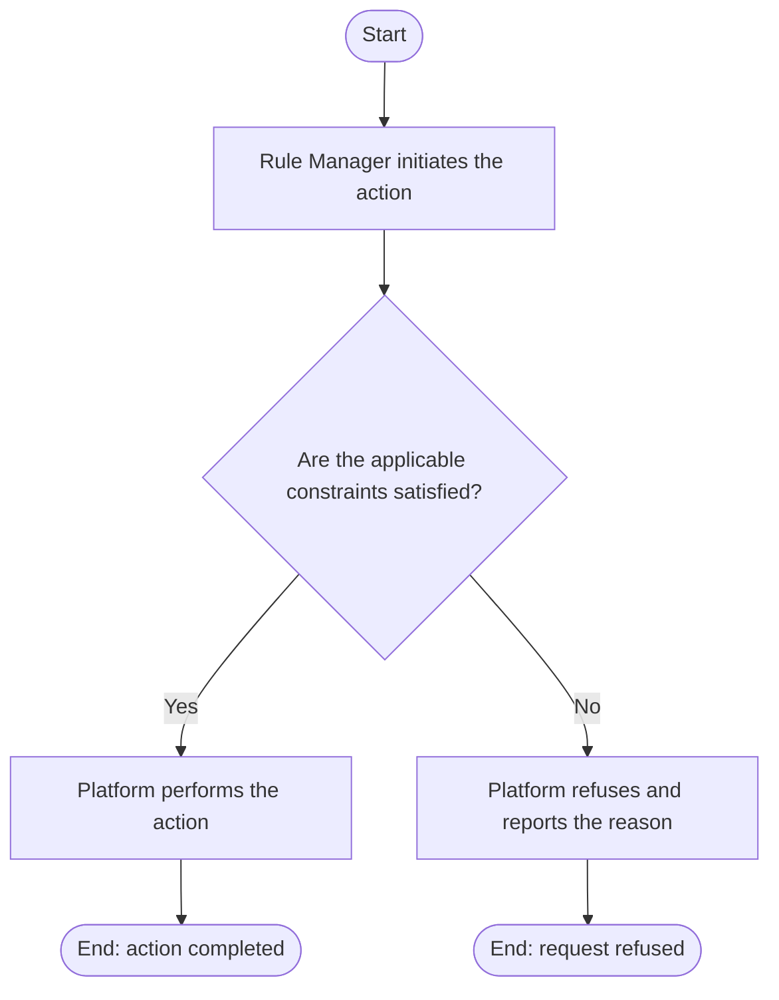

# Use Case Specification: Create a Rule Factor

## Revision History

| Date       | Version | Description                 | Author |
| :--------- | :------ | :-------------------------- | :----- |
| 2026-09-17 | 1.0     | Initial use-case definition | Codex  |

## 1. Use-Case Name

Create a Rule Factor.

## 2. Brief Description

A Rule Manager creates a version-local Rule Factor in an unreleased Workspace Version. The relevant concepts and constraints are defined in the [Rule requirement](../requirement.md).

## 3. Preconditions

The required target exists in the required lifecycle state stated by this use case.

## 4. Postconditions

- On success, the Rule Factor exists with its immutable identifier and satisfies applicable managed-definition constraints.
- The platform changes no state beyond that described above.

## 5. Flow of Events

### 5.1 Basic Flow

1. The manager submits a Rule Factor identifier and definition.
2. The platform finds the target unreleased version.
3. The platform validates identifier uniqueness and Rule Factor-specific definition constraints.
4. The platform adds the Rule Factor.

### 5.2 Alternative Flows

None.

### 5.3 Exception Flows

#### 5.3.1 Version not editable

The platform refuses the request when the workspace is archived or the version is absent, initial, or released.

#### 5.3.2 Invalid Rule Factor definition

The platform refuses an identifier collision or invalid definition. A Rule Factor definition must produce a valid Rule Factor projection.

## 6. Special Requirements

None.

## 7. Extension Points

None.
