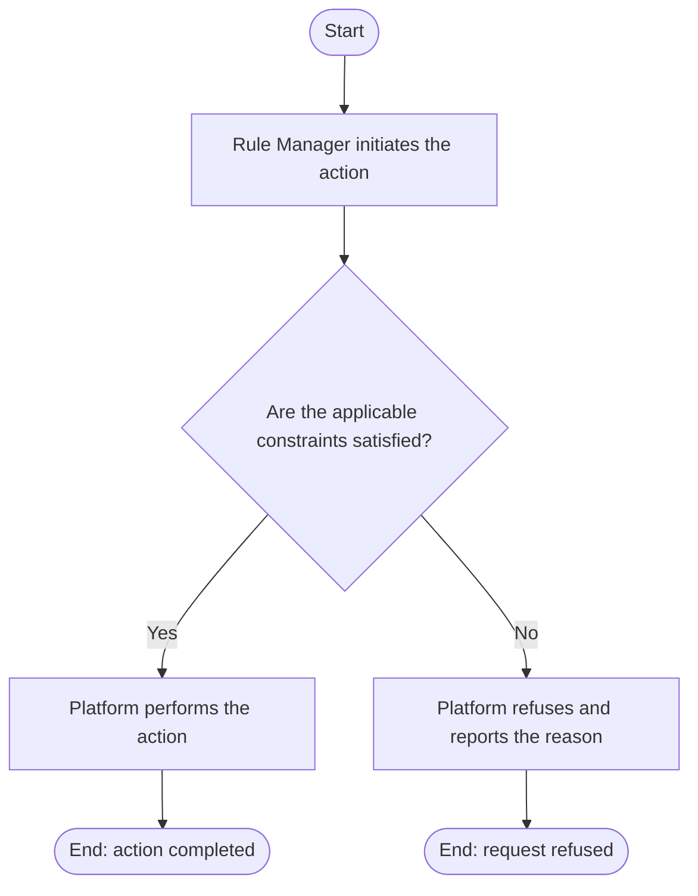

# Use Case Specification: Create a Rule Workspace

## Revision History

| Date       | Version | Description                 | Author |
| :--------- | :------ | :-------------------------- | :----- |
| 2026-09-17 | 1.0     | Initial use-case definition | Codex  |

## 1. Use-Case Name

Create a Rule Workspace.

## 2. Brief Description

A Rule Manager creates an active Rule Workspace and supplies its metadata and the initial version identifier and metadata. The relevant concepts and constraints are defined in the [Rule requirement](../requirement.md).

## 3. Preconditions

Fewer than 20 active Rule Workspaces exist.

## 4. Postconditions

- On success, an active Rule Workspace and its empty, read-only initial Workspace Version exist; the active-workspace limit is respected.

## 5. Flow of Events

### 5.1 Basic Flow

1. The manager submits the workspace and initial-version data.
2. The platform validates required non-empty, length-limited metadata and unique workspace name and identifier.
3. The platform confirms that fewer than 20 active workspaces exist.
4. The platform creates the workspace and its initial version.

### 5.2 Alternative Flows

None.

### 5.3 Exception Flows

#### 5.3.1 Invalid or duplicate workspace data

The platform refuses metadata or identifiers that violate the stated constraints.

#### 5.3.2 Active workspace limit reached

The platform refuses the request when 20 active workspaces already exist.

## 6. Special Requirements

None.

## 7. Extension Points

None.
