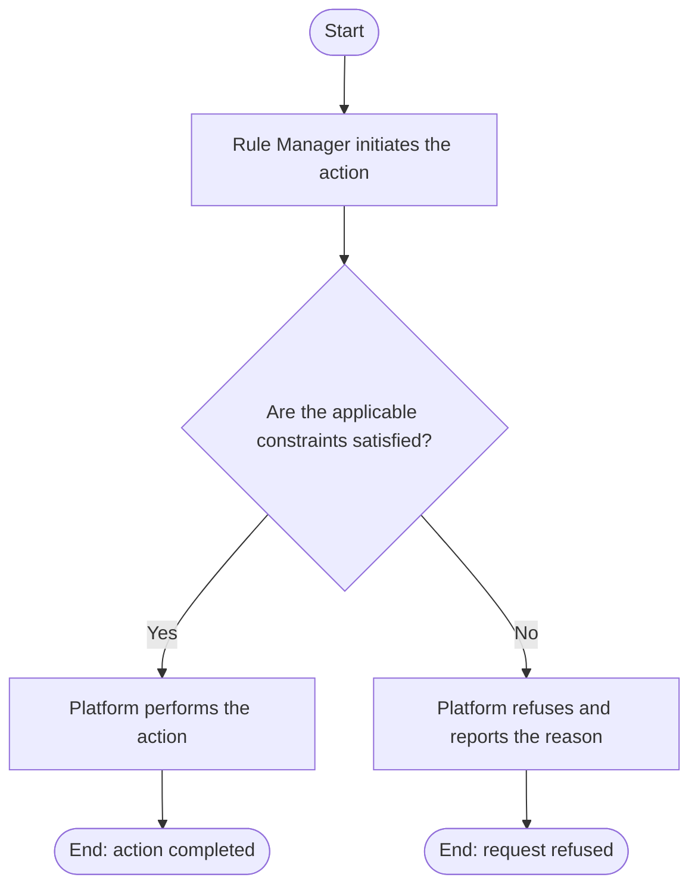

# Use Case Specification: Create an Unreleased Workspace Version

## Revision History

| Date       | Version | Description                 | Author |
| :--------- | :------ | :-------------------------- | :----- |
| 2026-09-18 | 1.0     | Initial use-case definition | Codex  |

## 1. Use-Case Name

Create an Unreleased Workspace Version.

## 2. Brief Description

A Rule Manager creates an empty unreleased Workspace Version in an active Rule Workspace. The relevant concepts and constraints are defined in the [Workspace Version glossary entry](../glossary/workspace-version.md).

## 3. Preconditions

- The specified Rule Workspace exists and is active.
- Fewer than three unreleased Workspace Versions exist in that workspace.

## 4. Postconditions

- On success, an empty unreleased Workspace Version with no base version exists in the workspace.

## 5. Business Rules

- The Rule Manager supplies the new version identifier and metadata. Its identifier must have semantic-version form and be unique within the workspace.
- The platform creates no Resources, Rule Factors, or Rules with the version.

## 6. Flow of Events

### 6.1 Basic Flow

## 7. Special Requirements

None.

## 8. Extension Points

None.
