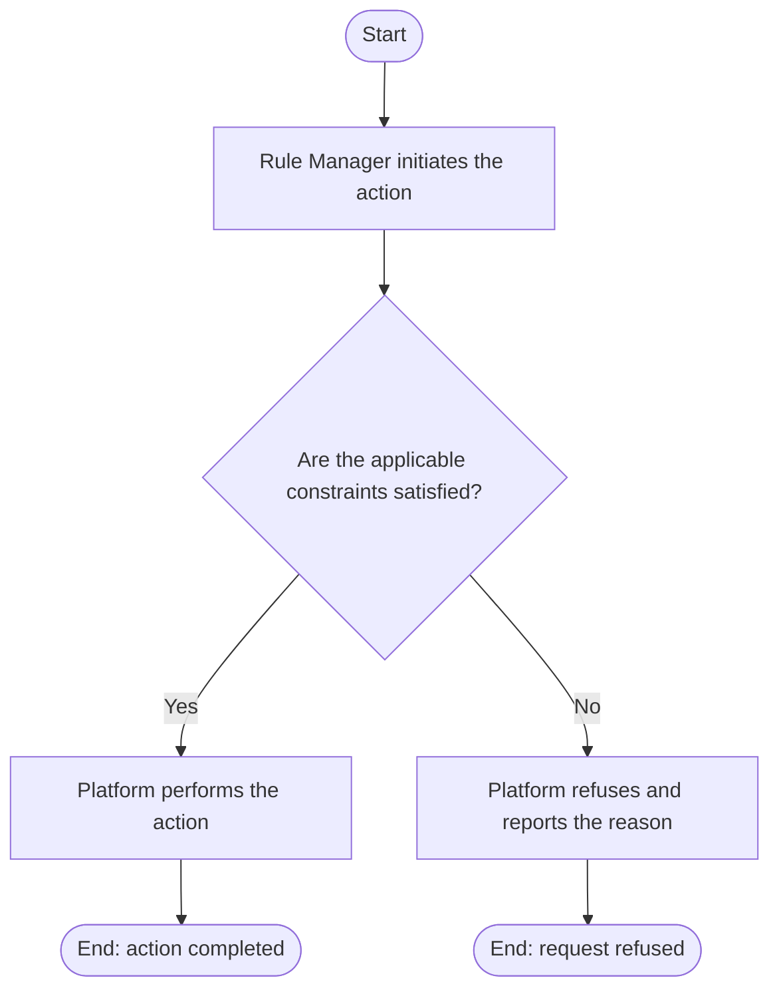

# Use Case Specification: Delete a Workspace Rule Factor Resource

## Revision History

| Date       | Version | Description                 | Author |
| :--------- | :------ | :-------------------------- | :----- |
| 2026-09-17 | 1.0     | Initial use-case definition | Codex  |

## 1. Use-Case Name

Delete a Workspace Rule Factor Resource.

## 2. Brief Description

A Rule Manager permanently deletes a version-local Workspace Rule Factor
Resource from an unreleased Workspace Version. The relevant concepts and
constraints are defined in the [Workspace Rule Factor Resource glossary entry](../glossary/workspace-rule-factor-resource.md).

## 3. Preconditions

- The specified Workspace exists and is active, and the target Workspace Version exists in that workspace and is unreleased.
- The specified Workspace Rule Factor Resource exists in that Workspace Version.

## 4. Postconditions

- On success, the Workspace Rule Factor Resource no longer exists, and the
  manager may create a Workspace Rule Factor Resource with the deleted
  identifier. Workspace Rule Factors and Workspace Rules remain unchanged.

## 5. Business Rules

- A Workspace Rule Factor Resource deletion is refused when it would leave a
  Workspace Rule Factor with an unsatisfied resource association.
- Deleting a Workspace Rule Factor Resource does not modify Workspace Rule
  Factors or Workspace Rules.

## 6. Flow of Events

### 6.1 Basic Flow

## 7. Special Requirements

None.

## 8. Extension Points

None.
