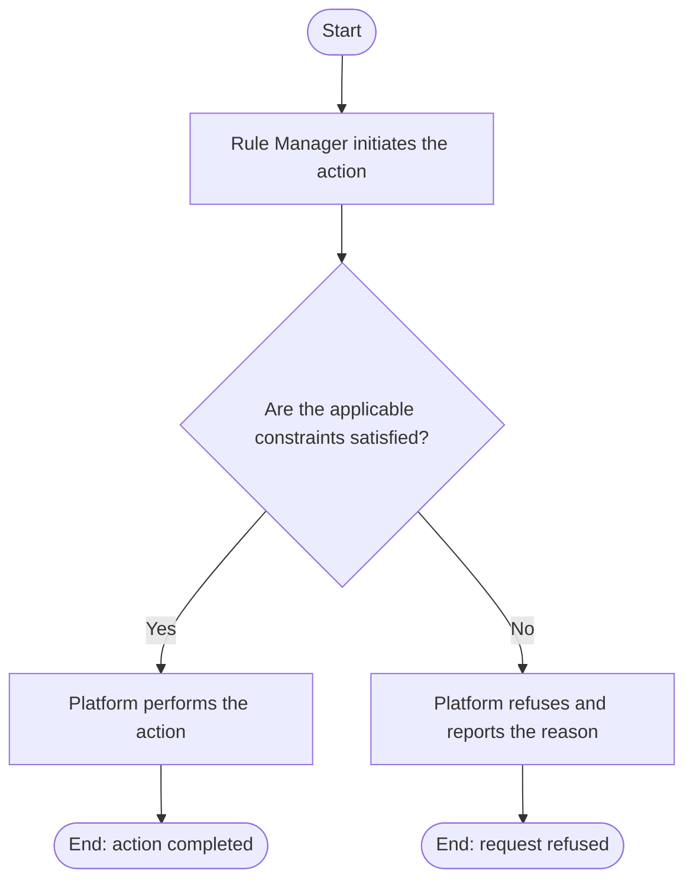

# Use Case Specification: Delete a Rule Factor

## Revision History

| Date       | Version | Description                 | Author |
| :--------- | :------ | :-------------------------- | :----- |
| 2026-09-17 | 1.0     | Initial use-case definition | Codex  |

## 1. Use-Case Name

Delete a Rule Factor.

## 2. Brief Description

A Rule Manager permanently deletes a version-local Rule Factor from an unreleased Workspace Version. The relevant concepts and constraints are defined in the [Rule requirement](../requirement.md).

## 3. Preconditions

- The specified Rule Workspace exists and is active, and the target Workspace Version exists in that workspace and is unreleased.
- The specified Rule Factor exists in that Workspace Version.

## 4. Postconditions

- On success, the Rule Factor no longer exists, and the manager may create a Rule Factor with the deleted identifier. Rules containing Atomic Rules previously configured from it remain unchanged.

## 5. Business Rules

- A Rule Factor may be deleted after the Rule Setter consumed it because the resulting Atomic Rules do not retain a managed Rule Factor reference.
- Deleting a Rule Factor does not change Atomic Rules previously configured from it.

## 6. Flow of Events

### 6.1 Basic Flow

## 7. Special Requirements

None.

## 8. Extension Points

None.
