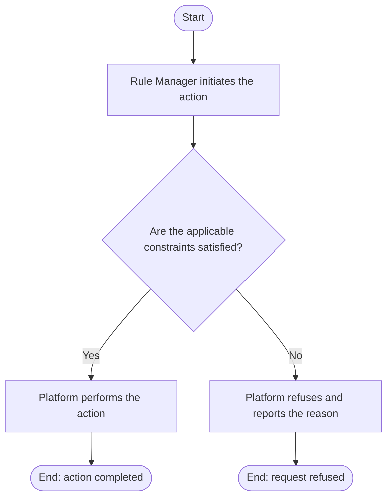

# Use Case Specification: Delete a Rule Workspace

## Revision History

| Date       | Version | Description                 | Author |
| :--------- | :------ | :-------------------------- | :----- |
| 2026-09-17 | 1.0     | Initial use-case definition | Codex  |

## 1. Use-Case Name

Delete a Rule Workspace.

## 2. Brief Description

A Rule Manager permanently deletes an active Rule Workspace with no protected version history. The relevant concepts and constraints are defined in the [Rule requirement](../requirement.md).

## 3. Preconditions

- The specified Rule Workspace exists and is active.
- The workspace has no non-initial released Workspace Versions and no unreleased Workspace Versions.

## 4. Postconditions

- On success, the workspace and its initial Workspace Version no longer exist.

## 5. Flow of Events

### 5.1 Basic Flow

1. The manager requests permanent deletion.
2. The platform confirms that no unreleased version exists.
3. The platform confirms that no non-initial released version exists.
4. The platform permanently deletes the workspace.

### 5.2 Alternative Flows

None.

### 5.3 Exception Flows

#### 5.3.1 Deletion preconditions not met

The platform refuses deletion when an unreleased or non-initial released version exists.

#### 5.3.2 Workspace not active

The platform refuses the request for an absent or archived workspace.

## 6. Special Requirements

None.

## 7. Extension Points

None.
