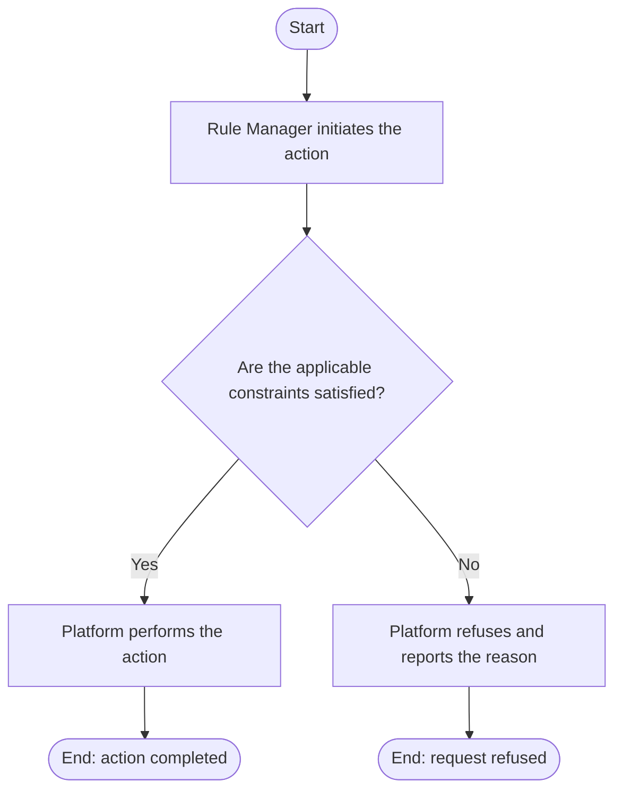

# Use Case Specification: Delete a Workspace Rule

## Revision History

| Date       | Version | Description                 | Author |
| :--------- | :------ | :-------------------------- | :----- |
| 2026-09-17 | 1.0     | Initial use-case definition | Codex  |

## 1. Use-Case Name

Delete a Workspace Rule.

## 2. Brief Description

A Rule Manager permanently deletes a version-local Workspace Rule from an
unreleased Workspace Version. The relevant concepts and constraints are defined
in the [Workspace Rule glossary entry](../glossary/workspace-rule.md).

## 3. Preconditions

- The specified Workspace exists and is active, and the target Workspace Version exists in that workspace and is unreleased.
- The specified Workspace Rule exists in that Workspace Version.

## 4. Postconditions

- On success, the Workspace Rule no longer exists, and the manager may create a
  Workspace Rule with the deleted identifier. This use case may remove the last
  Workspace Rule in the version.

## 5. Business Rules

- A Workspace Rule deletion may remove the last Workspace Rule in an unreleased
  Workspace Version.
- A deleted Workspace Rule identifier may be used again in that version.

## 6. Flow of Events

### 6.1 Basic Flow

## 7. Special Requirements

None.

## 8. Extension Points

None.
