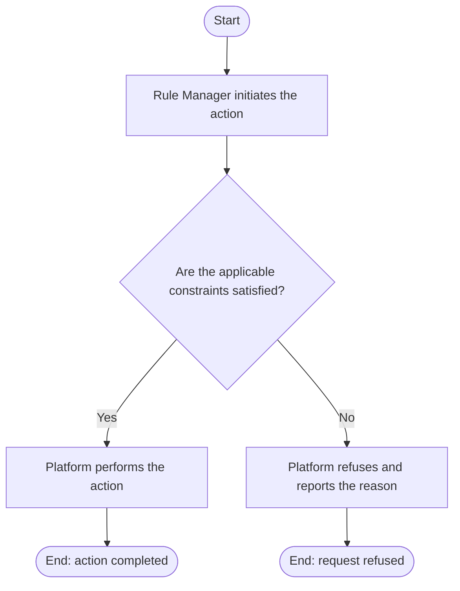

# Use Case Specification: Delete an Unreleased Workspace Version

## Revision History

| Date       | Version | Description                 | Author |
| :--------- | :------ | :-------------------------- | :----- |
| 2026-09-17 | 1.0     | Initial use-case definition | Codex  |

## 1. Use-Case Name

Delete an Unreleased Workspace Version.

## 2. Brief Description

A Rule Manager permanently deletes an unreleased Workspace Version from an active Rule Workspace. The relevant concepts and constraints are defined in the [Rule requirement](../requirement.md).

## 3. Preconditions

The required target exists in the required lifecycle state stated by this use case.

## 4. Postconditions

- On success, the version and its version-local content no longer exist; an unreleased-version slot is immediately available.
- The platform changes no state beyond that described above.

## 5. Flow of Events

### 5.1 Basic Flow

1. The manager requests deletion.
2. The platform finds the unreleased version in the active workspace.
3. The platform permanently deletes the version and its content.

### 5.2 Alternative Flows

None.

### 5.3 Exception Flows

#### 5.3.1 Version not deletable

The platform refuses deletion when the workspace is archived or the version is absent, initial, or released.

## 6. Special Requirements

None.

## 7. Extension Points

None.
