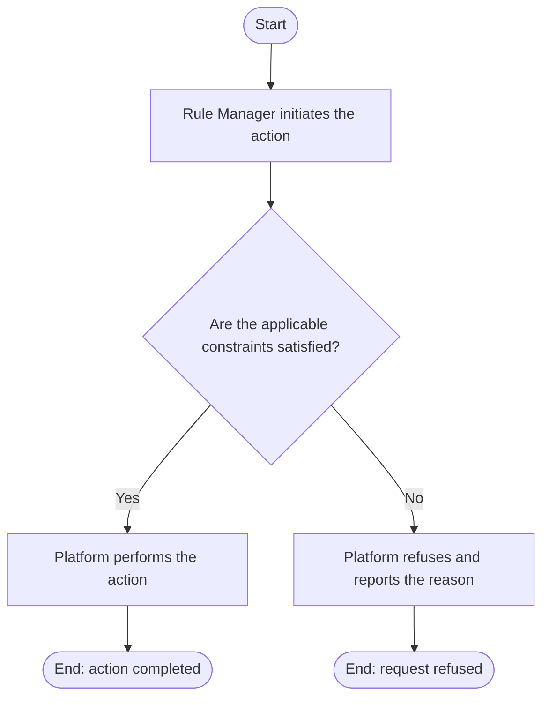

# Use Case Specification: Derive an Unreleased Workspace Version

## Revision History

| Date       | Version | Description                 | Author |
| :--------- | :------ | :-------------------------- | :----- |
| 2026-09-17 | 1.0     | Initial use-case definition | Codex  |

## 1. Use-Case Name

Derive an Unreleased Workspace Version.

## 2. Brief Description

A Rule Manager derives a new unreleased Workspace Version from a selected released base in an active Rule Workspace. The relevant concepts and constraints are defined in the [Workspace Version glossary entry](../glossary/workspace-version.md).

## 3. Preconditions

- The specified Rule Workspace exists and is active.
- The selected base Workspace Version exists in that workspace and is released.
- Fewer than three unreleased Workspace Versions exist in that workspace.

## 4. Postconditions

- On success, a new unreleased version stores the selected base identifier, the submitted metadata, and an independent copy of the base Resources, Rule Factors, Rules, and identifiers; the base remains unchanged.

## 5. Business Rules

- A subsequent Workspace Version is created only from a released base in the same active workspace.
- The new version copies the base Resources, Rule Factors, Rules, and identifiers but not its metadata; later changes do not affect the base.
- The Rule Manager supplies the new version identifier and metadata. Its identifier must have semantic-version form, be unique within the workspace, and be strictly greater than the selected base; no other semantic-version ordering is required.
- Multiple unreleased versions may share a released base. Each is assessed only against its own base.

## 6. Flow of Events

### 6.1 Basic Flow

## 7. Special Requirements

None.

## 8. Extension Points

None.
