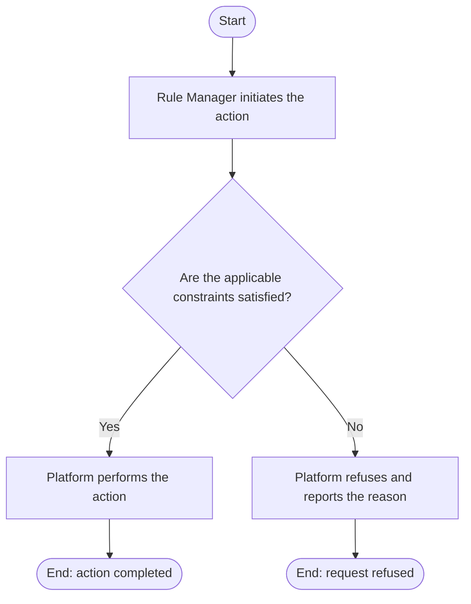

# Use Case Specification: Release an Unreleased Workspace Version

## Revision History

| Date       | Version | Description                 | Author |
| :--------- | :------ | :-------------------------- | :----- |
| 2026-09-17 | 1.0     | Initial use-case definition | Codex  |

## 1. Use-Case Name

Release an Unreleased Workspace Version.

## 2. Brief Description

A Rule Manager releases and locks an unreleased Workspace Version as a stable snapshot. The relevant concepts and constraints are defined in the [Release glossary entry](../glossary/release.md).

## 3. Preconditions

- The specified Rule Workspace exists and is active, and the specified Workspace Version exists in that workspace and is unreleased.
- The version contains at least one Rule; every Resource and Rule Factor projection is valid and resolvable; and every Rule contains at least one non-empty Atomic Rule Group that satisfies the canonical Rule Definition constraints.
- If the version is derived, its final Rule set differs from that of its base Workspace Version.

## 4. Postconditions

- On success, the version is permanently released and locked; its Rules are available downstream; no downstream notification is sent.

## 5. Business Rules

- A final Rule added, removed, or changed from the base satisfies the derived-version difference requirement. Metadata, Resource, and Rule Factor changes alone do not.
- Release locks the complete Workspace Version snapshot, is irreversible, and immediately makes its Rules available for downstream retrieval without notification.
- A sibling version with a higher identifier does not prevent release; each version is compared only with its own base.

## 6. Flow of Events

### 6.1 Basic Flow

## 7. Special Requirements

None.

## 8. Extension Points

None.
