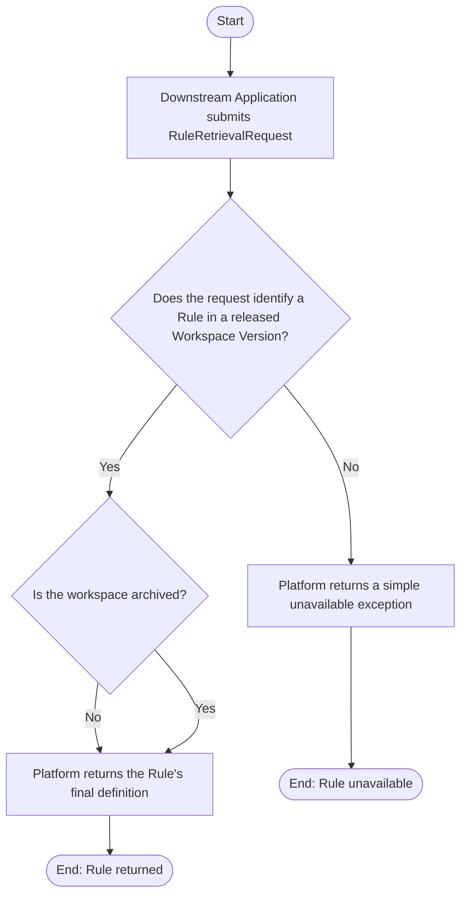

# Use Case Specification: Retrieve a Released Rule

Version 1.0

## Revision History

| Date       | Version | Description                 | Author |
| :--------- | :------ | :-------------------------- | :----- |
| 2026-09-15 | 1.0     | Initial use-case definition | Codex  |

## 1. Use-Case Name

Retrieve a Released Rule.

### 1.1 Brief Description

A Downstream Application obtains the final definition of one Rule from a specified released Workspace Version. The canonical request shape and retrieval constraints are defined in the [Rule requirement](../requirement.md#rule-retrieval).

```ts
import { RuleRetrievalRequest } from '../requirement.md';
```

The Downstream Application initiates this use case by submitting a `RuleRetrievalRequest` containing the Rule Workspace identifier, Workspace Version identifier, and Rule identifier.

## 2. Flow of Events

### 2.1 Basic Flow



1. The Downstream Application submits the `RuleRetrievalRequest`.
2. The platform finds the specified Rule in the specified released Workspace Version.
3. The platform returns the Rule's final definition.

### 2.2 Alternative Flows

#### 2.2.1 Archived Workspace

At step 2, the specified Rule Workspace is archived. If the specified Rule exists in the released Workspace Version, the platform resumes at step 3. Archival does not make the Rule unavailable.

#### 2.2.2 Unavailable Rule

At step 2, the request does not identify a Rule in a released Workspace Version. The platform returns a simple unavailable exception, and the use case ends.

## 3. Special Requirements

None.

## 4. Preconditions

None.

## 5. Postconditions

- On success, the Downstream Application has the final definition of the specified Rule.
- Retrieval does not change the Rule Workspace, Workspace Version, or Rule.

## 6. Extension Points

None.
