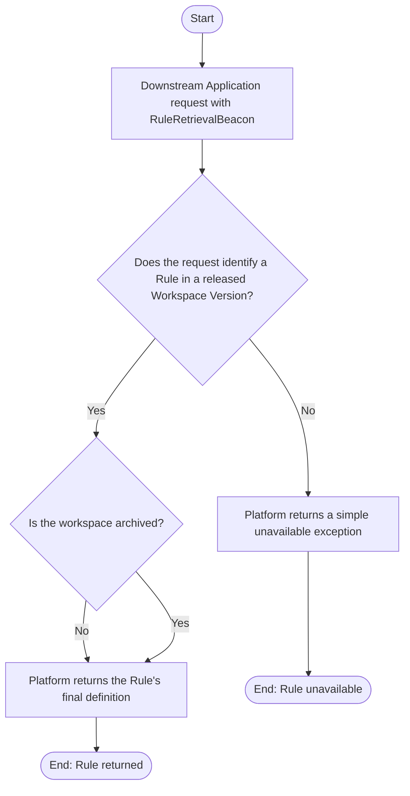

# Use Case Specification: Retrieve a Rule from a Released Workspace Version

## Revision History

| Date       | Version | Description                 | Author |
| :--------- | :------ | :-------------------------- | :----- |
| 2026-09-15 | 1.0     | Initial use-case definition | Codex  |

## 1. Use-Case Name

Retrieve a Rule from a Released Workspace Version.

## 2. Brief Description

A Downstream Application obtains the final definition of one Rule from a specified released Workspace Version.

## 3. Preconditions

None.

## 4. Postconditions

- On success, the Downstream Application has the final definition of the specified Rule; no managed definitions change.

## 5. Business Rules

- A Rule remains retrievable from a released Workspace Version after its workspace is archived.

## 6. Flow of Events

- The Downstream Application must provide [RuleRetrievalBeacon](../glossary/rule-retrieval-beacon.md)

## 7. Special Requirements

None.

## 8. Extension Points

None.
