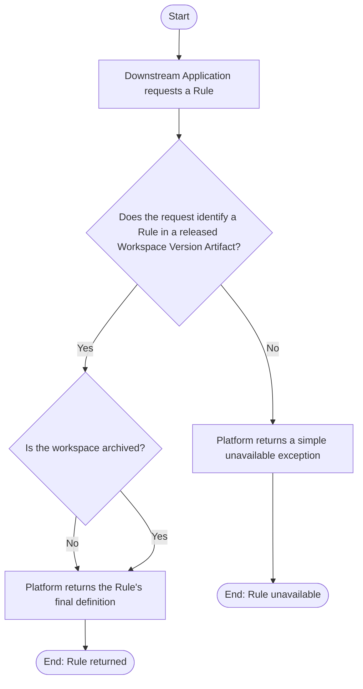

# Use Case Specification: Retrieve a Rule from a Released Workspace Version

## Revision History

| Date       | Version | Description                 | Author |
| :--------- | :------ | :-------------------------- | :----- |
| 2026-09-15 | 1.0     | Initial use-case definition | Codex  |

## 1. Use-Case Name

Retrieve a Rule from a Released Workspace Version.

## 2. Brief Description

A Downstream Application obtains the final definition of one Rule from the
Workspace Version Artifact produced by a specified released Workspace Version.

## 3. Preconditions

None.

## 4. Postconditions

- On success, the Downstream Application has the final definition of the specified Rule; no managed definitions change.

## 5. Flow of Events

```mermaid
flowchart TD
    start([Start]) --> submit[Downstream Application requests a Rule]
    submit --> available{Does the request identify a Rule in a released Workspace Version Artifact?}
    available -->|Yes| archived{Is the workspace archived?}
    archived -->|No| returnRule[Platform returns the Rule's final definition]
    archived -->|Yes| returnRule
    returnRule --> endSuccess([End: Rule returned])

    available -->|No| unavailable[Platform returns a simple unavailable exception]
    unavailable --> endUnavailable([End: Rule unavailable])
```

## 6. Special Requirements

None.

## 7. Extension Points

None.

## 8. Business Rules

- A Rule remains retrievable from a Workspace Version Artifact after its source workspace is archived.
