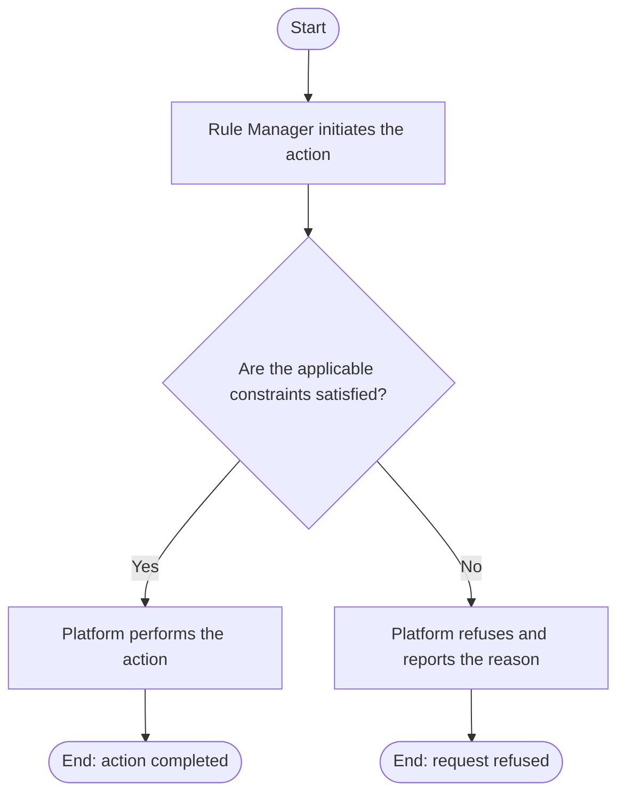

# Use Case Specification: Review an Unreleased Workspace Version

## Revision History

| Date       | Version | Description                 | Author |
| :--------- | :------ | :-------------------------- | :----- |
| 2026-09-17 | 1.0     | Initial use-case definition | Codex  |

## 1. Use-Case Name

Review an Unreleased Workspace Version.

## 2. Brief Description

A Rule Manager reviews the complete snapshot of an unreleased Workspace Version before release. The relevant concepts and constraints are defined in the [Rule requirement](../requirement.md).

## 3. Preconditions

The specified Rule Workspace exists and is active, and the specified Workspace Version exists in that workspace and is unreleased.

## 4. Postconditions

- On success, the manager has the complete snapshot and release-readiness findings; the version remains unreleased and unchanged.

## 5. Flow of Events

### 5.1 Basic Flow

1. The manager requests review.
2. The platform obtains the complete Resources, Rule Factors, and Rules snapshot.
3. The platform evaluates release constraints.
4. The platform returns the snapshot and findings.

### 5.2 Alternative Flows

None.

### 5.3 Exception Flows

#### 5.3.1 Version not reviewable

The platform reports it unavailable for review when the workspace is archived or the version is absent, initial, or released.

## 6. Special Requirements

None.

## 7. Extension Points

None.
