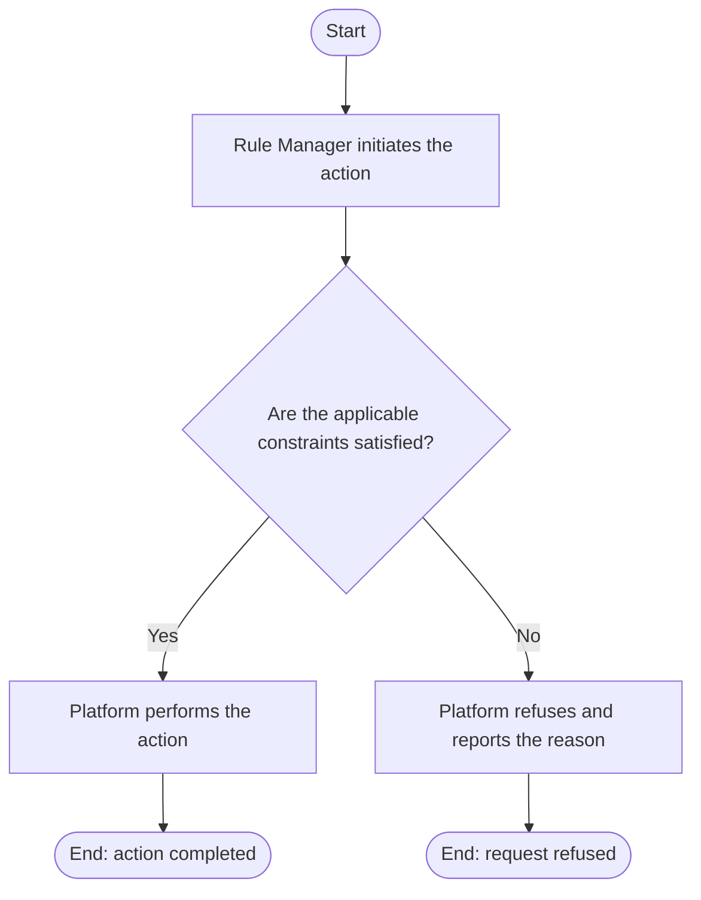

# Use Case Specification: Update a Rule Factor

## Revision History

| Date       | Version | Description                 | Author |
| :--------- | :------ | :-------------------------- | :----- |
| 2026-09-17 | 1.0     | Initial use-case definition | Codex  |

## 1. Use-Case Name

Update a Rule Factor.

## 2. Brief Description

A Rule Manager changes a version-local Rule Factor in an unreleased Workspace Version. The relevant concepts and constraints are defined in the [Rule requirement](../requirement.md).

## 3. Preconditions

- The specified Rule Workspace exists and is active, and the target Workspace Version exists in that workspace and is unreleased.
- The specified Rule Factor exists in that Workspace Version.

## 4. Postconditions

- On success, the Rule Factor stores the validated replacement definition; its identifier remains unchanged.

## 5. Flow of Events

### 5.1 Basic Flow

1. The manager submits a replacement Rule Factor definition.
2. The platform finds the target Rule Factor in the unreleased version.
3. The platform validates the replacement against all applicable constraints.
4. The platform updates the Rule Factor.

### 5.2 Alternative Flows

None.

### 5.3 Exception Flows

#### 5.3.1 Version not editable

The platform refuses the request when the workspace is archived or the version is absent, initial, or released.

#### 5.3.2 Invalid Rule Factor update

The platform refuses an invalid replacement. A Rule Factor definition must produce a valid Rule Factor projection.

## 6. Special Requirements

None.

## 7. Extension Points

None.
