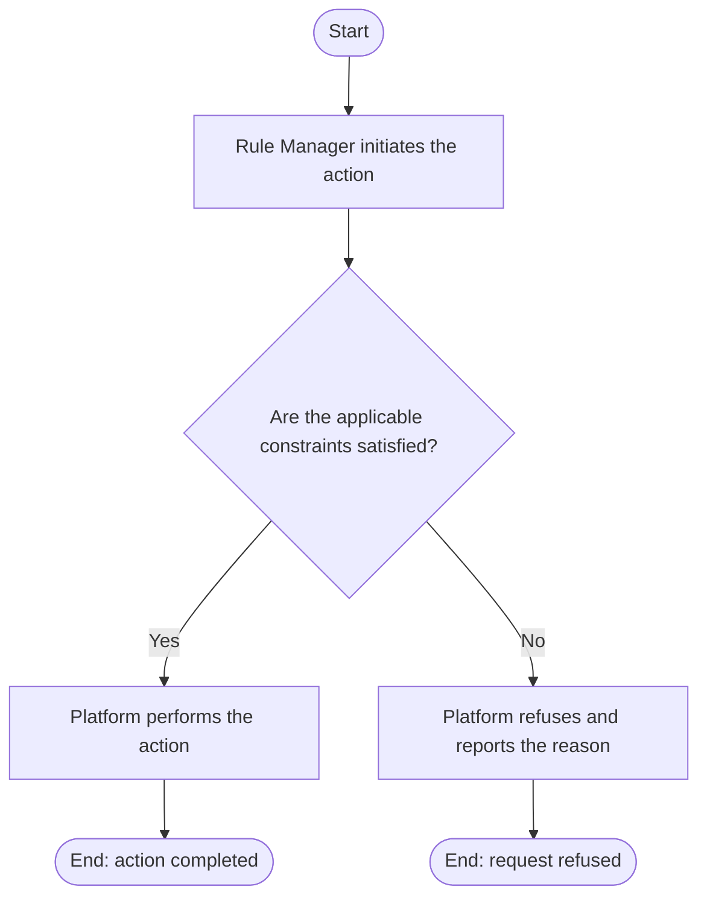

# Use Case Specification: Update a Rule Workspace

## Revision History

| Date       | Version | Description                 | Author |
| :--------- | :------ | :-------------------------- | :----- |
| 2026-09-17 | 1.0     | Initial use-case definition | Codex  |

## 1. Use-Case Name

Update a Rule Workspace.

## 2. Brief Description

A Rule Manager changes the metadata of an active Rule Workspace. The relevant concepts and constraints are defined in the [Rule requirement](../requirement.md).

## 3. Preconditions

The required target exists in the required lifecycle state stated by this use case.

## 4. Postconditions

- On success, the workspace stores validated replacement metadata; its identifier and versions remain unchanged.
- The platform changes no state beyond that described above.

## 5. Flow of Events

### 5.1 Basic Flow

1. The manager submits replacement workspace metadata.
2. The platform finds the active workspace.
3. The platform validates the metadata and name uniqueness.
4. The platform updates the metadata.

### 5.2 Alternative Flows

None.

### 5.3 Exception Flows

#### 5.3.1 Workspace not active

The platform refuses an update to an absent or archived workspace.

#### 5.3.2 Invalid or duplicate metadata

The platform refuses metadata that is invalid or has a name used by another workspace.

## 6. Special Requirements

None.

## 7. Extension Points

None.
