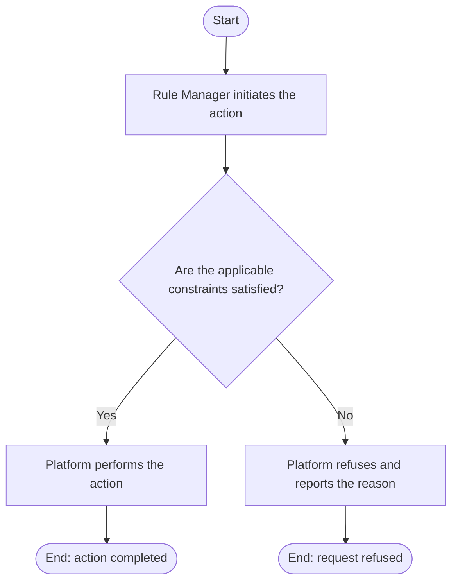

# Use Case Specification: Update a Workspace

## Revision History

| Date       | Version | Description                 | Author |
| :--------- | :------ | :-------------------------- | :----- |
| 2026-09-17 | 1.0     | Initial use-case definition | Codex  |

## 1. Use-Case Name

Update a Workspace.

## 2. Brief Description

A Rule Manager changes the metadata of an active Workspace. The relevant
concepts and constraints are defined in the [Workspace glossary entry](../glossary/workspace.md).

## 3. Preconditions

The specified Workspace exists and is active.

## 4. Postconditions

- On success, the Workspace stores the validated description and records the
  change in `updatedAt`; its identifier and Workspace Versions remain unchanged.

## 5. Flow of Events

### 5.1 Basic Flow

```mermaid
flowchart TD
    start([Start]) --> request[Rule Manager initiates the action]
    request --> validate{Are the applicable constraints satisfied?}
    validate -->|Yes| perform[Platform performs the action]
    perform --> success([End: action completed])
    validate -->|No| reject[Platform refuses and reports the reason]
    reject --> failure([End: request refused])
```

## 6. Special Requirements

None.

## 7. Extension Points

None.

## 8. Business Rules

- Workspace metadata may be changed only while the workspace is active.
