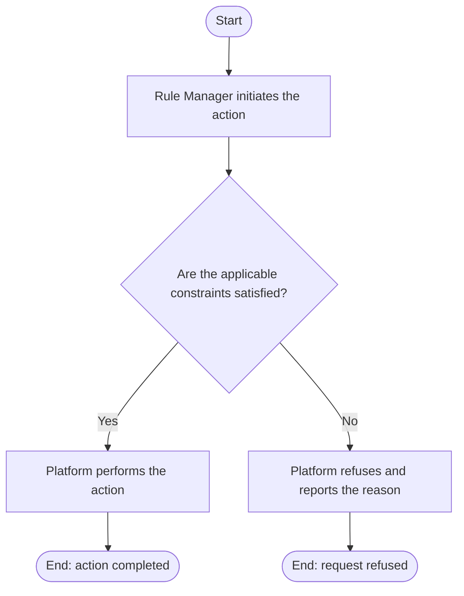

# Use Case Specification: Update a Rule

## Revision History

| Date       | Version | Description                 | Author |
| :--------- | :------ | :-------------------------- | :----- |
| 2026-09-17 | 1.0     | Initial use-case definition | Codex  |

## 1. Use-Case Name

Update a Rule.

## 2. Brief Description

A Rule Manager changes a version-local Rule in an unreleased Workspace Version. The relevant concepts and constraints are defined in the [Rule glossary entry](../glossary/rule.md).

## 3. Preconditions

- The specified Rule Workspace exists and is active, and the target Workspace Version exists in that workspace and is unreleased.
- The specified Rule exists in that Workspace Version.

## 4. Postconditions

- On success, the Rule stores the validated replacement definition; its identifier remains unchanged. Any removed Atomic Rule Group or Atomic Rule identifier may be used again in the replacement or a later Rule update.

## 5. Business Rules

- The Rule Setter validates each Atomic Rule against the Rule Factor it consumes during configuration.
- An Atomic Rule Group or Atomic Rule identifier removed during a Rule update may be used again in that version.

## 6. Flow of Events

### 6.1 Basic Flow

## 7. Special Requirements

None.

## 8. Extension Points

None.
