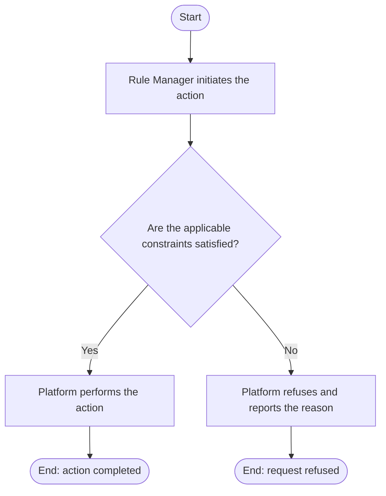

# Use Case Specification: Update an Unreleased Workspace Version

## Revision History

| Date       | Version | Description                 | Author |
| :--------- | :------ | :-------------------------- | :----- |
| 2026-09-17 | 1.0     | Initial use-case definition | Codex  |

## 1. Use-Case Name

Update an Unreleased Workspace Version.

## 2. Brief Description

A Rule Manager changes the metadata of an unreleased Workspace Version. The relevant concepts and constraints are defined in the [Rule requirement](../requirement.md).

## 3. Preconditions

The required target exists in the required lifecycle state stated by this use case.

## 4. Postconditions

- On success, the version stores validated replacement metadata; its identifier, base, and content remain unchanged.
- The platform changes no state beyond that described above.

## 5. Flow of Events

### 5.1 Basic Flow

1. The manager submits replacement version metadata.
2. The platform finds the unreleased version in an active workspace.
3. The platform validates metadata and name uniqueness within the workspace.
4. The platform updates the metadata.

### 5.2 Alternative Flows

None.

### 5.3 Exception Flows

#### 5.3.1 Version not editable

The platform refuses an update when the workspace is archived or the version is absent, initial, or released.

#### 5.3.2 Invalid or duplicate metadata

The platform refuses invalid metadata or a name used by another version.

## 6. Special Requirements

None.

## 7. Extension Points

None.
