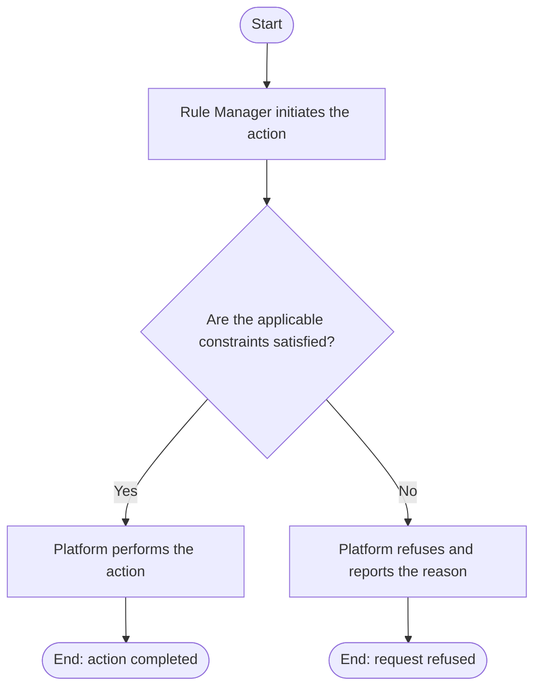

# Use Case Specification: View an Archived Workspace

## Revision History

| Date       | Version | Description                 | Author |
| :--------- | :------ | :-------------------------- | :----- |
| 2026-09-17 | 1.0     | Initial use-case definition | Codex  |

## 1. Use-Case Name

View an Archived Workspace.

## 2. Brief Description

A Rule Manager views an archived Workspace and its released Workspace Versions.
The relevant concepts and constraints are defined in the [Workspace glossary entry](../glossary/workspace.md).

## 3. Preconditions

The specified Workspace exists and is archived.

## 4. Postconditions

- On success, the manager has the archived workspace metadata and released Workspace Versions; no content changes.

## 5. Flow of Events

### 5.1 Basic Flow

## 6. Special Requirements

None.

## 7. Extension Points

None.
