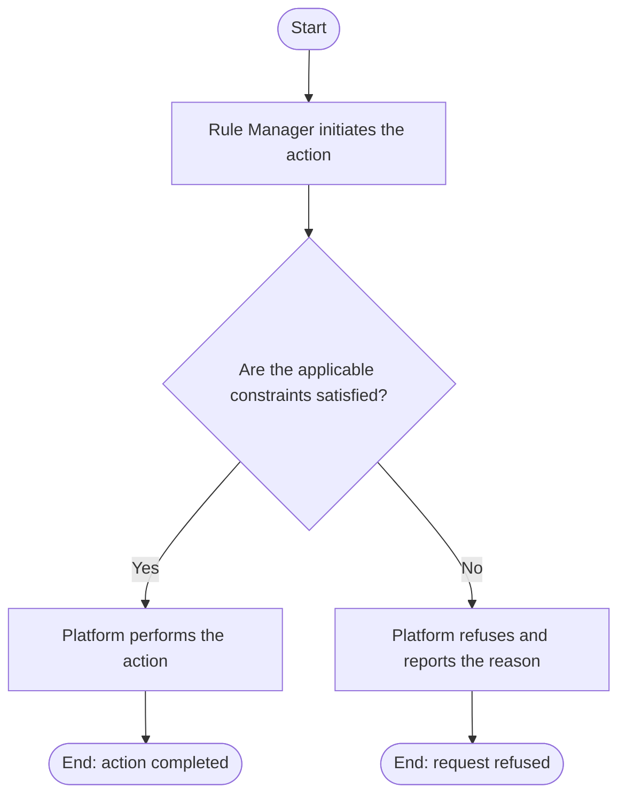

# Use Case Specification: View an Active Rule Workspace

## Revision History

| Date       | Version | Description                 | Author |
| :--------- | :------ | :-------------------------- | :----- |
| 2026-09-17 | 1.0     | Initial use-case definition | Codex  |

## 1. Use-Case Name

View an Active Rule Workspace.

## 2. Brief Description

A Rule Manager views an active Rule Workspace, including its metadata and Workspace Versions. The relevant concepts and constraints are defined in the [Rule requirement](../requirement.md).

## 3. Preconditions

The required target exists in the required lifecycle state stated by this use case.

## 4. Postconditions

- On success, the manager has current workspace metadata and version information; no managed definition changes.
- The platform changes no state beyond that described above.

## 5. Flow of Events

### 5.1 Basic Flow

1. The manager identifies an active workspace.
2. The platform finds the workspace.
3. The platform returns its metadata and Workspace Versions.

### 5.2 Alternative Flows

None.

### 5.3 Exception Flows

#### 5.3.1 Workspace unavailable

The platform reports the workspace unavailable when it does not exist or is archived.

## 6. Special Requirements

None.

## 7. Extension Points

None.
