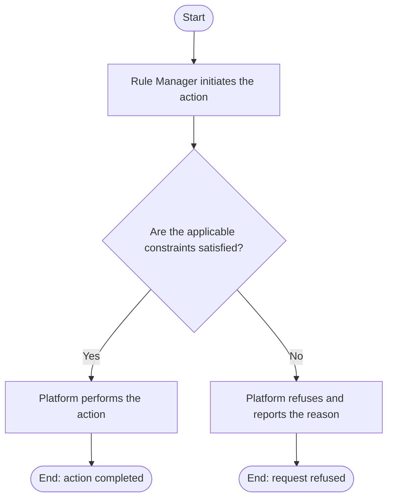

# Use Case Specification: View a Rule

## Revision History

| Date       | Version | Description                 | Author |
| :--------- | :------ | :-------------------------- | :----- |
| 2026-09-17 | 1.0     | Initial use-case definition | Codex  |

## 1. Use-Case Name

View a Rule.

## 2. Brief Description

A Rule Manager views a version-local Rule in a Workspace Version. The relevant concepts and constraints are defined in the [Rule glossary entry](../glossary/rule.md).

## 3. Preconditions

The specified Workspace Version and Rule exist, and the Rule belongs to that Workspace Version.

## 4. Postconditions

- On success, the manager has the selected Rule definition; no content changes.

## 5. Flow of Events

### 5.1 Basic Flow

## 6. Special Requirements

None.

## 7. Extension Points

None.
