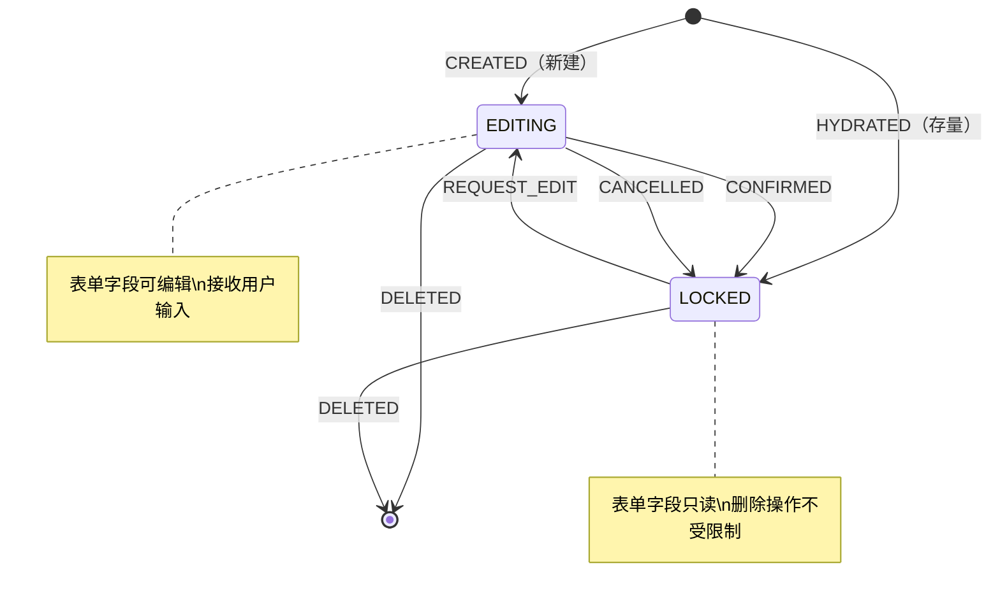
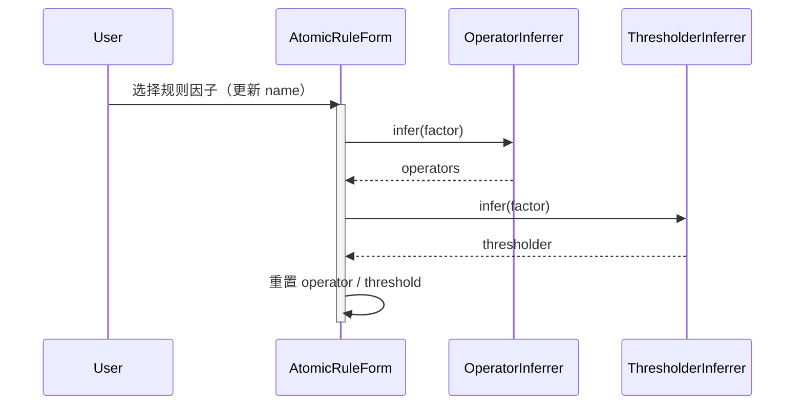
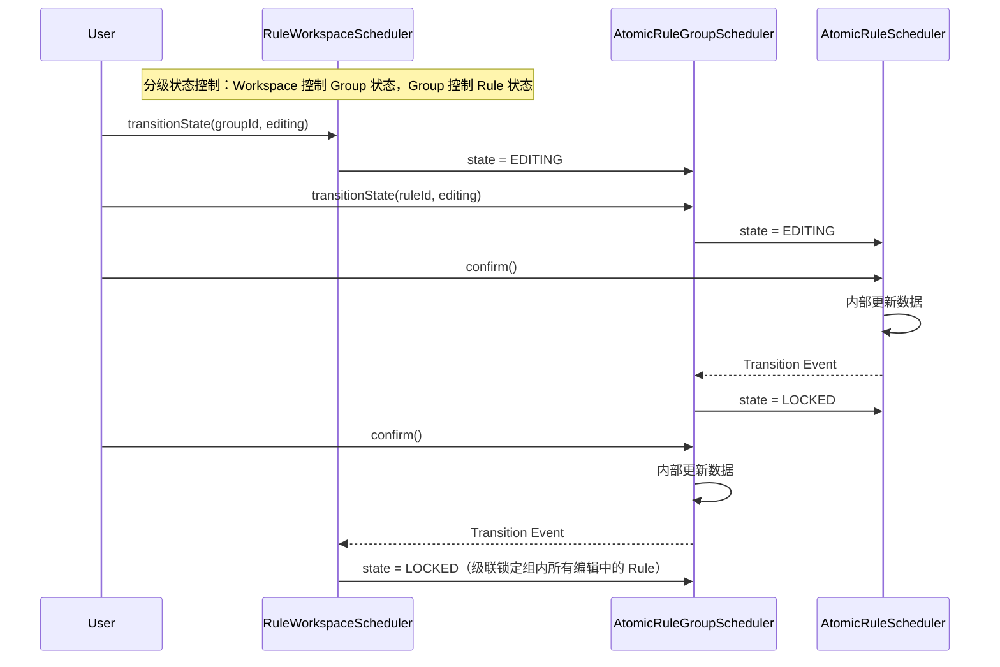

# 应用层

编排领域逻辑，负责规则配置的数据、行为封装

## 前置依赖

- [规则配置内核](./spec.md)
- [领域层](./domain.md)
- [规则因子解释器](../interpreter.md)

## 调度器状态控制

`AtomicRuleScheduler` 与 `AtomicRuleGroupScheduler` 均引入 **编辑态 / 锁定态** 状态控制，确保用户操作的有序性。

```ts
/**
 * 调度器状态枚举
 *
 * 控制 Scheduler 的可编辑性，编辑态允许修改表单字段，锁定态禁止修改（删除不受影响）
 */
enum SchedulerState {
  /** 编辑态 - 允许修改表单字段 */
  EDITING = 'editing',
  /** 锁定态 - 禁止修改表单字段（删除操作不受限制） */
  LOCKED = 'locked',
}
```



## 调度器规则控制

**并行编辑约束**（分级独立控制，各级仅约束直接子级）：

- `AtomicRuleGroupScheduler` 级别：最多 **1 个 Rule** 处于编辑态，存在编辑中的 `Rule` 时禁用 **新增功能**
- `RuleWorkspaceScheduler` 级别：最多 **1 个 Group** 处于编辑态；存在编辑中的 `Group`，或存在配置规则为空的 `Group` 时，禁用 **新增功能**

**业务规则校验**（`build` 阶段执行）：

- `AtomicRuleGroupScheduler.build()`：规则组至少包含 **1 条已配置的原子规则**
- `RuleWorkspaceScheduler.build()`：工作空间至少包含 **1 个已配置的规则组**
- 校验不通过时 `build()` 抛出异常，调用方应先用 `validate()` 进行前置检查

## AtomicRuleScheduler

原子规则调度器，状态由所属 `AtomicRuleGroupScheduler` 控制。自身暴露只读状态信号、表单委托，以及确认指令接收入口。

```ts
interface AtomicRuleScheduler {
  /** 唯一标识 */
  readonly id: string;
  /** 当前状态（编辑态 / 锁定态），由所属 Group 控制，自身只读 */
  readonly state: Signal<SchedulerState>;
  /** 是否处于编辑态（派生信号，便于视图层绑定） */
  readonly editable: Signal<boolean>;
  /**
   * 上次用户确认且数据无误时更新的原子规则配置
   *
   * 与 Form 的不稳定态隔离：Form 字段的实时变化不影响 rule，仅在 confirm() 且内部校验通过后更新。
   * `build()` 返回值与 `rule.value` 始终一致
   */
  readonly rule: Signal<AtomicRule>;
  /** 关联的表单实例（管理表单数据与推断联动） */
  readonly form: AtomicRuleForm;

  /**
   * 确认规则配置（指令接收入口）
   *
   * 内部检查当前表单配置是否满足规则约束，通过后向所属 Group 发出 Transition Event，由 Group 写入 LOCKED 状态
   * @returns 内部校验是否通过
   */
  confirm(): boolean;

  /** 验证配置是否完整可用 */
  validate(): boolean;
  /** 构建原子规则（返回值与 rule.value 始终一致） */
  build(): AtomicRule;
}
```

## AtomicRuleForm

表单模型独立于调度器，负责管理表单字段状态、用户交互与推断联动。

> **占位声明**：后续进一步细化表单模型的完整协议

```ts
/**
 * 原子规则表单模型
 *
 * 职责：
 * - 管理表单字段状态（name / operator / threshold）
 * - 驱动推断联动：用户选择规则因子 → 推断 operators / thresholder → 重置 operator / threshold
 * - 消费推断结果，供视图层渲染
 *
 * **状态约束**：仅编辑态（state=EDITING）时接受用户输入，锁定态静默忽略
 */
interface AtomicRuleForm {
  // 表单字段
  /** 选中的规则因子名称 */
  readonly name: Signal<string | null>;
  /** 选中的操作符 */
  readonly operator: Signal<string | null>;
  /** 阈值 */
  readonly threshold: Signal<unknown>;

  // 推断数据（由内核自动计算，供视图层消费）
  /** 已激活的规则因子定义 */
  readonly factor: Signal<RuleFactorDefinition | null>;
  /** 可用的匹配操作符列表 */
  readonly operators: Signal<readonly FieldDataSource[]>;
  /** threshold 渲染组件属性 */
  readonly thresholder: Signal<readonly ThresholdComponentProperties>;
}
```

规则因子选择联动流程（编辑态下，由 `Form` 内部驱动）：



**状态切换与互斥流程**：



## AtomicRuleGroupScheduler

规则组设置器管理原子规则集合：

```ts
/**
 * 规则因子选项推断器
 *
 * 1. 数据源：allFactors.signal（RuleWorkspace 共享的规则因子定义列表）
 * 2. 排除规则：已存在于 rules.signal 中的原子规则的 name（通过 usedFactors 获取）
 * 3. 输出格式：转换为 FieldDataSource[] 供 Select 组件使用，已使用的因子标记 disabled
 * 4. 作用域：AtomicRuleGroup 级别，每个规则组独立计算
 */
class FactorOptionsInferrer {
  infer(
    allFactors: readonly RuleFactorDefinition[],
    usedFactorNames: readonly string[]
  ): readonly FieldDataSource[];
}

/** 规则组初始化数据（编辑场景） */
interface AtomicRuleGroup {
  /** 唯一标识 */
  readonly id: string;
  /** 已有的原子规则列表 */
  readonly rules: readonly AtomicRule[];
}

/**
 * 规则组设置器
 *
 * 管理原子规则集合，并实现规则配置约束：
 * - 特定规则因子仅允许配置一次（通过 usedFactors + factors.disabled 实现）
 * - 原子规则最大数量等同于规则因子的数量（通过 canAddRule 暴露）
 * - 编辑态 / 锁定态状态控制，状态由所属 Workspace 控制，自身只读
 * - 组内不支持并行编辑，最多 1 个 Rule 处于编辑态；存在编辑中的 Rule 时禁用 addRule
 */
interface AtomicRuleGroupScheduler {
  /** 规则组唯一标识 */
  readonly id: string;
  /** 当前状态（编辑态 / 锁定态），由所属 Workspace 控制，自身只读 */
  readonly state: Signal<SchedulerState>;
  /** 是否处于编辑态（派生信号，便于视图层绑定） */
  readonly editable: Signal<boolean>;
  /** 初始化时传入的规则快照数据（编辑场景），不可变 */
  readonly snapshots: readonly AtomicRule[];
  /** 已创建的规则实例列表 */
  readonly rules: Signal<readonly AtomicRuleScheduler[]>;
  /** 可用的规则因子列表 */
  readonly allFactors: Signal<readonly RuleFactorDefinition[]>;
  /** Group 内部已使用的规则因子名称集合 */
  readonly usedFactors: Signal<string[]>;
  /** 适配选择器的规则因子选项集合，已使用的规则因子标记 disabled */
  readonly factors: Signal<readonly FieldDataSource[]>;
  /** 是否可继续添加原子规则（rules.length < maxRuleCount 且存在未使用的规则因子，且当前无编辑中的 Rule） */
  readonly canAddRule: Signal<boolean>;

  /**
   * 创建原子规则设置器（新建场景）
   *
   * **状态约束**：仅 Group 处于编辑态时允许调用
   * **互斥行为**：新建的 Rule 默认进入编辑态，当前编辑中的 Rule（如有）自动锁定
   * **前置约束**：canAddRule=false 时调用静默忽略
   */
  addRule(): AtomicRuleScheduler;
  /**
   * 获取原子规则设置器（精细操作场景）
   */
  pickRule(ruleId: string): AtomicRuleScheduler | undefined;
  /**
   * 移除原子规则
   *
   * **状态无关**：删除操作不受锁定态限制，任何状态下均可执行
   */
  removeRule(ruleId: string): void;
  /**
   * 恢复原子规则设置器（编辑场景）
   *
   * 恢复的 Rule 默认进入 **锁定态**
   */
  hydrateRule(rule: AtomicRule): void;

  /**
   * 切换指定规则的状态（逻辑控制入口）
   *
   * - 目标为 EDITING：应用互斥约束，同时锁定当前编辑中的 Rule（如有），返回是否成功进入编辑态
   * - 目标为 LOCKED：直接转换，始终返回 true
   */
  transitionState(ruleId: string, state: SchedulerState): boolean;

  /**
   * 确认规则组配置（指令接收入口）
   *
   * 内部检查当前组内规则配置是否满足业务约束，通过后向所属 Workspace 发出 Transition Event，
   * 由 Workspace 写入 LOCKED 状态，并级联锁定组内所有处于编辑态的 Rule
   */
  confirm(): void;

  /** 验证所有原子规则 */
  validate(): boolean;
  /**
   * 构建规则组
   *
   * **业务校验**：规则组至少包含 1 条已配置的原子规则，校验不通过时抛出异常
   */
  build(): AtomicRuleGroup;
}
```

**特别说明**：

- `FactorOptionsInferrer` 属于 `AtomicRuleGroup` 级别，每个规则组独立维护自己的 `factors`，不同规则组之间 **不共享**
- `canAddRule` 综合数量约束（`rules.length < allFactors.length`）与 **编辑互斥约束**，供视图层控制「添加规则」按钮的可操作状态
- `addRule` 仅在 `Group` 处于编辑态时允许调用，锁定态调用静默忽略
- `removeRule` 不受状态约束，锁定态下仍可删除规则

## RuleWorkspaceScheduler

统一入口，持有规则因子定义供调度器共享，控制 `Group` 状态，并提供完整的生命周期管理能力：

```ts
interface RuleWorkspaceScheduler {
  /** 初始化时传入的规则组快照数据（编辑场景），不可变 */
  readonly snapshots: readonly AtomicRuleGroup[];
  /** 已创建的规则组实例列表 */
  readonly groups: Signal<readonly AtomicRuleGroupScheduler[]>;
  /** 是否可继续添加规则组（当前无编辑中的 Group，且不存在配置规则为空的 Group） */
  readonly canAddGroup: Signal<boolean>;

  // 创建与删除
  /**
   * 创建规则组设置器（新建场景）
   *
   * **状态约束**：仅 Workspace 处于可编辑状态时允许调用
   * **互斥行为**：新建的 Group 默认进入编辑态，当前编辑中的 Group（如有）自动锁定
   * **前置约束**：canAddGroup=false 时调用静默忽略
   */
  addGroup(): AtomicRuleGroupScheduler;
  /**
   * 获取规则组设置器（精细操作场景）
   */
  pickGroup(groupId: string): AtomicRuleGroupScheduler | undefined;
  /**
   * 移除规则组
   *
   * **状态无关**：删除操作不受锁定态限制，任何状态下均可执行
   */
  removeGroup(groupId: string): void;
  /**
   * 恢复规则组设置器（编辑场景）
   *
   * 恢复的 Group 及其内部 Rule 默认进入 **锁定态**
   */
  hydrateGroup(group: AtomicRuleGroup): void;

  // 状态控制
  /**
   * 切换指定规则组的状态（逻辑控制入口）
   *
   * - 目标为 EDITING：应用互斥约束，同时锁定当前编辑中的 Group（如有），返回是否成功进入编辑态
   * - 目标为 LOCKED：直接转换，级联锁定组内所有编辑中的 Rule，始终返回 true
   */
  transitionState(groupId: string, state: SchedulerState): boolean;

  // 验证与构建
  /** 验证所有规则组 */
  validate(): boolean;
  /**
   * 构建所有规则组
   *
   * **业务校验**：工作空间至少包含 1 个已配置的规则组，校验不通过时抛出异常
   */
  build(): readonly AtomicRuleGroup[];

  // 生命周期管理
  /** 销毁工作空间，释放所有资源（订阅、缓存等） */
  destroy(): void;
}
```
