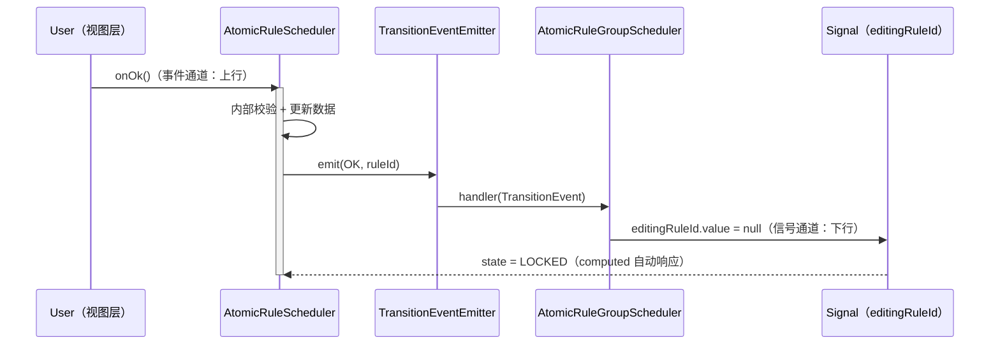
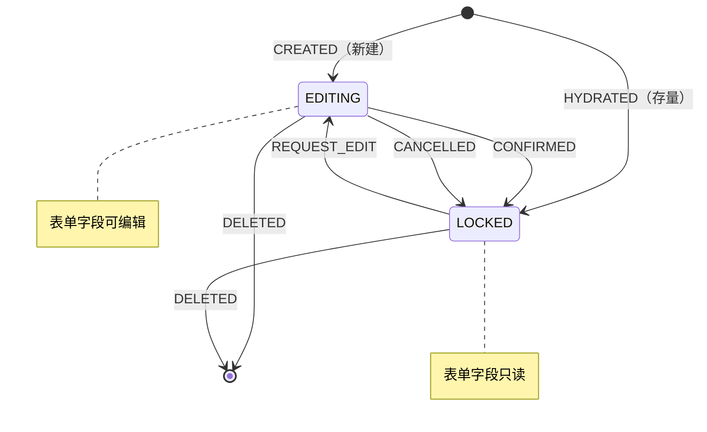
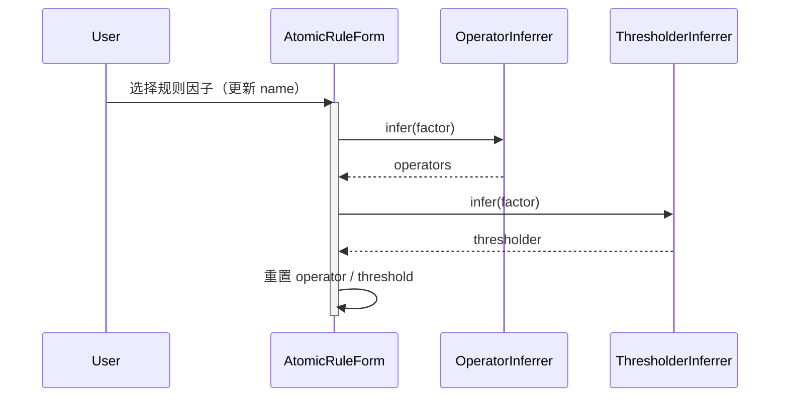
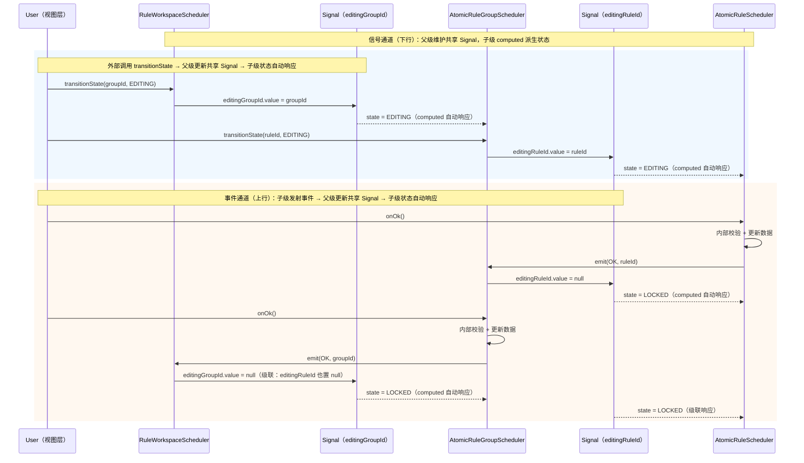

# 应用层

编排领域逻辑，负责规则配置的数据、行为封装

## 前置依赖

- [规则配置内核](./spec.md)
- [领域层](./domain.md)
- [规则因子解释器](../interpreter.md)

## 层级间协议

三层调度器（`RuleWorkspaceScheduler` → `AtomicRuleGroupScheduler` → `AtomicRuleScheduler`）之间通过两个通道协作：

- **事件通道（上行）**：子级通过 `TransitionEventEmitter` 发射事件，通知父级用户行为的发生
- **信号通道（下行）**：父级维护共享状态 `Signal`，子级通过 `computed` 派生自身状态，父级不直接修改子级状态

### TransitionEvent 事件模型

事件是子级向父级通信的唯一载体，与用户行为入口对应

```ts
/**
 * 状态迁移事件类型
 *
 * - OK：用户确认配置（onOk）
 * - EDIT：用户请求进入编辑态（onEdit）
 * - CANCEL：用户取消编辑（onCancel，仅 Rule 级别）
 */
enum TransitionEventType {
  OK = 'ok',
  EDIT = 'edit',
  CANCEL = 'cancel',
}

/**
 * 状态迁移事件
 *
 * 事件流向：子级 → 父级（单向）
 */
interface TransitionEvent<TId = string> {
  /** 事件类型 */
  readonly type: TransitionEventType;
  /** 事件来源子级标识 */
  readonly sourceId: TId;
}
```

### TransitionEventEmitter

子级 `Scheduler` 内部持有 `TransitionEventEmitter`，`onOk`/`onEdit`/`onCancel` 内部调用 `emit()` 发射事件。父级在创建子级时自动订阅，无需外部介入

```ts
/**
 * 状态迁移事件发射器
 *
 * 职责：
 * - 提供事件订阅 / 取消订阅能力
 * - Scheduler 内部持有实例，onOk / onEdit / onCancel 触发 emit()
 * - 父级在创建子级时自动 on() 订阅，在销毁 / 移除子级时自动 off() 取消订阅
 */
interface TransitionEventEmitter<TId = string> {
  /** 订阅指定类型的事件 */
  on(event: TransitionEventType, handler: (e: TransitionEvent<TId>) => void): void;
  /** 取消订阅 */
  off(event: TransitionEventType, handler: (e: TransitionEvent<TId>) => void): void;
}
```

### 信号共享机制

父级维护的共享状态 `Signal` 是协议要素，子级状态通过 `computed` 从父级 `Signal` 派生，而非由父级直接写入：

```ts
// 示例：Group 级别维护编辑中的 Rule ID
// Rule 实例通过 computed 派生自身状态
interface AtomicRuleGroupScheduler {
  /** Group 级别共享状态：当前处于编辑态的 Rule ID（null 表示无编辑中的 Rule） */
  readonly editingRuleId: Signal<string | null>;
}

// AtomicRuleScheduler.state 实际实现为：
// state = computed(() =>
//   group.editingRuleId.value === this.id ? SchedulerState.EDITING : SchedulerState.LOCKED
// )
```

**层级间共享 Signal 一览**：

| 父级                       | 共享 Signal                                           | 子级消费方式                                          |
| -------------------------- | ----------------------------------------------------- | ----------------------------------------------------- |
| `AtomicRuleGroupScheduler` | `editingRuleId: Signal<string \| null>`               | `AtomicRuleScheduler.state` 通过 `computed` 派生      |
| `RuleWorkspaceScheduler`   | `editingGroupId: Signal<string \| null>`              | `AtomicRuleGroupScheduler.state` 通过 `computed` 派生 |
| `RuleWorkspaceScheduler`   | `allFactors: Signal<readonly RuleFactorDefinition[]>` | `AtomicRuleGroupScheduler.allFactors` 直接共享        |

**状态流转路径**：

1. 子级发射事件（如 `emit(OK, ruleId)`）
2. 父级 `handler` 接收事件，应用互斥约束后更新自身的共享 `Signal`（如 `editingRuleId.value = null`）
3. 子级 `state`（`computed`）自动响应变化，无需父级直接修改子级状态

事件流转全景（以 Rule 确认为例）：



## 调度器状态控制

`AtomicRuleScheduler` 与 `AtomicRuleGroupScheduler` 均引入 **编辑态 / 锁定态** 状态控制，确保用户操作的有序性。

```ts
/**
 * 调度器状态枚举
 *
 * 控制 Scheduler 的可编辑性，编辑态允许修改表单字段，锁定态禁止修改（删除不受影响）
 */
enum SchedulerState {
  /** 编辑态 - 允许修改表单字段 */
  EDITING = 'editing',
  /** 锁定态 - 禁止修改表单字段（删除操作不受限制） */
  LOCKED = 'locked',
}
```



## 调度器规则控制

### 并行编辑约束

分级独立控制，各级仅约束直接子级

- `AtomicRuleGroupScheduler` 级别：最多 **1 个 Rule** 处于编辑态，存在编辑中的 `Rule` 时禁用 **新增功能**
- `RuleWorkspaceScheduler` 级别：最多 **1 个 Group** 处于编辑态；存在编辑中的 `Group`，或存在配置规则为空的 `Group` 时，禁用 **新增功能**

### 业务规则校验

`build` 阶段执行业务规则

- `AtomicRuleGroupScheduler.build()`：规则组至少包含 **1 条已配置的原子规则**
- `RuleWorkspaceScheduler.build()`：工作空间至少包含 **1 个已配置的规则组**
- 校验不通过时 `build()` 抛出异常，调用方应先用 `validate()` 进行前置检查

## AtomicRuleScheduler

原子规则调度器。自身状态通过 `computed` 从所属 `AtomicRuleGroupScheduler` 的共享 Signal 派生，暴露只读状态信号、表单委托，以及用户行为接收入口。

> **协议角色**：事件上行（发射 `TransitionEvent` 给 Group）+ 信号下行（从 Group 的 `editingRuleId` 派生 `state`）。

```ts
interface AtomicRuleScheduler {
  // ─── 状态（从 Group.editingRuleId computed 派生）────────────────
  /** 唯一标识 */
  readonly id: string;
  /**
   * 当前状态（编辑态 / 锁定态）
   *
   * 通过 `computed` 从所属 Group 的 `editingRuleId` 派生：
   * `editingRuleId === this.id` → EDITING，否则 → LOCKED
   */
  readonly state: Signal<SchedulerState>;
  /** 是否处于编辑态（派生信号，便于视图层绑定） */
  readonly editable: Signal<boolean>;
  /**
   * 上次用户确认且数据无误时更新的原子规则配置
   *
   * 与 Form 的不稳定态隔离：Form 字段的实时变化不影响 rule，仅在 onOk() 且内部校验通过后更新。
   * `build()` 返回值与 `rule.value` 始终一致
   */
  readonly rule: Signal<AtomicRule>;
  /** 关联的表单实例（管理表单数据与推断联动） */
  readonly form: AtomicRuleForm;

  /** 验证配置是否完整可用 */
  validate(): boolean;
  /** 构建原子规则（返回值与 rule.value 始终一致） */
  build(): AtomicRule;

  // ─── 用户行为接入（发射 TransitionEvent 给 Group）────────
  /**
   * 确认规则配置（用户行为驱动）
   *
   * 内部判断表单配置是否满足规则约束，更新内部数据，然后发射 `TransitionEventType.OK` 事件
   */
  onOk(): void;

  /**
   * 取消规则配置（用户行为驱动）
   *
   * 无内部逻辑，直接发射 `TransitionEventType.CANCEL` 事件
   */
  onCancel(): void;

  /**
   * 激活规则配置编辑（用户行为驱动）
   *
   * 实例化编辑 Form 实例，然后发射 `TransitionEventType.EDIT` 事件
   */
  onEdit(): void;
}
```

## AtomicRuleForm

表单模型独立于调度器，负责管理表单字段状态、用户交互与推断联动。

> **占位声明**：后续进一步细化表单模型的完整协议

```ts
/**
 * 原子规则表单模型
 *
 * 职责：
 * - 管理表单字段状态（name / operator / threshold）
 * - 驱动推断联动：用户选择规则因子 → 推断 operators / thresholder → 重置 operator / threshold
 * - 消费推断结果，供视图层渲染
 *
 * **状态约束**：仅编辑态（state=EDITING）时接受用户输入，锁定态静默忽略
 */
interface AtomicRuleForm {
  // 表单字段
  /** 选中的规则因子名称 */
  readonly name: Signal<string | null>;
  /** 选中的操作符 */
  readonly operator: Signal<string | null>;
  /** 阈值 */
  readonly threshold: Signal<unknown>;

  // 推断数据（由内核自动计算，供视图层消费）
  /** 已激活的规则因子定义 */
  readonly factor: Signal<RuleFactorDefinition | null>;
  /** 可用的匹配操作符列表 */
  readonly operators: Signal<readonly FieldDataSource[]>;
  /** threshold 渲染组件属性 */
  readonly thresholder: Signal<readonly ThresholdComponentProperties>;
}
```

规则因子选择联动流程（编辑态下，由 `Form` 内部驱动）：



**状态切换与互斥流程**（事件上行 + 信号下行完整链路）：



## AtomicRuleGroupScheduler

规则组设置器管理原子规则集合：

```ts
/**
 * 规则因子选项推断器
 *
 * 1. 数据源：allFactors.signal（RuleWorkspace 共享的规则因子定义列表）
 * 2. 排除规则：已存在于 rules.signal 中的原子规则的 name（通过 usedFactors 获取）
 * 3. 输出格式：转换为 FieldDataSource[] 供 Select 组件使用，已使用的因子标记 disabled
 * 4. 作用域：AtomicRuleGroup 级别，每个规则组独立计算
 */
class FactorOptionsInferrer {
  infer(
    allFactors: readonly RuleFactorDefinition[],
    usedFactorNames: readonly string[]
  ): readonly FieldDataSource[];
}

/** 规则组初始化数据（编辑场景） */
interface AtomicRuleGroup {
  /** 唯一标识 */
  readonly id: string;
  /** 已有的原子规则列表 */
  readonly rules: readonly AtomicRule[];
}

/**
 * 规则组设置器
 *
 * **协议角色**：事件上行（发射 `TransitionEvent` 给 Workspace）+ 信号下行（从 Workspace 的 `editingGroupId` 派生 `state`，同时维护 `editingRuleId` 供 Rule 派生状态）
 *
 * 管理原子规则集合，并实现规则配置约束：
 * - 特定规则因子仅允许配置一次（通过 usedFactors + factors.disabled 实现）
 * - 原子规则最大数量等同于规则因子的数量（通过 canAddRule 暴露）
 * - 编辑态 / 锁定态状态通过 `computed` 从 Workspace 的 `editingGroupId` 派生
 * - 组内不支持并行编辑，最多 1 个 Rule 处于编辑态；存在编辑中的 Rule 时禁用 addRule
 */
interface AtomicRuleGroupScheduler {
  /** 规则组唯一标识 */
  readonly id: string;
  /**
   * 当前状态（编辑态 / 锁定态）
   *
   * 通过 `computed` 从所属 Workspace 的 `editingGroupId` 派生：
   * `editingGroupId === this.id` → EDITING，否则 → LOCKED
   */
  readonly state: Signal<SchedulerState>;
  /** 是否处于编辑态（派生信号，便于视图层绑定） */
  readonly editable: Signal<boolean>;
  /** 初始化时传入的规则快照数据（编辑场景），不可变 */
  readonly snapshots: readonly AtomicRule[];
  /** 已创建的规则实例列表 */
  readonly rules: Signal<readonly AtomicRuleScheduler[]>;
  /** 可用的规则因子列表（Workspace 级共享 Signal） */
  readonly allFactors: Signal<readonly RuleFactorDefinition[]>;
  /** Group 内部已使用的规则因子名称集合 */
  readonly usedFactors: Signal<string[]>;
  /** 适配选择器的规则因子选项集合，已使用的规则因子标记 disabled */
  readonly factors: Signal<readonly FieldDataSource[]>;
  /** 是否可继续添加原子规则（rules.length < maxRuleCount 且存在未使用的规则因子，且当前无编辑中的 Rule） */
  readonly canAddRule: Signal<boolean>;

  // ─── 共享状态 Signal（供 Rule computed 派生）────────────
  /**
   * Group 级别共享状态：当前处于编辑态的 Rule ID
   *
   * `null` 表示当前无编辑中的 Rule。
   * `AtomicRuleScheduler.state` 通过 `computed` 从此 Signal 派生
   */
  readonly editingRuleId: Signal<string | null>;

  // ─── 生命周期管理（对 Rule）────────────
  /**
   * 创建原子规则设置器（新建场景）
   *
   * **状态约束**：仅 Group 处于编辑态时允许调用
   * **互斥行为**：新建的 Rule 默认进入编辑态（`editingRuleId` 更新为新 Rule ID），当前编辑中的 Rule（如有）自动锁定
   * **前置约束**：canAddRule=false 时调用静默忽略
   * **事件订阅**：创建后自动订阅 Rule 的 TransitionEvent
   */
  addRule(): AtomicRuleScheduler;
  /**
   * 获取原子规则设置器（精细操作场景）
   */
  pickRule(ruleId: string): AtomicRuleScheduler | undefined;
  /**
   * 移除原子规则
   *
   * **状态无关**：删除操作不受锁定态限制，任何状态下均可执行
   */
  removeRule(ruleId: string): void;
  /**
   * 恢复原子规则设置器（编辑场景）
   *
   * 恢复的 Rule 默认进入 **锁定态**
   */
  hydrateRule(rule: AtomicRule): void;

  /**
   * 切换指定规则的状态（内部更新 editingRuleId Signal）
   *
   * - 目标为 EDITING：应用互斥约束，更新 `editingRuleId.value = ruleId`，返回是否成功
   * - 目标为 LOCKED：更新 `editingRuleId.value = null`，始终返回 true
   * - 子级 `AtomicRuleScheduler.state` 通过 `computed` 自动响应
   */
  transitionState(ruleId: string, state: SchedulerState): boolean;

  /** 验证所有原子规则 */
  validate(): boolean;
  /**
   * 构建规则组
   *
   * **业务校验**：规则组至少包含 1 条已配置的原子规则，校验不通过时抛出异常
   */
  build(): AtomicRuleGroup;

  // ─── 用户行为接入（发射 TransitionEvent 给 Workspace）────────
  /**
   * 确认配置规则（用户行为驱动）
   *
   * 内部判断规则组配置是否满足约束，更新内部数据，然后发射 `TransitionEventType.OK` 事件
   */
  onOk(): void;

  /**
   * 激活配置编辑（用户行为驱动）
   *
   * 发射 `TransitionEventType.EDIT` 事件
   */
  onEdit(): void;
}
```

**特别说明**：

- `FactorOptionsInferrer` 属于 `AtomicRuleGroup` 级别，每个规则组独立维护自己的 `factors`，不同规则组之间 **不共享**
- `canAddRule` 综合数量约束（`rules.length < allFactors.length`）与 **编辑互斥约束**
- `addRule` 仅在 `Group` 处于编辑态时允许调用，锁定态调用静默忽略
- `removeRule` 不受状态约束，锁定态下仍可删除规则

## RuleWorkspaceScheduler

统一入口，持有规则因子定义供调度器共享，并提供完整的生命周期管理能力：

> **协议角色**：信号下行（维护 `editingGroupId` + `allFactors` 共享 Signal）+ 事件上行（订阅 Group 的 `TransitionEvent`）。Workspace 是协议层级的顶部，无父级。

```ts
interface RuleWorkspaceScheduler {
  /** 初始化时传入的规则组快照数据（编辑场景），不可变 */
  readonly snapshots: readonly AtomicRuleGroup[];
  /** 已创建的规则组实例列表 */
  readonly groups: Signal<readonly AtomicRuleGroupScheduler[]>;
  /** 是否可继续添加规则组（当前无编辑中的 Group，且不存在配置规则为空的 Group） */
  readonly canAddGroup: Signal<boolean>;

  // ─── 共享状态 Signal（供 Group computed 派生）────────────
  /**
   * Workspace 级别共享状态：当前处于编辑态的 Group ID
   *
   * `null` 表示当前无编辑中的 Group。
   * `AtomicRuleGroupScheduler.state` 通过 `computed` 从此 Signal 派生
   */
  readonly editingGroupId: Signal<string | null>;

  // ─── 生命周期管理（对 Group）────────────
  /**
   * 创建规则组设置器（新建场景）
   *
   * **状态约束**：仅 Workspace 处于可编辑状态时允许调用
   * **互斥行为**：新建的 Group 默认进入编辑态（`editingGroupId` 更新为新 Group ID），当前编辑中的 Group（如有）自动锁定
   * **前置约束**：canAddGroup=false 时调用静默忽略
   * **事件订阅**：创建后自动订阅 Group 的 TransitionEvent
   */
  addGroup(): AtomicRuleGroupScheduler;
  /**
   * 获取规则组设置器（精细操作场景）
   */
  pickGroup(groupId: string): AtomicRuleGroupScheduler | undefined;
  /**
   * 移除规则组
   *
   * **状态无关**：删除操作不受锁定态限制，任何状态下均可执行
   */
  removeGroup(groupId: string): void;
  /**
   * 恢复规则组设置器（编辑场景）
   *
   * 恢复的 Group 及其内部 Rule 默认进入 **锁定态**
   */
  hydrateGroup(group: AtomicRuleGroup): void;

  // 状态控制
  /**
   * 切换指定规则组的状态（内部更新 editingGroupId Signal）
   *
   * - 目标为 EDITING：应用互斥约束，更新 `editingGroupId.value = groupId`
   * - 目标为 LOCKED：更新 `editingGroupId.value = null`，级联锁定组内所有编辑中的 Rule
   * - 子级 `AtomicRuleGroupScheduler.state` 通过 `computed` 自动响应
   */
  transitionState(groupId: string, state: SchedulerState): boolean;

  // 验证与构建
  /** 验证所有规则组 */
  validate(): boolean;
  /**
   * 构建所有规则组
   *
   * **业务校验**：工作空间至少包含 1 个已配置的规则组，校验不通过时抛出异常
   */
  build(): readonly AtomicRuleGroup[];

  // 生命周期管理
  /** 销毁工作空间，释放所有资源（订阅、缓存等） */
  destroy(): void;
}
```
