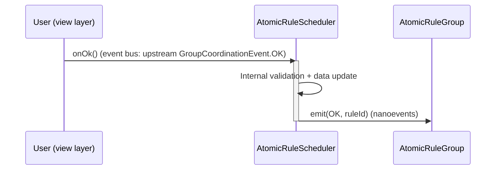
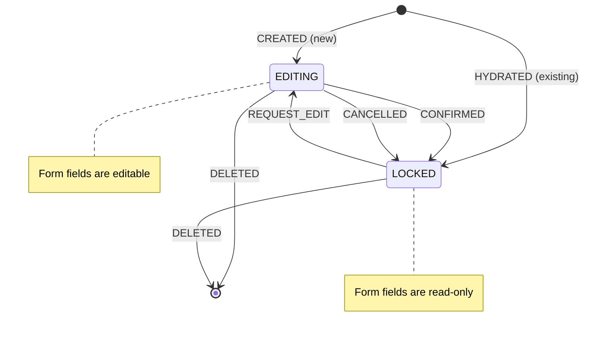
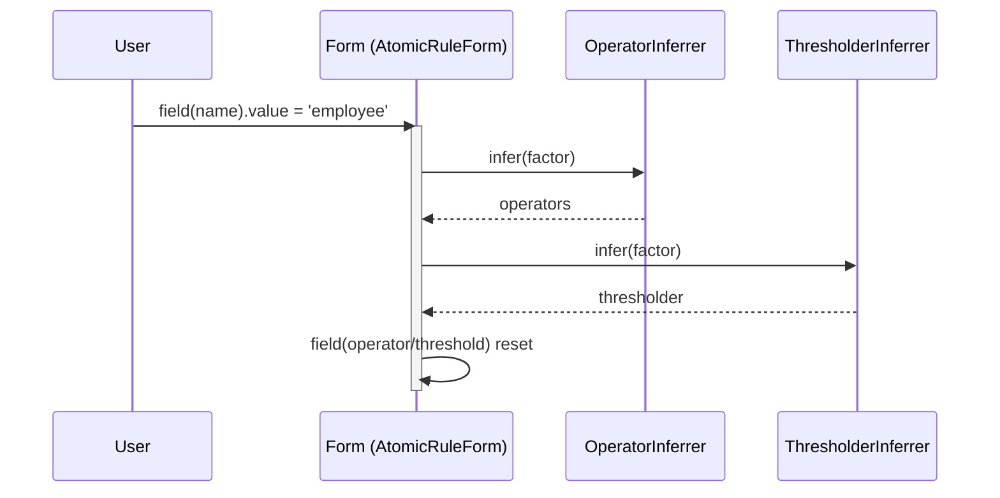
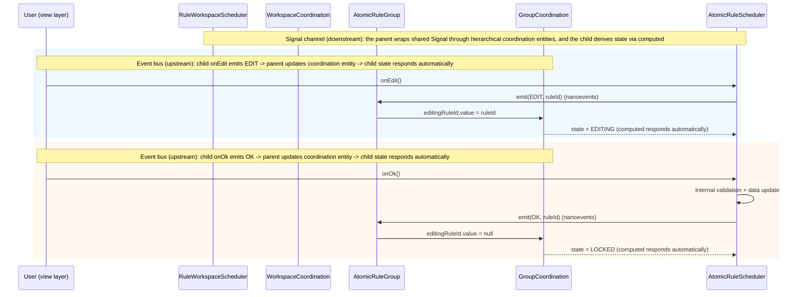

# Application Layer

Orchestrates domain logic and encapsulates rule-configuration data and behavior.

## Prerequisites

- [Core spec](./spec.md)
- [Domain layer](./domain.md)
- [Rule factor interpreter](../interpreter.md)

## Layer-to-Layer Protocol

The three schedulers (`RuleWorkspaceScheduler` → `AtomicRuleGroup` → `AtomicRuleScheduler`) collaborate through two channels:

- **Event bus (upstream)**: child components emit coordination events to notify the parent that a user action has occurred. Event subscription is handled by the dependency library (`nanoevents`).
- **Signal channel (downstream)**: the parent wraps shared state in hierarchical coordination entities. Children derive their own state through `computed` or run side effects through `effect`; the parent does not directly manipulate the child.

Each layer protocol explicitly contains both the event bus and the signal channel, forming a complete hierarchical communication contract.

### Hierarchical Coordination Entity

Each parent-child scheduler pair uses an independent coordination entity to explicitly encapsulate both the event bus and the signal channel, rather than applying a single protocol across multiple levels. Each parent scheduler owns a coordination entity, and the child accesses shared state through it:

> Events are the only carrier for child-to-parent communication and correspond to user action entry points. Each layer protocol defines its own event types and event interfaces so that the communication contract is self-contained.

> **Event emitter**: The child `Scheduler` uses the dependency library (`nanoevents`) to provide event subscribe / unsubscribe capabilities. `onOk` / `onEdit` / `onCancel` / `onRemove` emit events internally. The parent subscribes when the child is created and unsubscribes automatically when the child is destroyed or removed. The concrete `API` is determined by the dependency library.

#### WorkspaceCoordination (Workspace → Group protocol)

Owned by `RuleWorkspaceScheduler` and consumed by `AtomicRuleGroup`.

**Event bus (upstream: Group → Workspace)**:

| Event type | Trigger entry point          | Parent handling logic                                |
| ---------- | ---------------------------- | ---------------------------------------------------- |
| `REMOVE`   | `AtomicRuleGroup.onRemove()` | Remove the Group instance and clean up subscriptions |

**Signal channel (downstream: Workspace → Rule)**: none

```ts
/**
 * Workspace-level coordination event type (Group → Workspace)
 *
 * - REMOVE: user requests self-removal (onRemove)
 */
enum WorkspaceCoordinationEventType {
  REMOVE = 'remove',
}

/** Workspace-level coordination event (Group → Workspace, one-way) */
interface WorkspaceCoordinationEvent {
  /** Event type */
  readonly type: WorkspaceCoordinationEventType;
  /** Source Group identifier */
  readonly sourceId: string;
}

/**
 * Workspace-level coordination entity (Workspace → Group protocol)
 *
 * Event bus (upstream): Group → Workspace, valid event type REMOVE
 * Signal channel (downstream): Workspace → Group
 * - children share rule factor definitions through allFactors
 */
interface WorkspaceCoordination {
  // ── Event bus (upstream: Group → Workspace)────────────
  /** Event bus; valid event type: REMOVE (the concrete type is determined by nanoevents) */
  readonly bus: EventBus;

  // ── Signal channel (downstream: Workspace → Group)────────────
  /** Available rule factor definition list (shared at the Workspace level) */
  readonly allFactors: Signal<readonly RuleFactorDefinition[]>;
}
```

#### GroupCoordination (Group → Rule protocol)

Owned by `AtomicRuleGroup` and consumed by `AtomicRuleScheduler`.

**Event bus (upstream: Rule → Group)**:

| Event type | Trigger entry point              | Parent handling logic                                                        |
| ---------- | -------------------------------- | ---------------------------------------------------------------------------- |
| `OK`       | `AtomicRuleScheduler.onOk()`     | After validation passes, update `editingRuleId.value = null`                 |
| `EDIT`     | `AtomicRuleScheduler.onEdit()`   | Apply mutual-exclusion constraints and update `editingRuleId.value = ruleId` |
| `CANCEL`   | `AtomicRuleScheduler.onCancel()` | Update `editingRuleId.value = null`                                          |
| `REMOVE`   | `AtomicRuleScheduler.onRemove()` | Remove the Rule instance and clean up subscriptions                          |

**Signal channel (downstream: Group → Rule)**:

```ts
/**
 * Group-level coordination event type (Rule → Group)
 *
 * - OK: user confirms configuration (onOk)
 * - EDIT: user requests to enter editing state (onEdit)
 * - CANCEL: user cancels editing (onCancel)
 * - REMOVE: user requests self-removal (onRemove)
 */
enum GroupCoordinationEventType {
  OK = 'ok',
  EDIT = 'edit',
  CANCEL = 'cancel',
  REMOVE = 'remove',
}

/** Group-level coordination event (Rule → Group, one-way) */
interface GroupCoordinationEvent {
  /** Event type */
  readonly type: GroupCoordinationEventType;
  /** Source Rule identifier */
  readonly sourceId: string;
}

/**
 * Group-level coordination entity (Group → Rule protocol)
 *
 * Event bus (upstream): Rule → Group, valid event types OK | EDIT | CANCEL | REMOVE
 * Signal channel (downstream): Group → Rule
 * - child AtomicRuleScheduler derives state from editingRuleId via computed
 * - child uses factors to obtain available rule factors (already-used factors in the group are marked disabled,
 *   ensuring each factor can only be configured once)
 */
interface GroupCoordination {
  // ── Event bus (upstream: Rule → Group)────────────
  /** Event bus; valid event types: OK | EDIT | CANCEL | REMOVE (the concrete type is determined by nanoevents) */
  readonly bus: EventBus;

  // ── Signal channel (downstream: Group → Rule)────────────
  /** Currently editing Rule ID (null means no rule is being edited) */
  readonly editingRuleId: Signal<string | null>;
  /** Available rule factor set (derived from WorkspaceCoordination.allFactors; already-used factors in the group are marked disabled) */
  readonly factors: ReadonlySignal<readonly FieldDataSource[]>;
}
```

**Hierarchical communication contract overview**:

| Protocol layer    | Coordination entity     | Event bus (upstream)                       | Signal channel (downstream) |
| ----------------- | ----------------------- | ------------------------------------------ | --------------------------- |
| Workspace → Group | `WorkspaceCoordination` | `WorkspaceCoordinationEvent` (`REMOVE`)    | `allFactors`                |
| Group → Rule      | `GroupCoordination`     | `GroupCoordinationEvent` (`OK` / `REMOVE`) | `factors`                   |

**State flow path**:

1. The child emits an event (for example, `emit(OK, ruleId)`), and the event type is constrained by the layer protocol.
2. The parent `handler` receives the event and updates its internal data according to the protocol-defined handling logic.

Full event flow (using rule confirmation as an example):



## Scheduler State Control

`AtomicRuleScheduler` introduces **editing state / locked state** control to ensure orderly user operations.

```ts
/**
 * Scheduler state enum
 *
 * Controls Scheduler editability. Editing state allows form fields to be modified,
 * locked state forbids modification (deletion is not affected).
 */
enum SchedulerState {
  /** Editing state - allows modification of form fields */
  EDITING = 'editing',
  /** Locked state - prohibits modification of form fields (deletion is unrestricted) */
  LOCKED = 'locked',
}
```



## Scheduler Rule Control

### Parallel Editing Constraints

- At the `RuleWorkspaceScheduler` level: if there is a `Group` with an empty rule configuration, disable **adding a new rule group**.
- At the `AtomicRuleScheduler` level: at most **1 Rule** can be in editing state. When a Rule is being edited, disable **adding a new rule**.

### Business Rule Validation

Business rules are enforced during the `build` phase:

- `RuleWorkspaceScheduler.build()`: the workspace must contain at least **1 configured rule group**, and each rule group must contain at least **1 configured atomic rule**.
- If validation fails, `build()` throws an exception. Callers should use `validate()` first as a pre-check.

## AtomicRuleScheduler

The atomic rule scheduler derives its own state through `computed` from the `AtomicRuleGroup`'s `GroupCoordination.editingRuleId`, exposes read-only state signals, a Formily form delegate, and user action entry points. Internally, it synchronizes scheduler state to the `pattern` property of the Formily form.

> **Protocol role**: event bus (emits `GroupCoordinationEvent` to the Group) + signal channel (derives `state` from the Group's `GroupCoordination.editingRuleId`, and obtains available rule factors through `GroupCoordination.factors`).

```ts
interface AtomicRuleScheduler {
  // ─── State (derived via computed from Group.GroupCoordination.editingRuleId)──────
  /** Unique identifier */
  readonly id: string;
  /**
   * Current state (editing / locked)
   *
   * Derived via `computed` from the associated Group's `GroupCoordination.editingRuleId`:
   * `GroupCoordination.editingRuleId === this.id` → EDITING, otherwise → LOCKED
   */
  readonly state: Signal<SchedulerState>;
  /** Whether the scheduler is in editing state (derived signal, convenient for view binding) */
  readonly editable: Signal<boolean>;
  /**
   * The atomic rule configuration last confirmed by the user and known to be valid
   *
   * Isolated from the unstable Formily form state: live form field changes do not affect rule,
   * and the rule is updated only after onOk() succeeds and internal validation passes.
   * `build()` always matches `rule.value`
   */
  readonly rule: Signal<AtomicRule | null>;
  /** Confirmed atomic rule factor name (derived from the rule signal via computed) */
  readonly factorName: ReadonlySignal<string | null>;
  /** Associated form instance (equivalent to Formily `Form`, created by createForm and wired through effects) */
  readonly form: AtomicRuleForm;

  /** Validate whether the configuration is complete and usable */
  validate(): boolean;
  /** Build the atomic rule (the return value always matches `rule.value`) */
  build(): AtomicRule;

  // ─── User action entry points (emit GroupCoordinationEvent to Group)────────
  /**
   * Confirm rule configuration (user-driven)
   *
   * Internally checks whether the form configuration satisfies rule constraints, updates internal data,
   * and then emits `GroupCoordinationEventType.OK`
   */
  onOk(): void;

  /**
   * Cancel rule configuration (user-driven)
   *
   * No internal logic; directly emits `GroupCoordinationEventType.CANCEL`
   */
  onCancel(): void;

  /**
   * Activate rule editing (user-driven)
   *
   * Emits `GroupCoordinationEventType.EDIT`; the parent controls state through GroupCoordination.editingRuleId
   */
  onEdit(): void;

  /**
   * Request self-removal (user-driven)
   *
   * Emits `GroupCoordinationEventType.REMOVE`; the parent AtomicRuleGroup performs the actual removal
   */
  onRemove(): void;
}
```

## AtomicRuleForm

`AtomicRuleForm` is equivalent to a Formily `Form` instance and does not introduce an additional wrapper layer.

```ts
import type { Form } from '@formily/core';

/**
 * Atomic rule form = Formily Form
 *
 * When created, effects are registered for inference linkage:
 * name changes -> infer operators / thresholder -> reset operator / threshold
 *
 * **State constraint**: the form pattern is controlled by the owning AtomicRuleScheduler
 * - EDITING -> `pattern = 'editable'`
 * - LOCKED -> `pattern = 'disabled'`
 *
 * Three core fields (created by createField):
 * - name: rule factor (Select, dataSource comes from Group-level factors)
 * - operator: operator (Select, dataSource comes from the inference result)
 * - threshold: threshold (dynamic component, component type comes from the inference result)
 */
type AtomicRuleForm = Form;
```

Rule-factor selection linkage flow (driven by Formily `effects` in editing state):



**State transition and mutual-exclusion flow** (full chain of upstream event bus + downstream signal channel):



## AtomicRuleGroup

The rule group manages a set of atomic rules:

```ts
/**
 * Rule-factor option inferrer
 *
 * 1. Data source: WorkspaceCoordination.allFactors (the rule factor definition list shared by RuleWorkspace through WorkspaceCoordination)
 * 2. Exclusion rule: the name of atomic rules already present in rules.signal (obtained via usedFactors)
 * 3. Output format: converted to FieldDataSource[] for Select components; already-used factors are marked disabled
 * 4. Scope: AtomicRuleGroup level, computed independently for each group
 */
class FactorOptionsInferrer {
  infer(
    allFactors: readonly RuleFactorDefinition[],
    usedFactorNames: readonly string[]
  ): readonly FieldDataSource[];
}

/** Rule-group initialization data (editing scenario) */
interface AtomicRuleGroup {
  /** Unique identifier */
  readonly id: string;
  /** Existing atomic rule list */
  readonly rules: readonly AtomicRule[];
}

/**
 * Rule group
 *
 * **Protocol role**: event bus (emits `WorkspaceCoordinationEvent` to the Workspace) + signal channel
 * (derives `factors` from the Workspace's `WorkspaceCoordination.allFactors`, and also exposes `GroupCoordination`
 * for Rule consumption)
 *
 * Manages the atomic-rule set and enforces rule-configuration constraints:
 * - A specific rule factor may only be configured once (implemented via usedFactors + factors.disabled)
 * - The maximum number of atomic rules equals the number of rule factors (exposed through canAddRule)
 * - Parallel editing is not supported within a group; at most 1 Rule can be in editing state. When a Rule is being edited, addRule is disabled
 */
interface AtomicRuleGroup {
  /** Unique rule-group identifier */
  readonly id: string;
  /** List of created rule instances */
  readonly rules: Signal<readonly AtomicRuleScheduler[]>;
  /** Whether another atomic rule can be added (`rules.length < maxRuleCount`, there are unused factors, and no Rule is currently editing) */
  readonly canAddRule: Signal<boolean>;

  // ─── Coordination entity (Group → Rule layer protocol)────────────
  /**
   * Group-level coordination entity, encapsulating shared signals used by child Rules
   *
   * `GroupCoordination.factors`: available rule-factor set (already-used factors in the group are marked disabled)
   */
  readonly coordination: GroupCoordination;

  // ─── Lifecycle management (for Rule)────────────
  /**
   * Create an atomic rule scheduler (new scenario)
   *
   * **Mutual exclusion behavior**: a newly created Rule enters editing state by default, and the currently editing Rule (if any) is automatically locked
   * **Precondition**: returns undefined silently when canAddRule=false
   */
  addRule(): AtomicRuleScheduler | undefined;
  /**
   * Get an atomic rule scheduler (fine-grained operations)
   */
  pickRule(ruleId: string): AtomicRuleScheduler | undefined;
  /**
   * Remove an atomic rule
   *
   * **State-independent**: deletion is not restricted by the locked state and can be performed in any state
   */
  removeRule(ruleId: string): void;
  /**
   * Hydrate an atomic rule scheduler (editing scenario)
   *
   * The restored Rule enters **locked** state by default
   */
  hydrateRule(rule: AtomicRule): void;

  /** Whether there are no rules (`rules` set is empty) */
  isEmpty(): boolean;

  /** Validate all atomic rules */
  validate(): boolean;
  /**
   * Build the rule group
   *
   * **Business validation**: the rule group must contain at least 1 configured atomic rule.
   * If validation fails, throw an exception.
   */
  build(): AtomicRuleGroup;

  // ─── User action entry points (emit WorkspaceCoordinationEvent to Workspace)────────
  /**
   * Request self-removal (user-driven)
   *
   * Emits `WorkspaceCoordinationEventType.REMOVE`; the parent RuleWorkspaceScheduler performs the actual removal
   */
  onRemove(): void;
}
```

**Special notes**:

- `FactorOptionsInferrer` belongs to the `AtomicRuleGroup` level. Each rule group maintains its own `factors` independently; different rule groups do **not** share them.
- `canAddRule` combines the quantity constraint (`rules.length < WorkspaceCoordination.allFactors.length`) with the editing mutual-exclusion constraint.
- `removeRule` is not restricted by state and still works in locked state.

## RuleWorkspaceScheduler

A unified entry point that holds the rule factor definitions shared by the schedulers and provides complete lifecycle management:

> **Protocol role**: signal channel (encapsulates `allFactors` through `WorkspaceCoordination`) + event bus (subscribes to `WorkspaceCoordinationEvent` from Groups). The Workspace is the top of the protocol hierarchy and has no parent.

```ts
interface RuleWorkspaceScheduler {
  /** Snapshot data for rule groups passed in at initialization (editing scenario), immutable */
  readonly snapshots: readonly AtomicRuleGroup[];
  /** List of created rule-group instances */
  readonly groups: Signal<readonly AtomicRuleGroup[]>;
  /** Whether another rule group can be added (no Group with an empty configuration exists) */
  readonly canAddGroup: Signal<boolean>;

  // ─── Coordination entity (Workspace → Group layer protocol)────────────
  /**
   * Workspace-level coordination entity, encapsulating shared signals used by child Groups
   *
   * `WorkspaceCoordination.allFactors`: available rule-factor definition list
   */
  readonly coordination: WorkspaceCoordination;

  // ─── Lifecycle management (for Group)────────────
  /**
   * Create a rule group (new scenario)
   *
   * **Precondition**: returns undefined silently when canAddGroup=false
   */
  addGroup(): AtomicRuleGroup | undefined;
  /**
   * Get a rule group (fine-grained operations)
   */
  pickGroup(groupId: string): AtomicRuleGroup | undefined;
  /**
   * Remove a rule group
   *
   * **State-independent**: deletion is not restricted by the locked state and can be performed in any state
   */
  removeGroup(groupId: string): void;
  /**
   * Hydrate a rule group (editing scenario)
   *
   * The restored Group and all its internal Rules enter **locked** state by default
   */
  hydrateGroup(group: AtomicRuleGroup): void;

  // Validation and build
  /** Validate all rule groups */
  validate(): boolean;
  /**
   * Build all rule groups
   *
   * **Business validation**: the workspace must contain at least 1 configured rule group, and each rule group
   * must contain at least 1 configured atomic rule. If validation fails, throw an exception.
   */
  build(): readonly AtomicRuleGroup[];

  // Lifecycle management
  /** Destroy the workspace and release all resources (subscriptions, caches, etc.) */
  destroy(): void;
}
```
