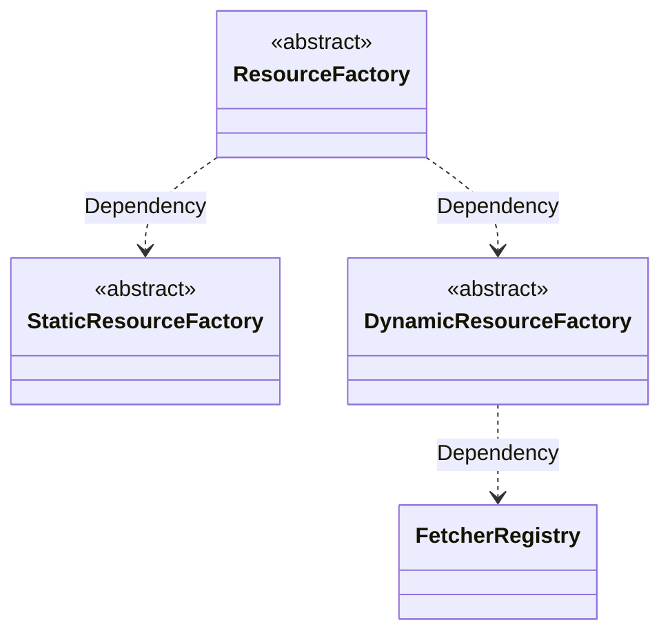

# 基础设施层

将原始 `RuleFactorResource` 转化为 `Resource` 实体，定义动态资源获取的 `Fetcher` 抽象，依赖业务方提供 `Fetcher` 实现

## 前置依赖

- [规则配置内核](./spec.md)
- [规则因子解释器](../interpreter.md)

**特别说明**：`Resource` 实体的具体协议定义详见 [interpreter.md](../interpreter.md)，`StaticResource` 为静态资源，预设选项无需动态加载

## Fetcher 端口

业务方按场景组合提供 `Fetcher`，作为具体的实现细节

**重要设计约定**：`Fetcher` 只与 `Resource` 的 `features` 相关，不与具体 `Resource.name` 绑定。
`Resource.name` 在请求时通过 `fetch()` 的第一参数传入，从而**一个 `Fetcher` 可被多个 `Resource` 复用**，便于业务方按 features 复用同一种数据获取实现（例如多个 Resource 都走同一套分页过滤 API）。
`Resource.name` 的语义是数据查询的**业务主键 / 路由参数**，由 DSL `RuleFactorDefinition.resource.name` 决定，而非由 Fetcher 端指定。

```ts
// 基础动态资源 Fetcher - 无分页、无过滤
interface ElementaryFetcher<T = FieldDataSource> {
  /**
   * @param resourceName 资源名称，来源于 DSL 中 `RuleFactorDefinition.resource.name`
   */
  fetch(resourceName: string): Promise<T[]>;
}

// 分页动态资源 Fetcher
interface PaginatedFetcher<T = FieldDataSource> {
  /**
   * @param resourceName 资源名称，来源于 DSL 中 `RuleFactorDefinition.resource.name`
   * @param page 当前页码（从 1 开始）
   * @param pageSize 每页条数
   */
  fetch(resourceName: string, page: number, pageSize: number): Promise<PaginatedResult<T>>;
}

// 过滤动态资源 Fetcher
interface FilterableFetcher<T = FieldDataSource> {
  /**
   * @param resourceName 资源名称，来源于 DSL 中 `RuleFactorDefinition.resource.name`
   * @param keyword 过滤关键词
   */
  fetch(resourceName: string, keyword: string): Promise<T[]>;
}

// 分页+过滤动态资源 Fetcher
interface PaginatedFilterableFetcher<T = FieldDataSource> {
  /**
   * @param resourceName 资源名称，来源于 DSL 中 `RuleFactorDefinition.resource.name`
   * @param keyword 过滤关键词
   * @param page 当前页码（从 1 开始）
   * @param pageSize 每页条数
   */
  fetch(
    resourceName: string,
    keyword: string,
    page: number,
    pageSize: number
  ): Promise<PaginatedResult<T>>;
}
```

## Fetcher Type 枚举

`FetcherProvider` 通过 `type` 字段区分亚型，枚举集中声明 `type` 取值：

```ts
/**
 * Fetcher 类型枚举
 *
 * 标识 FetcherProvider 的能力组合（是否支持分页、是否支持服务端过滤），
 * 与 DynamicRuleFactorResource.features 共同决定 DynamicResource 亚型
 */
enum FetcherType {
  /** 基础动态资源 - 不支持分页、不支持服务端过滤 */
  ELEMENTARY = 'elementary',
  /** 分页动态资源 - 支持分页、不支持服务端过滤 */
  PAGINATED = 'paginated',
  /** 可过滤动态资源 - 不支持分页、支持服务端过滤 */
  FILTERABLE = 'filterable',
  /** 分页+过滤动态资源 - 支持分页、支持服务端过滤 */
  PAGINATED_FILTERABLE = 'paginatedFilterable',
}
```

## 资源工厂与 Fetcher 管理

### 依赖关系



**职责说明**：

- `FetcherRegistry`：负责持有 `FetcherProvider` 列表，提供按 `type` 查找 `Fetcher` 的能力。`FetcherRegistry` **不**负责按资源名称映射 `Fetcher`（资源名称是 `Fetcher` 调用时的请求参数，不是注册时的元数据）
- `StaticResourceFactory`：负责将 `StaticRuleFactorResource` 转换为 `StaticResource` 实体
- `DynamicResourceFactory`：负责将 `DynamicRuleFactorResource` 转换为对应亚型 `DynamicResource` 实体。内部按 `features` 决定亚型，再从 `FetcherRegistry` 中按 `type` 选取匹配的 `Fetcher`
- `ResourceFactory`：作为统一 `Facade` 入口，根据 `RuleFactorDefinition.resource` 形态自动选择工厂

### 抽象设计

```ts
/**
 * Elementary 资源 Provider
 */
interface ElementaryFetcherProvider<T extends FieldDataSource> {
  readonly type: FetcherType.ELEMENTARY;
  readonly fetcher: ElementaryFetcher<T>;
}

/**
 * 分页资源 Provider
 */
interface PaginatedFetcherProvider<T extends FieldDataSource> {
  readonly type: FetcherType.PAGINATED;
  readonly fetcher: PaginatedFetcher<T>;
}

/**
 * 可过滤资源 Provider
 */
interface FilterableFetcherProvider<T extends FieldDataSource> {
  readonly type: FetcherType.FILTERABLE;
  readonly fetcher: FilterableFetcher<T>;
}

/**
 * 分页+过滤资源 Provider
 */
interface PaginatedFilterableFetcherProvider<T extends FieldDataSource> {
  readonly type: FetcherType.PAGINATED_FILTERABLE;
  readonly fetcher: PaginatedFilterableFetcher<T>;
}

/**
 * FetcherProvider 联合类型（按 type 判别）
 *
 * 重要：不包含 resourceName 字段。Fetcher 行为与具体资源名称解耦，
 * 资源名称作为请求参数在 fetch() 调用时传入
 */
type FetcherProvider<T extends FieldDataSource> =
  | ElementaryFetcherProvider<T>
  | PaginatedFetcherProvider<T>
  | FilterableFetcherProvider<T>
  | PaginatedFilterableFetcherProvider<T>;

/**
 * 运行时 Resource 实体联合类型
 *
 * 涵盖所有 Resource 亚型，便于 ResourceFactory（Facade）作为统一返回类型
 */
type Resource = StaticResource<FieldDataSource> | DynamicResource<FieldDataSource>;

type DynamicResource<T> =
  | ElementaryDynamicResource<T>
  | PaginatedDynamicResource<T>
  | FilterableDynamicResource<T>
  | PaginatedFilterableDynamicResource<T>;

/**
 * Fetcher Registry
 *
 * 职责：按 features 决定亚型时，查找匹配的 Fetcher。
 * Fetcher 与具体资源名称解耦，多个 Resource 可复用同一个 Fetcher
 */
abstract class FetcherRegistry {
  /**
   * 查找首个匹配指定 type 的 Fetcher
   * @param type FetcherProvider 类型，与 features 组合决定亚型
   * @returns 匹配的 FetcherProvider，未找到返回 undefined
   */
  abstract find(type: FetcherType): FetcherProvider<FieldDataSource> | undefined;

  /**
   * 获取全部 Provider
   */
  abstract all(): readonly FetcherProvider<FieldDataSource>[];
}

/**
 * 静态资源工厂
 *
 * 职责：创建 StaticResource
 * 依赖：无外部依赖，options 直接来源于 DSL 的 StaticRuleFactorResource.options
 */
abstract class StaticResourceFactory {
  /**
   * 创建静态资源实例
   * @param resource DSL 描述的静态资源
   */
  abstract create(resource: StaticRuleFactorResource): StaticResource<FieldDataSource>;
}

/**
 * 动态资源工厂
 *
 * 职责：创建 DynamicResource（根据 resource.features 组合确定亚型）
 * 依赖：FetcherRegistry（按 type 选取 Fetcher）
 */
abstract class DynamicResourceFactory {
  /**
   * 创建动态资源实例
   * @param resource DSL 描述的动态资源（包含 features 组合）
   */
  abstract create(resource: DynamicRuleFactorResource): DynamicResource<FieldDataSource>;
}

/**
 * 统一资源工厂（Facade）
 *
 * 职责：作为资源创建的统一入口
 *       根据 RuleFactorDefinition.resource 形态自动选择工厂
 * 依赖：StaticResourceFactory + DynamicResourceFactory
 */
abstract class ResourceFactory {
  /**
   * 统一资源创建入口
   * @param factor 规则因子定义
   * @returns 资源实例，若无 resource 声明则返回 null
   */
  abstract create(factor: RuleFactorDefinition): Resource | null;
}
```
