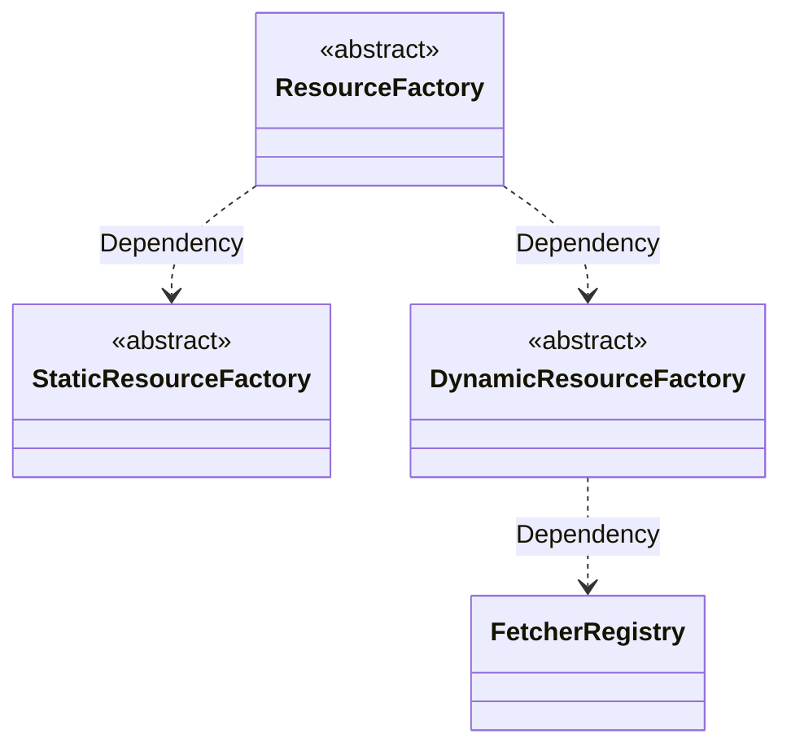

# Infrastructure

Converts the raw `RuleFactorResource` into `Resource` entities and defines the `Fetcher` abstraction for dynamic resource

## Fetcher Port

**Important**: `Fetcher` is related only to the `features` of a `Resource`, not to a specific `Resource.name`.

```ts
/**
 * Fetcher type enum
 *
 * Identifies the capability combination of a FetcherProvider (whether it supports pagination
 * and whether it supports server-side filtering), and together with DynamicRuleFactorResource.features
 * determines the DynamicResource subtype.
 */
enum FetcherType {
  /** Basic dynamic resource - no pagination, no server-side filtering */
  ELEMENTARY = 'elementary',
  /** Paginated dynamic resource - supports pagination, no server-side filtering */
  PAGINATED = 'paginated',
  /** Filterable dynamic resource - no pagination, supports server-side filtering */
  FILTERABLE = 'filterable',
  /** Paginated + filterable dynamic resource - supports pagination and server-side filtering */
  PAGINATED_FILTERABLE = 'paginatedFilterable',
}

// Basic dynamic resource fetcher - no pagination, no filtering
interface ElementaryFetcher<T = FieldDataSource> {
  /**
   * @param resourceName Resource name, comes from `RuleFactor.resource.name`
   */
  fetch(resourceName: string): Promise<T[]>;
}

// Paginated dynamic resource fetcher
interface PaginatedFetcher<T = FieldDataSource> {
  /**
   * @param resourceName Resource name, comes from `RuleFactor.resource.name`
   * @param pageIndex Current page number (starting from 1)
   * @param pageSize Items per page
   */
  fetch(resourceName: string, pageIndex: number, pageSize: number): Promise<PaginatedResult<T>>;
}

// Filterable dynamic resource fetcher
interface FilterableFetcher<T = FieldDataSource> {
  /**
   * @param resourceName Resource name, comes from `RuleFactor.resource.name`
   * @param keyword Filter keyword
   */
  fetch(resourceName: string, keyword: string): Promise<T[]>;
}

// Paginated + filterable dynamic resource fetcher
interface PaginatedFilterableFetcher<T = FieldDataSource> {
  /**
   * @param resourceName Resource name, comes from `RuleFactor.resource.name`
   * @param keyword Filter keyword
   * @param pageIndex Current page number (starting from 1)
   * @param pageSize Items per page
   */
  fetch(
    resourceName: string,
    keyword: string,
    pageIndex: number,
    pageSize: number
  ): Promise<PaginatedResult<T>>;
}
```

## Resource Factory and Fetcher Management

### Dependency Graph



**Responsibilities**:

- `FetcherRegistry`: holds the `FetcherProvider` list and provides lookup by `type`. `FetcherRegistry` does **not** map by resource name, because the resource name is a request parameter passed when calling `Fetcher`, not registration metadata.
- `StaticResourceFactory`: converts `StaticRuleFactorResource` into a `StaticResource` entity.
- `DynamicResourceFactory`: converts `DynamicRuleFactorResource` into the appropriate `DynamicResource` subtype. It determines the subtype from `features` and then selects the matching `Fetcher` from `FetcherRegistry` by `type`.
- `ResourceFactory`: acts as the unified `Facade` entry point and automatically chooses the factory according to the shape of `RuleFactor.resource`.

### Abstract Design

```ts
/**
 * Elementary resource provider
 */
interface ElementaryFetcherProvider<T extends FieldDataSource> {
  readonly type: FetcherType.ELEMENTARY;
  readonly fetcher: ElementaryFetcher<T>;
}

/**
 * Paginated resource provider
 */
interface PaginatedFetcherProvider<T extends FieldDataSource> {
  readonly type: FetcherType.PAGINATED;
  readonly fetcher: PaginatedFetcher<T>;
}

/**
 * Filterable resource provider
 */
interface FilterableFetcherProvider<T extends FieldDataSource> {
  readonly type: FetcherType.FILTERABLE;
  readonly fetcher: FilterableFetcher<T>;
}

/**
 * Paginated + filterable resource provider
 */
interface PaginatedFilterableFetcherProvider<T extends FieldDataSource> {
  readonly type: FetcherType.PAGINATED_FILTERABLE;
  readonly fetcher: PaginatedFilterableFetcher<T>;
}

/**
 * FetcherProvider union type (discriminated by type)
 *
 * Important: does not include a resourceName field. Fetcher behavior is decoupled from
 * specific resource names; resource names are passed as request parameters at fetch() call time.
 */
type FetcherProvider<T extends FieldDataSource> =
  | ElementaryFetcherProvider<T>
  | PaginatedFetcherProvider<T>
  | FilterableFetcherProvider<T>
  | PaginatedFilterableFetcherProvider<T>;

/**
 * Runtime Resource entity union type
 *
 * Covers all Resource subtypes, making ResourceFactory (Facade) a unified return type.
 */
type Resource = StaticResource<FieldDataSource> | DynamicResource<FieldDataSource>;

type DynamicResource<T> =
  | ElementaryDynamicResource<T>
  | PaginatedDynamicResource<T>
  | FilterableDynamicResource<T>
  | PaginatedFilterableDynamicResource<T>;

/**
 * Fetcher Registry
 *
 * Responsibility: look up matching Fetchers when subtype selection is based on features.
 * Fetchers are decoupled from specific resource names; multiple Resources can reuse the same Fetcher.
 */
abstract class FetcherRegistry {
  /**
   * Find the first Fetcher matching the specified type.
   * @param type FetcherProvider type, combined with features to determine the subtype
   * @returns the matching FetcherProvider, or undefined if none is found
   */
  abstract find(type: FetcherType): FetcherProvider<FieldDataSource> | undefined;

  /**
   * Get all providers
   */
  abstract all(): readonly FetcherProvider<FieldDataSource>[];
}

/**
 * Static resource factory
 *
 * Responsibility: create StaticResource
 * Dependency: none. options come directly from DSL `StaticRuleFactorResource.options`.
 */
abstract class StaticResourceFactory {
  /**
   * Create a static resource instance
   * @param resource The static resource described by the DSL
   */
  abstract create(resource: StaticRuleFactorResource): StaticResource<FieldDataSource>;
}

/**
 * Dynamic resource factory
 *
 * Responsibility: create DynamicResource (subtype determined by resource.features)
 * Dependency: FetcherRegistry (selects Fetcher by type)
 */
abstract class DynamicResourceFactory {
  /**
   * Create a dynamic resource instance
   * @param resource The dynamic resource described by the DSL (including feature combinations)
   */
  abstract create(resource: DynamicRuleFactorResource): DynamicResource<FieldDataSource>;
}

/**
 * Unified resource factory (Facade)
 *
 * Responsibility: unified entry point for resource creation
 *               automatically selects a factory according to the shape of RuleFactor.resource
 * Dependency: StaticResourceFactory + DynamicResourceFactory
 */
abstract class ResourceFactory {
  /**
   * Unified resource creation entry point
   * @param factor Rule factor definition
   * @returns the resource instance, or null if no resource is declared
   */
  abstract create(factor: RuleFactor): Resource | null;
}
```
