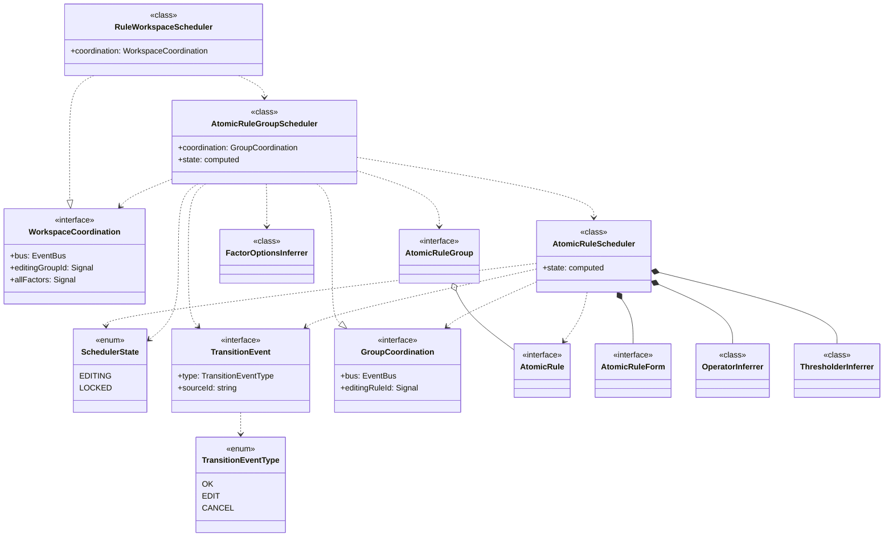

# @sisyphus/core

规则配置的内核，负责 `Intermediate Representation` 的推断、匹配操作符 `Operator` 的推断、可用规则因子的推断、规则配置的逻辑封装

## 前置依赖

- [规则及规则因子描述](../spec.md)
- [规则因子解释器](../interpreter.md)

## 技术选型

使用依赖库 `API` 前，务必使用 `context7` 获取使用指导

- [nanoid](https://www.npmjs.com/package/nanoid) 客户端生成唯一标识
- [nanoevents](https://github.com/ai/nanoevents) 轻量级事件监听
- [formily](https://github.com/alibaba/formily) 表单解决方案（`@formily/core`）

## 设计目标

- **框架无关**：内核实现与框架/组件库解耦，便于多框架、多终端适配
- **可测试性**：内核负责核心解释器、业务逻辑封装
- **分层架构**：内核实现遵循领域驱动设计风格的分层架构

## 设计约定

- 响应式状态管理基于 `@preact/signals-core`，看做运行时标准，不纳入内核分层架构范畴

## 分层架构

- 接入层：对外暴露类型安全的 `API` 协议，简化业务方实例化内核应用层的过程
- 基础设施层：将原始 `RuleFactorResource` 转化为 `Resource` 实体，定义动态资源获取的 `Fetcher` 抽象，依赖业务方提供 `Fetcher` 实现
- 应用层：编排领域逻辑，负责规则配置的数据、行为封装
- 领域层：封装核心业务规则，包括规则推断机制、操作符映射逻辑、阈值属性计算逻辑。根据 `RuleFactorDefinition` 定义推断可用 `operators` 和 `thresholder`，以及 `AtomicRuleGroup` 级别的可选规则因子选项推断

### 基础设施层

将原始 `RuleFactorResource` 转化为 `Resource` 实体，定义动态资源获取的 `Fetcher` 抽象，依赖业务方提供 `Fetcher` 实现

[详见基础设施层设计](./infrastructure.md)

### 接入层

对外暴露类型安全的 `API` 协议，简化业务方实例化内核应用层的过程

[详见接入层设计](./access.md)

### 领域层

封装核心业务规则，包括规则推断机制、操作符映射逻辑、阈值属性计算逻辑

[详见领域层设计](./domain.md)

### 应用层

编排领域逻辑，负责规则配置的数据、行为封装

[详见应用层设计](./application.md)

### 领域模型

## 业务方使用示例

[详见使用示例](./usage.md)
