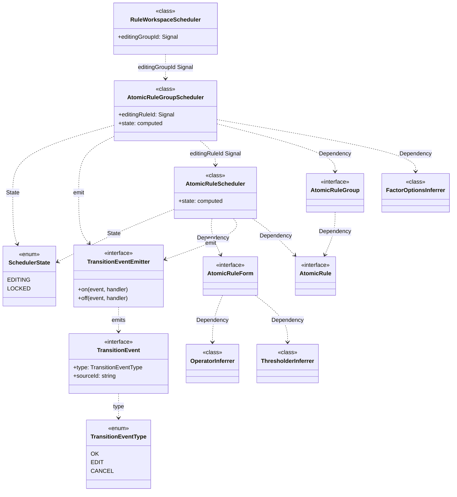

# @sisyphus/core

规则配置的内核，负责 `Intermediate Representation` 的推断、匹配操作符 `Operator` 的推断、可用规则因子的推断、规则配置的逻辑封装

## 前置依赖

- [规则及规则因子描述](../spec.md)
- [规则因子解释器](../interpreter.md)

## 技术选型

使用依赖库 `API` 前，务必使用 `context7` 获取使用指导

- [nanoid](https://www.npmjs.com/package/nanoid) 客户端生成唯一标识

## 设计目标

- **框架无关**：内核实现与框架/组件库解耦，便于多框架、多终端适配
- **可测试性**：内核负责核心解释器、业务逻辑封装
- **分层架构**：内核实现遵循领域驱动设计风格的分层架构

## 设计约定

- 响应式状态管理基于 `@preact/signals-core`，看做运行时标准，不纳入内核分层架构范畴

## 分层架构

- 接入层：对外暴露类型安全的 `API` 协议，简化业务方实例化内核应用层的过程
- 基础设施层：将原始 `RuleFactorResource` 转化为 `Resource` 实体，定义动态资源获取的 `Fetcher` 抽象，依赖业务方提供 `Fetcher` 实现
- 应用层：编排领域逻辑，负责规则配置的数据、行为封装
- 领域层：封装核心业务规则，包括规则推断机制、操作符映射逻辑、阈值属性计算逻辑。根据 `RuleFactorDefinition` 定义推断可用 `operators` 和 `thresholder`，以及 `AtomicRuleGroup` 级别的可选规则因子选项推断

### 基础设施层

将原始 `RuleFactorResource` 转化为 `Resource` 实体，定义动态资源获取的 `Fetcher` 抽象，依赖业务方提供 `Fetcher` 实现

[详见基础设施层设计](./infrastructure.md)

### 接入层

对外暴露类型安全的 `API` 协议，简化业务方实例化内核应用层的过程

[详见接入层设计](./access.md)

### 领域层

封装核心业务规则，包括规则推断机制、操作符映射逻辑、阈值属性计算逻辑

[详见领域层设计](./domain.md)

### 应用层

编排领域逻辑，负责规则配置的数据、行为封装

[详见应用层设计](./application.md)

### 领域模型



## 业务方使用示例

### 新建场景

```ts
import { DataType, Mode, Quantity, SchedulerState } from '@sisyphus/core';
import { RuleWorkspaceBuilder, providePaginatedFilterableFetcher } from '@sisyphus/core';

// 1. 定义 DSL
// 多个因子可以共享同一种 features 组合的 Fetcher（例：employee / department 都走分页过滤）
const factors: RuleFactorDefinition[] = [
  {
    name: 'employee',
    title: '员工',
    dataType: DataType.STRING,
    resource: { name: 'Employee', features: ['pagination', 'filter'] },
  },
  {
    name: 'department',
    title: '部门',
    dataType: DataType.STRING,
    resource: { name: 'Department', features: ['pagination', 'filter'] },
  },
  {
    name: 'deliver_city',
    title: '目标城市',
    dataType: DataType.STRING,
    resource: { name: 'City' }, // 无 features = StaticResource（由内核默认提供）
  },
  {
    name: 'order_amount',
    title: '订单金额',
    dataType: DataType.NUMBER,
    mode: Mode.RANGE,
    quantity: Quantity.MULTIPLE,
  },
];

// 2. 提供 Fetcher（仅 DynamicResource 需要，StaticResource 由内核默认提供）
// Fetcher 只与 features 相关，resourceName 在调用时透传
// 同一个 Fetcher 可被 Employee / Department 复用
const fetchers = [
  providePaginatedFilterableFetcher({
    fetch(resourceName, keyword, page, pageSize) {
      switch (resourceName) {
        case 'Employee':
          return api.searchEmployees(keyword, page, pageSize);
        case 'Department':
          return api.searchDepartments(keyword, page, pageSize);
        default:
          throw new Error(`[sisyphus] Unknown resource: ${resourceName}`);
      }
    },
  }),
];

// 3. 构建 RuleWorkspace
const workspace = new RuleWorkspaceBuilder().withFactors(factors).withFetchers(fetchers).build();

// 4. 创建规则组（新建的 Group 默认进入编辑态）
const group = workspace.addGroup();
// group.state.value === SchedulerState.EDITING

// 5. 创建原子规则（新建的 Rule 默认进入编辑态）
const rule = group.addRule();
// rule.state.value === SchedulerState.EDITING

// 6. 通过 Form 驱动表单交互（编辑态下生效，锁定态静默忽略）
// rule.form.name.value = 'employee'
// rule.form.operator.value = 'eq'
// rule.form.threshold.value = 100
// Form 自动完成 factor 切换 → operators / thresholder 推断

// 7. 确认规则配置，进入锁定态（Rule 接收确认指令，内部校验通过后由 Group 写入状态）
rule.confirm();
// rule.state.value === SchedulerState.LOCKED

// 8. 确认规则组配置，进入锁定态（Group 接收确认指令，内部校验通过后由 Workspace 写入状态）
group.confirm();
// group.state.value === SchedulerState.LOCKED

// 9. 验证并构建（build 阶段执行业务校验）
if (workspace.validate()) {
  const result = workspace.build();
  // 校验：至少 1 个已配置的规则组，每个规则组至少 1 条已配置的原子规则
  // result: readonly AtomicRuleGroup[]
}

// 10. 编辑已有配置（需显式切换到编辑态，由父级控制状态）
workspace.transitionState(group.id, SchedulerState.EDITING);
group.transitionState(rule.id, SchedulerState.EDITING);
// 通过 rule.form 驱动表单修改...
rule.confirm();
group.confirm();

// 11. 锁定态下仍可删除规则
group.removeRule(rule.id); // 删除不受锁定态限制

// 12. 销毁工作空间，释放订阅与缓存
workspace.destroy();
```

### 编辑场景

```ts
// 已有规则组数据（从外部加载）
import { AtomicRuleGroup, SchedulerState } from '../spec.md';

const groups: AtomicRuleGroup[] = [
  {
    id: 'group-1',
    rules: [
      { id: 'rule-1', name: 'employee', operator: 'eq', threshold: 100 },
      { id: 'rule-2', name: 'deliver_city', operator: 'in', threshold: ['北京', '上海'] },
    ],
  },
];

// 初始化时传入已有数据（factors / fetchers 沿用新建场景中已定义的实例）
const workspace = new RuleWorkspaceBuilder()
  .withFactors(factors)
  .withFetchers(fetchers)
  .withRuleGroups(groups)
  .build();

// 存量配置默认进入锁定态
const group = workspace.pickGroup('group-1');
// group.state.value === SchedulerState.LOCKED

const rule1 = group.pickRule('rule-1');
// rule1.state.value === SchedulerState.LOCKED

// 用户需显式切换到编辑态后才能修改（由父级控制状态）
workspace.transitionState('group-1', SchedulerState.EDITING);
group.transitionState('rule-1', SchedulerState.EDITING);
// 通过 rule1.form 驱动表单修改...
rule1.confirm();
group.confirm();

// 编辑态下的并行编辑互斥（Group 级别约束，与 Workspace 级别独立）
group.transitionState('rule-1', SchedulerState.EDITING); // rule1 进入编辑态
group.transitionState('rule-2', SchedulerState.EDITING); // rule2 进入编辑态，rule1 自动锁定
// rule1.state.value === SchedulerState.LOCKED
// rule2.state.value === SchedulerState.EDITING
// group.canAddRule.value === false（存在编辑中的 Rule，禁用新增）
```
