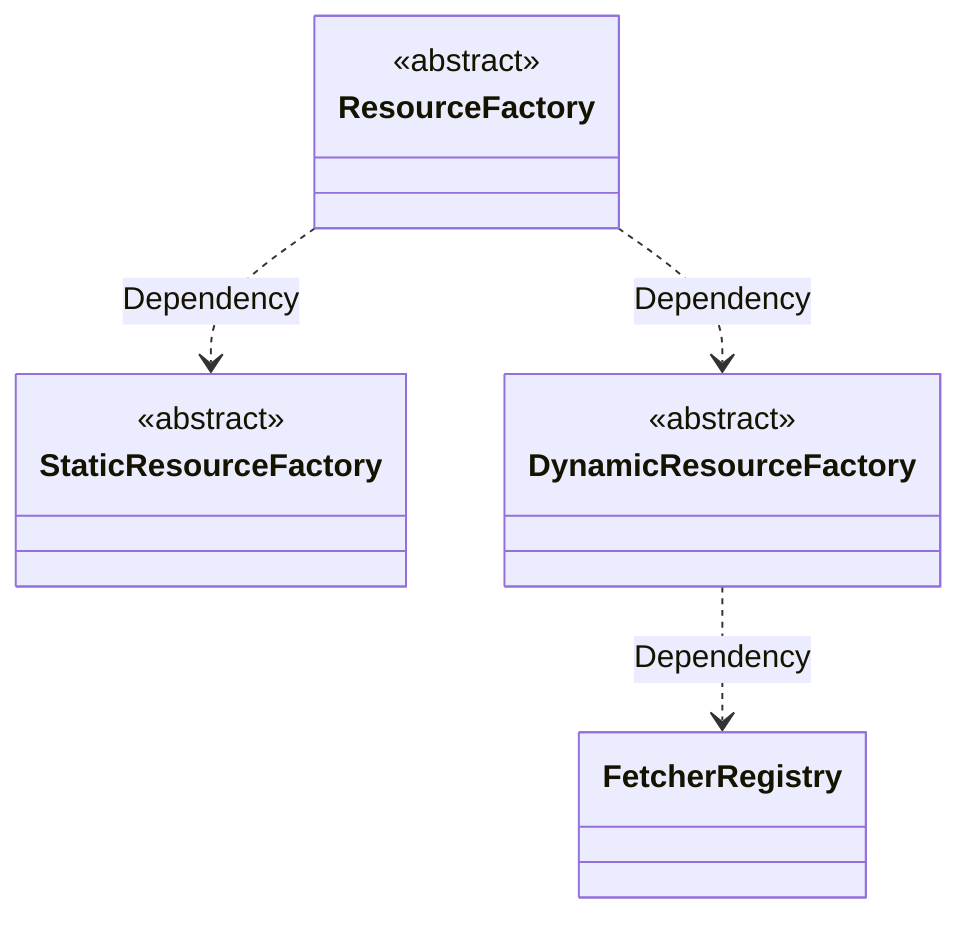
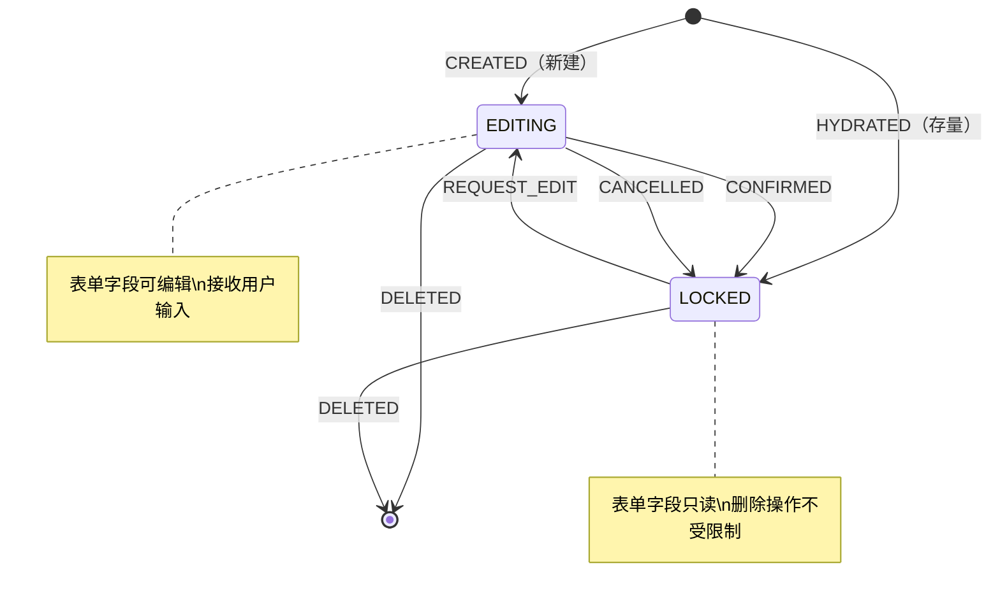
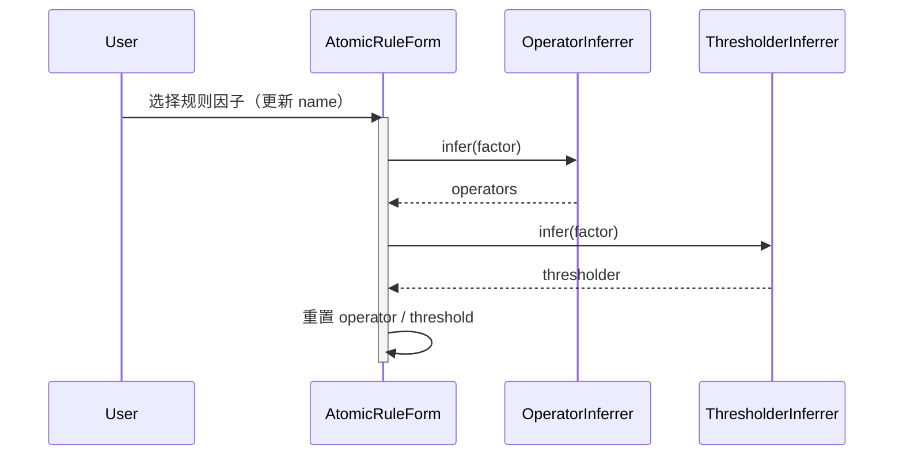
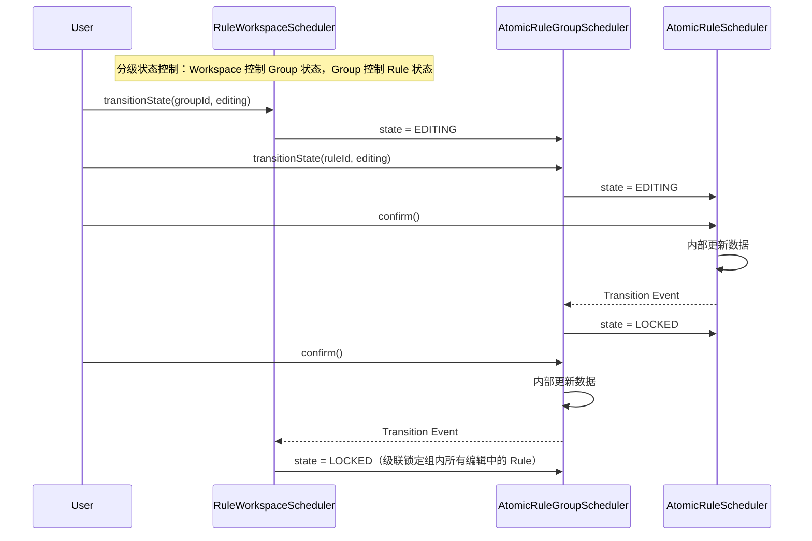
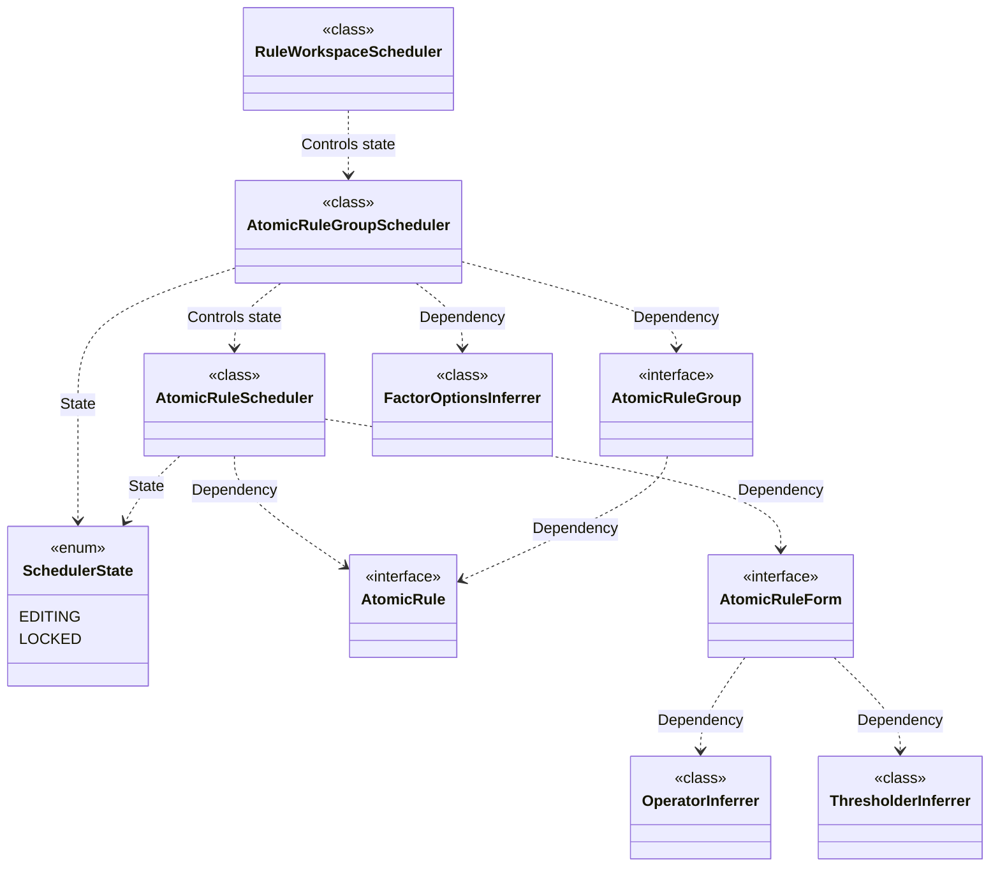

# @sisyphus/core

规则配置的内核，负责 `Intermediate Representation` 的推断、匹配操作符 `Operator` 的推断、可用规则因子的推断、规则配置的逻辑封装

## 前置依赖

- [规则及规则因子描述](../spec.md)
- [规则因子解释器](../interpreter.md)

## 技术选型

使用依赖库 `API` 前，务必使用 `context7` 获取使用指导

- [nanoid](https://www.npmjs.com/package/nanoid) 客户端生成唯一标识

## 设计目标

- **框架无关**：内核实现与框架/组件库解耦，便于多框架、多终端适配
- **可测试性**：内核负责核心解释器、业务逻辑封装
- **分层架构**：内核实现遵循领域驱动设计风格的分层架构

## 设计约定

- 响应式状态管理基于 `@preact/signals-core`，看做运行时标准，不纳入内核分层架构范畴

## 分层架构

- 接入层：对外暴露类型安全的 `API` 协议，简化业务方实例化内核应用层的过程
- 基础设施层：将原始 `RuleFactorResource` 转化为 `Resource` 实体，定义动态资源获取的 `Fetcher` 抽象，依赖业务方提供 `Fetcher` 实现
- 应用层：编排领域逻辑，负责规则配置的数据、行为封装
- 领域层：封装核心业务规则，包括规则推断机制、操作符映射逻辑、阈值属性计算逻辑。根据 `RuleFactorDefinition` 定义推断可用 `operators` 和 `thresholder`，以及 `AtomicRuleGroup` 级别的可选规则因子选项推断

### 基础设施层

**特别说明**：`Resource` 实体的具体协议定义详见 [interpreter.md](../interpreter.md)，`StaticResource` 为静态资源，预设选项无需动态加载

#### Fetcher 端口

业务方按场景组合提供 `Fetcher`，作为具体的实现细节

**重要设计约定**：`Fetcher` 只与 `Resource` 的 `features` 相关，不与具体 `Resource.name` 绑定。
`Resource.name` 在请求时通过 `fetch()` 的第一参数传入，从而**一个 `Fetcher` 可被多个 `Resource` 复用**，便于业务方按 features 复用同一种数据获取实现（例如多个 Resource 都走同一套分页过滤 API）。
`Resource.name` 的语义是数据查询的**业务主键 / 路由参数**，由 DSL `RuleFactorDefinition.resource.name` 决定，而非由 Fetcher 端指定。

```ts
// 基础动态资源 Fetcher - 无分页、无过滤
interface ElementaryFetcher<T = FieldDataSource> {
  /**
   * @param resourceName 资源名称，来源于 DSL 中 `RuleFactorDefinition.resource.name`
   */
  fetch(resourceName: string): Promise<T[]>;
}

// 分页动态资源 Fetcher
interface PaginatedFetcher<T = FieldDataSource> {
  /**
   * @param resourceName 资源名称，来源于 DSL 中 `RuleFactorDefinition.resource.name`
   * @param page 当前页码（从 1 开始）
   * @param pageSize 每页条数
   */
  fetch(resourceName: string, page: number, pageSize: number): Promise<PaginatedResult<T>>;
}

// 过滤动态资源 Fetcher
interface FilterableFetcher<T = FieldDataSource> {
  /**
   * @param resourceName 资源名称，来源于 DSL 中 `RuleFactorDefinition.resource.name`
   * @param keyword 过滤关键词
   */
  fetch(resourceName: string, keyword: string): Promise<T[]>;
}

// 分页+过滤动态资源 Fetcher
interface PaginatedFilterableFetcher<T = FieldDataSource> {
  /**
   * @param resourceName 资源名称，来源于 DSL 中 `RuleFactorDefinition.resource.name`
   * @param keyword 过滤关键词
   * @param page 当前页码（从 1 开始）
   * @param pageSize 每页条数
   */
  fetch(
    resourceName: string,
    keyword: string,
    page: number,
    pageSize: number
  ): Promise<PaginatedResult<T>>;
}
```

#### Fetcher Type 枚举

`FetcherProvider` 通过 `type` 字段区分亚型，枚举集中声明 `type` 取值：

```ts
/**
 * Fetcher 类型枚举
 *
 * 标识 FetcherProvider 的能力组合（是否支持分页、是否支持服务端过滤），
 * 与 DynamicRuleFactorResource.features 共同决定 DynamicResource 亚型
 */
enum FetcherType {
  /** 基础动态资源 - 不支持分页、不支持服务端过滤 */
  ELEMENTARY = 'elementary',
  /** 分页动态资源 - 支持分页、不支持服务端过滤 */
  PAGINATED = 'paginated',
  /** 可过滤动态资源 - 不支持分页、支持服务端过滤 */
  FILTERABLE = 'filterable',
  /** 分页+过滤动态资源 - 支持分页、支持服务端过滤 */
  PAGINATED_FILTERABLE = 'paginatedFilterable',
}
```

#### 资源工厂与 Fetcher 管理

##### 依赖关系



**职责说明**：

- `FetcherRegistry`：负责持有 `FetcherProvider` 列表，提供按 `type` 查找 `Fetcher` 的能力。`FetcherRegistry` **不**负责按资源名称映射 `Fetcher`（资源名称是 `Fetcher` 调用时的请求参数，不是注册时的元数据）
- `StaticResourceFactory`：负责将 `StaticRuleFactorResource` 转换为 `StaticResource` 实体
- `DynamicResourceFactory`：负责将 `DynamicRuleFactorResource` 转换为对应亚型 `DynamicResource` 实体。内部按 `features` 决定亚型，再从 `FetcherRegistry` 中按 `type` 选取匹配的 `Fetcher`
- `ResourceFactory`：作为统一 `Facade` 入口，根据 `RuleFactorDefinition.resource` 形态自动选择工厂

##### 抽象设计

```ts
/**
 * Elementary 资源 Provider
 */
interface ElementaryFetcherProvider<T extends FieldDataSource> {
  readonly type: FetcherType.ELEMENTARY;
  readonly fetcher: ElementaryFetcher<T>;
}

/**
 * 分页资源 Provider
 */
interface PaginatedFetcherProvider<T extends FieldDataSource> {
  readonly type: FetcherType.PAGINATED;
  readonly fetcher: PaginatedFetcher<T>;
}

/**
 * 可过滤资源 Provider
 */
interface FilterableFetcherProvider<T extends FieldDataSource> {
  readonly type: FetcherType.FILTERABLE;
  readonly fetcher: FilterableFetcher<T>;
}

/**
 * 分页+过滤资源 Provider
 */
interface PaginatedFilterableFetcherProvider<T extends FieldDataSource> {
  readonly type: FetcherType.PAGINATED_FILTERABLE;
  readonly fetcher: PaginatedFilterableFetcher<T>;
}

/**
 * FetcherProvider 联合类型（按 type 判别）
 *
 * 重要：不包含 resourceName 字段。Fetcher 行为与具体资源名称解耦，
 * 资源名称作为请求参数在 fetch() 调用时传入
 */
type FetcherProvider<T extends FieldDataSource> =
  | ElementaryFetcherProvider<T>
  | PaginatedFetcherProvider<T>
  | FilterableFetcherProvider<T>
  | PaginatedFilterableFetcherProvider<T>;

/**
 * 运行时 Resource 实体联合类型
 *
 * 涵盖所有 Resource 亚型，便于 ResourceFactory（Facade）作为统一返回类型
 */
type Resource = StaticResource<FieldDataSource> | DynamicResource<FieldDataSource>;

type DynamicResource<T> =
  | ElementaryDynamicResource<T>
  | PaginatedDynamicResource<T>
  | FilterableDynamicResource<T>
  | PaginatedFilterableDynamicResource<T>;

/**
 * Fetcher Registry
 *
 * 职责：按 features 决定亚型时，查找匹配的 Fetcher。
 * Fetcher 与具体资源名称解耦，多个 Resource 可复用同一个 Fetcher
 */
abstract class FetcherRegistry {
  /**
   * 查找首个匹配指定 type 的 Fetcher
   * @param type FetcherProvider 类型，与 features 组合决定亚型
   * @returns 匹配的 FetcherProvider，未找到返回 undefined
   */
  abstract find(type: FetcherType): FetcherProvider<FieldDataSource> | undefined;

  /**
   * 获取全部 Provider
   */
  abstract all(): readonly FetcherProvider<FieldDataSource>[];
}

/**
 * 静态资源工厂
 *
 * 职责：创建 StaticResource
 * 依赖：无外部依赖，options 直接来源于 DSL 的 StaticRuleFactorResource.options
 */
abstract class StaticResourceFactory {
  /**
   * 创建静态资源实例
   * @param resource DSL 描述的静态资源
   */
  abstract create(resource: StaticRuleFactorResource): StaticResource<FieldDataSource>;
}

/**
 * 动态资源工厂
 *
 * 职责：创建 DynamicResource（根据 resource.features 组合确定亚型）
 * 依赖：FetcherRegistry（按 type 选取 Fetcher）
 */
abstract class DynamicResourceFactory {
  /**
   * 创建动态资源实例
   * @param resource DSL 描述的动态资源（包含 features 组合）
   */
  abstract create(resource: DynamicRuleFactorResource): DynamicResource<FieldDataSource>;
}

/**
 * 统一资源工厂（Facade）
 *
 * 职责：作为资源创建的统一入口
 *       根据 RuleFactorDefinition.resource 形态自动选择工厂
 * 依赖：StaticResourceFactory + DynamicResourceFactory
 */
abstract class ResourceFactory {
  /**
   * 统一资源创建入口
   * @param factor 规则因子定义
   * @returns 资源实例，若无 resource 声明则返回 null
   */
  abstract create(factor: RuleFactorDefinition): Resource | null;
}
```

### 接入层

#### Fetcher 工厂函数

通过 `provideXXXFetcher` 工厂函数创建类型安全的 `Fetcher` 注册项：

**重要**：不需传入 `resourceName`。一个 `Fetcher` 可被多个 `Resource` 复用，资源名称在调用时透传。

```ts
function provideElementaryFetcher<T extends FieldDataSource>(
  fetcher: ElementaryFetcher<T>
): ElementaryFetcherProvider<T>;

function providePaginatedFetcher<T extends FieldDataSource>(
  fetcher: PaginatedFetcher<T>
): PaginatedFetcherProvider<T>;

function provideFilterableFetcher<T extends FieldDataSource>(
  fetcher: FilterableFetcher<T>
): FilterableFetcherProvider<T>;

function providePaginatedFilterableFetcher<T extends FieldDataSource>(
  fetcher: PaginatedFilterableFetcher<T>
): PaginatedFilterableFetcherProvider<T>;
```

**与 `Fetcher` 调用约定的联动**：

```ts
const PAGINATED_FILTERABLE_FETCHER = providePaginatedFilterableFetcher<FieldDataSource>({
  fetch(resourceName, keyword, page, pageSize) {
    // resourceName 来源于 DSL `RuleFactorDefinition.resource.name`
    // 业务方可按 resourceName 路由到不同业务服务
    if (resourceName === 'Employee') return api.searchEmployees(keyword, page, pageSize);
    if (resourceName === 'Department') return api.searchDepartments(keyword, page, pageSize);
    throw new Error(`[sisyphus] Unknown resource: ${resourceName}`);
  },
});
```

#### Builder Pattern 入口

**工厂函数 vs Builder Pattern** 职责边界：

- `createRuleWorkspace`：简化入口，一站式创建规则工作空间，适合简单场景
- `RuleWorkspaceBuilder`：链式配置入口，适合需要精细控制配置的场景

```ts
/**
 * 简化工厂函数 - 一站式创建（推荐新手场景）
 */
function createRuleWorkspace(config: {
  factors: RuleFactorDefinition[];
  fetchers?: readonly FetcherProvider[];
  ruleGroups?: readonly AtomicRuleGroup[];
}): RuleWorkspaceScheduler;

/**
 * Builder Pattern - 链式配置入口（推荐标准场景）
 */
class RuleWorkspaceBuilder {
  /**
   * 配置规则因子定义（必须）
   */
  withFactors(factors: RuleFactorDefinition[]): RuleWorkspaceBuilder;

  /**
   * 配置动态资源 Fetcher（DynamicResource 必须，StaticResource 由内核默认提供）
   */
  withFetchers(fetchers: readonly FetcherProvider[]): RuleWorkspaceBuilder;

  /**
   * 配置已有规则组数据（编辑场景可选，新建场景可不传入）
   */
  withRuleGroups(ruleGroups: readonly AtomicRuleGroup[]): RuleWorkspaceBuilder;

  /**
   * 构建工作空间调度器
   */
  build(): RuleWorkspaceScheduler;
}
```

### 领域层

**核心推断逻辑**：

- `AtomicRule` 级别根据 `RuleFactorDefinition` 推断可用 `operators` 和 `thresholder`，参考 [规则因子解释器](../interpreter.md) 中的推断机制
- `AtomicRuleGroup` 级别的规则因子选项推断，参考 [规则及规则因子描述](../spec.md) 中的规则配置约束章节

#### 推断器类声明

```ts
/**
 * 操作符推断器
 *
 * 根据 dataType + semantic 确定"数据域"，再结合 mode（点/区间）和 quantity（单/多）确定"操作域"
 */
class OperatorInferrer {
  infer(factor: RuleFactorDefinition): readonly FieldDataSource[];
}

/**
 * 阈值渲染组件属性推断器
 *
 * 根据 RuleFactorDefinition 推断中间形态的表单组件 + 表单组件属性
 */
class ThresholderInferrer {
  infer(factor: RuleFactorDefinition): ThresholdComponentProperties;
}
```

### 应用层

#### 调度器状态控制

`AtomicRuleScheduler` 与 `AtomicRuleGroupScheduler` 均引入 **编辑态 / 锁定态** 状态控制，确保用户操作的有序性。

```ts
/**
 * 调度器状态枚举
 *
 * 控制 Scheduler 的可编辑性，编辑态允许修改表单字段，锁定态禁止修改（删除不受影响）
 */
enum SchedulerState {
  /** 编辑态 - 允许修改表单字段 */
  EDITING = 'editing',
  /** 锁定态 - 禁止修改表单字段（删除操作不受限制） */
  LOCKED = 'locked',
}
```



#### 调度器规则控制

**并行编辑约束**（分级独立控制，各级仅约束直接子级）：

- `AtomicRuleGroupScheduler` 级别：最多 **1 个 Rule** 处于编辑态，存在编辑中的 `Rule` 时禁用 **新增功能**
- `RuleWorkspaceScheduler` 级别：最多 **1 个 Group** 处于编辑态；存在编辑中的 `Group`，或存在配置规则为空的 `Group` 时，禁用 **新增功能**

**业务规则校验**（`build` 阶段执行）：

- `AtomicRuleGroupScheduler.build()`：规则组至少包含 **1 条已配置的原子规则**
- `RuleWorkspaceScheduler.build()`：工作空间至少包含 **1 个已配置的规则组**
- 校验不通过时 `build()` 抛出异常，调用方应先用 `validate()` 进行前置检查

#### AtomicRuleScheduler

原子规则调度器，状态由所属 `AtomicRuleGroupScheduler` 控制。自身暴露只读状态信号、表单委托，以及确认指令接收入口。

```ts
interface AtomicRuleScheduler {
  /** 唯一标识 */
  readonly id: string;
  /** 当前状态（编辑态 / 锁定态），由所属 Group 控制，自身只读 */
  readonly state: Signal<SchedulerState>;
  /** 是否处于编辑态（派生信号，便于视图层绑定） */
  readonly editable: Signal<boolean>;
  /**
   * 上次用户确认且数据无误时更新的原子规则配置
   *
   * 与 Form 的不稳定态隔离：Form 字段的实时变化不影响 rule，仅在 confirm() 且内部校验通过后更新。
   * `build()` 返回值与 `rule.value` 始终一致
   */
  readonly rule: Signal<AtomicRule>;
  /** 关联的表单实例（管理表单数据与推断联动） */
  readonly form: AtomicRuleForm;

  /**
   * 确认规则配置（指令接收入口）
   *
   * 内部检查当前表单配置是否满足规则约束，通过后向所属 Group 发出 Transition Event，由 Group 写入 LOCKED 状态
   * @returns 内部校验是否通过
   */
  confirm(): boolean;

  /** 验证配置是否完整可用 */
  validate(): boolean;
  /** 构建原子规则（返回值与 rule.value 始终一致） */
  build(): AtomicRule;
}
```

#### AtomicRuleForm

表单模型独立于调度器，负责管理表单字段状态、用户交互与推断联动。

> **占位声明**：后续进一步细化表单模型的完整协议

```ts
/**
 * 原子规则表单模型
 *
 * 职责：
 * - 管理表单字段状态（name / operator / threshold）
 * - 驱动推断联动：用户选择规则因子 → 推断 operators / thresholder → 重置 operator / threshold
 * - 消费推断结果，供视图层渲染
 *
 * **状态约束**：仅编辑态（state=EDITING）时接受用户输入，锁定态静默忽略
 */
interface AtomicRuleForm {
  // 表单字段
  /** 选中的规则因子名称 */
  readonly name: Signal<string | null>;
  /** 选中的操作符 */
  readonly operator: Signal<string | null>;
  /** 阈值 */
  readonly threshold: Signal<unknown>;

  // 推断数据（由内核自动计算，供视图层消费）
  /** 已激活的规则因子定义 */
  readonly factor: Signal<RuleFactorDefinition | null>;
  /** 可用的匹配操作符列表 */
  readonly operators: Signal<readonly FieldDataSource[]>;
  /** threshold 渲染组件属性 */
  readonly thresholder: Signal<readonly ThresholdComponentProperties>;
}
```

规则因子选择联动流程（编辑态下，由 `Form` 内部驱动）：



**状态切换与互斥流程**：



#### AtomicRuleGroupScheduler

规则组设置器管理原子规则集合：

```ts
/**
 * 规则因子选项推断器
 *
 * 1. 数据源：allFactors.signal（RuleWorkspace 共享的规则因子定义列表）
 * 2. 排除规则：已存在于 rules.signal 中的原子规则的 name（通过 usedFactors 获取）
 * 3. 输出格式：转换为 FieldDataSource[] 供 Select 组件使用，已使用的因子标记 disabled
 * 4. 作用域：AtomicRuleGroup 级别，每个规则组独立计算
 */
class FactorOptionsInferrer {
  infer(
    allFactors: readonly RuleFactorDefinition[],
    usedFactorNames: readonly string[]
  ): readonly FieldDataSource[];
}

/** 规则组初始化数据（编辑场景） */
interface AtomicRuleGroup {
  /** 唯一标识 */
  readonly id: string;
  /** 已有的原子规则列表 */
  readonly rules: readonly AtomicRule[];
}

/**
 * 规则组设置器
 *
 * 管理原子规则集合，并实现规则配置约束：
 * - 特定规则因子仅允许配置一次（通过 usedFactors + factors.disabled 实现）
 * - 原子规则最大数量等同于规则因子的数量（通过 canAddRule 暴露）
 * - 编辑态 / 锁定态状态控制，状态由所属 Workspace 控制，自身只读
 * - 组内不支持并行编辑，最多 1 个 Rule 处于编辑态；存在编辑中的 Rule 时禁用 addRule
 */
interface AtomicRuleGroupScheduler {
  /** 规则组唯一标识 */
  readonly id: string;
  /** 当前状态（编辑态 / 锁定态），由所属 Workspace 控制，自身只读 */
  readonly state: Signal<SchedulerState>;
  /** 是否处于编辑态（派生信号，便于视图层绑定） */
  readonly editable: Signal<boolean>;
  /** 初始化时传入的规则快照数据（编辑场景），不可变 */
  readonly snapshots: readonly AtomicRule[];
  /** 已创建的规则实例列表 */
  readonly rules: Signal<readonly AtomicRuleScheduler[]>;
  /** 可用的规则因子列表 */
  readonly allFactors: Signal<readonly RuleFactorDefinition[]>;
  /** Group 内部已使用的规则因子名称集合 */
  readonly usedFactors: Signal<string[]>;
  /** 适配选择器的规则因子选项集合，已使用的规则因子标记 disabled */
  readonly factors: Signal<readonly FieldDataSource[]>;
  /** 是否可继续添加原子规则（rules.length < maxRuleCount 且存在未使用的规则因子，且当前无编辑中的 Rule） */
  readonly canAddRule: Signal<boolean>;

  /**
   * 创建原子规则设置器（新建场景）
   *
   * **状态约束**：仅 Group 处于编辑态时允许调用
   * **互斥行为**：新建的 Rule 默认进入编辑态，当前编辑中的 Rule（如有）自动锁定
   * **前置约束**：canAddRule=false 时调用静默忽略
   */
  addRule(): AtomicRuleScheduler;
  /**
   * 获取原子规则设置器（精细操作场景）
   */
  pickRule(ruleId: string): AtomicRuleScheduler | undefined;
  /**
   * 移除原子规则
   *
   * **状态无关**：删除操作不受锁定态限制，任何状态下均可执行
   */
  removeRule(ruleId: string): void;
  /**
   * 恢复原子规则设置器（编辑场景）
   *
   * 恢复的 Rule 默认进入 **锁定态**
   */
  hydrateRule(rule: AtomicRule): void;

  /**
   * 切换指定规则的状态（逻辑控制入口）
   *
   * - 目标为 EDITING：应用互斥约束，同时锁定当前编辑中的 Rule（如有），返回是否成功进入编辑态
   * - 目标为 LOCKED：直接转换，始终返回 true
   */
  transitionState(ruleId: string, state: SchedulerState): boolean;

  /**
   * 确认规则组配置（指令接收入口）
   *
   * 内部检查当前组内规则配置是否满足业务约束，通过后向所属 Workspace 发出 Transition Event，
   * 由 Workspace 写入 LOCKED 状态，并级联锁定组内所有处于编辑态的 Rule
   */
  confirm(): void;

  /** 验证所有原子规则 */
  validate(): boolean;
  /**
   * 构建规则组
   *
   * **业务校验**：规则组至少包含 1 条已配置的原子规则，校验不通过时抛出异常
   */
  build(): AtomicRuleGroup;
}
```

**特别说明**：

- `FactorOptionsInferrer` 属于 `AtomicRuleGroup` 级别，每个规则组独立维护自己的 `factors`，不同规则组之间 **不共享**
- `canAddRule` 综合数量约束（`rules.length < allFactors.length`）与 **编辑互斥约束**，供视图层控制「添加规则」按钮的可操作状态
- `addRule` 仅在 `Group` 处于编辑态时允许调用，锁定态调用静默忽略
- `removeRule` 不受状态约束，锁定态下仍可删除规则

#### RuleWorkspaceScheduler

统一入口，持有规则因子定义供调度器共享，控制 `Group` 状态，并提供完整的生命周期管理能力：

```ts
interface RuleWorkspaceScheduler {
  /** 初始化时传入的规则组快照数据（编辑场景），不可变 */
  readonly snapshots: readonly AtomicRuleGroup[];
  /** 已创建的规则组实例列表 */
  readonly groups: Signal<readonly AtomicRuleGroupScheduler[]>;
  /** 是否可继续添加规则组（当前无编辑中的 Group，且不存在配置规则为空的 Group） */
  readonly canAddGroup: Signal<boolean>;

  // 创建与删除
  /**
   * 创建规则组设置器（新建场景）
   *
   * **状态约束**：仅 Workspace 处于可编辑状态时允许调用
   * **互斥行为**：新建的 Group 默认进入编辑态，当前编辑中的 Group（如有）自动锁定
   * **前置约束**：canAddGroup=false 时调用静默忽略
   */
  addGroup(): AtomicRuleGroupScheduler;
  /**
   * 获取规则组设置器（精细操作场景）
   */
  pickGroup(groupId: string): AtomicRuleGroupScheduler | undefined;
  /**
   * 移除规则组
   *
   * **状态无关**：删除操作不受锁定态限制，任何状态下均可执行
   */
  removeGroup(groupId: string): void;
  /**
   * 恢复规则组设置器（编辑场景）
   *
   * 恢复的 Group 及其内部 Rule 默认进入 **锁定态**
   */
  hydrateGroup(group: AtomicRuleGroup): void;

  // 状态控制
  /**
   * 切换指定规则组的状态（逻辑控制入口）
   *
   * - 目标为 EDITING：应用互斥约束，同时锁定当前编辑中的 Group（如有），返回是否成功进入编辑态
   * - 目标为 LOCKED：直接转换，级联锁定组内所有编辑中的 Rule，始终返回 true
   */
  transitionState(groupId: string, state: SchedulerState): boolean;

  // 验证与构建
  /** 验证所有规则组 */
  validate(): boolean;
  /**
   * 构建所有规则组
   *
   * **业务校验**：工作空间至少包含 1 个已配置的规则组，校验不通过时抛出异常
   */
  build(): readonly AtomicRuleGroup[];

  // 生命周期管理
  /** 销毁工作空间，释放所有资源（订阅、缓存等） */
  destroy(): void;
}
```

### 领域模型



## 业务方使用示例

### 新建场景

```ts
import { DataType, Mode, Quantity, SchedulerState } from '@sisyphus/core';
import { RuleWorkspaceBuilder, providePaginatedFilterableFetcher } from '@sisyphus/core';

// 1. 定义 DSL
// 多个因子可以共享同一种 features 组合的 Fetcher（例：employee / department 都走分页过滤）
const factors: RuleFactorDefinition[] = [
  {
    name: 'employee',
    title: '员工',
    dataType: DataType.STRING,
    resource: { name: 'Employee', features: ['pagination', 'filter'] },
  },
  {
    name: 'department',
    title: '部门',
    dataType: DataType.STRING,
    resource: { name: 'Department', features: ['pagination', 'filter'] },
  },
  {
    name: 'deliver_city',
    title: '目标城市',
    dataType: DataType.STRING,
    resource: { name: 'City' }, // 无 features = StaticResource（由内核默认提供）
  },
  {
    name: 'order_amount',
    title: '订单金额',
    dataType: DataType.NUMBER,
    mode: Mode.RANGE,
    quantity: Quantity.MULTIPLE,
  },
];

// 2. 提供 Fetcher（仅 DynamicResource 需要，StaticResource 由内核默认提供）
// Fetcher 只与 features 相关，resourceName 在调用时透传
// 同一个 Fetcher 可被 Employee / Department 复用
const fetchers = [
  providePaginatedFilterableFetcher({
    fetch(resourceName, keyword, page, pageSize) {
      switch (resourceName) {
        case 'Employee':
          return api.searchEmployees(keyword, page, pageSize);
        case 'Department':
          return api.searchDepartments(keyword, page, pageSize);
        default:
          throw new Error(`[sisyphus] Unknown resource: ${resourceName}`);
      }
    },
  }),
];

// 3. 构建 RuleWorkspace
const workspace = new RuleWorkspaceBuilder().withFactors(factors).withFetchers(fetchers).build();

// 4. 创建规则组（新建的 Group 默认进入编辑态）
const group = workspace.addGroup();
// group.state.value === SchedulerState.EDITING

// 5. 创建原子规则（新建的 Rule 默认进入编辑态）
const rule = group.addRule();
// rule.state.value === SchedulerState.EDITING

// 6. 通过 Form 驱动表单交互（编辑态下生效，锁定态静默忽略）
// rule.form.name.value = 'employee'
// rule.form.operator.value = 'eq'
// rule.form.threshold.value = 100
// Form 自动完成 factor 切换 → operators / thresholder 推断

// 7. 确认规则配置，进入锁定态（Rule 接收确认指令，内部校验通过后由 Group 写入状态）
rule.confirm();
// rule.state.value === SchedulerState.LOCKED

// 8. 确认规则组配置，进入锁定态（Group 接收确认指令，内部校验通过后由 Workspace 写入状态）
group.confirm();
// group.state.value === SchedulerState.LOCKED

// 9. 验证并构建（build 阶段执行业务校验）
if (workspace.validate()) {
  const result = workspace.build();
  // 校验：至少 1 个已配置的规则组，每个规则组至少 1 条已配置的原子规则
  // result: readonly AtomicRuleGroup[]
}

// 10. 编辑已有配置（需显式切换到编辑态，由父级控制状态）
workspace.transitionState(group.id, SchedulerState.EDITING);
group.transitionState(rule.id, SchedulerState.EDITING);
// 通过 rule.form 驱动表单修改...
rule.confirm();
group.confirm();

// 11. 锁定态下仍可删除规则
group.removeRule(rule.id); // 删除不受锁定态限制

// 12. 销毁工作空间，释放订阅与缓存
workspace.destroy();
```

### 编辑场景

```ts
// 已有规则组数据（从外部加载）
import { AtomicRuleGroup, SchedulerState } from '../spec.md';

const groups: AtomicRuleGroup[] = [
  {
    id: 'group-1',
    rules: [
      { id: 'rule-1', name: 'employee', operator: 'eq', threshold: 100 },
      { id: 'rule-2', name: 'deliver_city', operator: 'in', threshold: ['北京', '上海'] },
    ],
  },
];

// 初始化时传入已有数据（factors / fetchers 沿用新建场景中已定义的实例）
const workspace = new RuleWorkspaceBuilder()
  .withFactors(factors)
  .withFetchers(fetchers)
  .withRuleGroups(groups)
  .build();

// 存量配置默认进入锁定态
const group = workspace.pickGroup('group-1');
// group.state.value === SchedulerState.LOCKED

const rule1 = group.pickRule('rule-1');
// rule1.state.value === SchedulerState.LOCKED

// 用户需显式切换到编辑态后才能修改（由父级控制状态）
workspace.transitionState('group-1', SchedulerState.EDITING);
group.transitionState('rule-1', SchedulerState.EDITING);
// 通过 rule1.form 驱动表单修改...
rule1.confirm();
group.confirm();

// 编辑态下的并行编辑互斥（Group 级别约束，与 Workspace 级别独立）
group.transitionState('rule-1', SchedulerState.EDITING); // rule1 进入编辑态
group.transitionState('rule-2', SchedulerState.EDITING); // rule2 进入编辑态，rule1 自动锁定
// rule1.state.value === SchedulerState.LOCKED
// rule2.state.value === SchedulerState.EDITING
// group.canAddRule.value === false（存在编辑中的 Rule，禁用新增）
```
