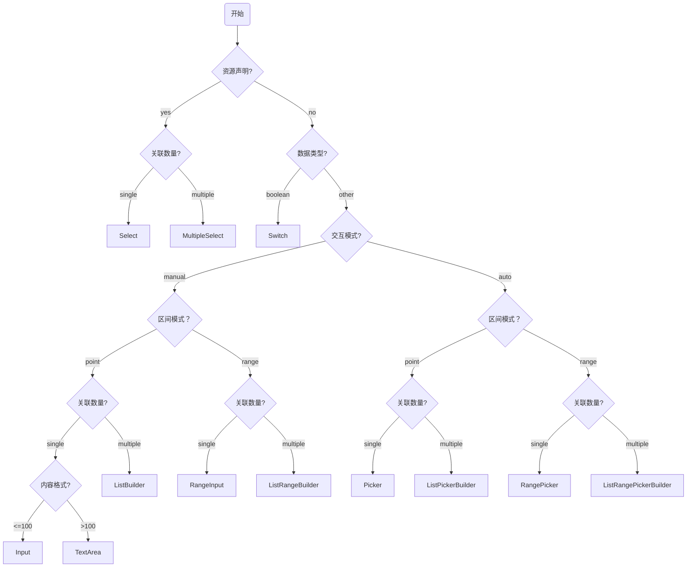

# 规则因子解释器

规范解释器的实现机制，明确 `DSL` 从抽象到具体的转换机制

## 前置依赖

- [规则及规则因子描述](./spec.md)

## 术语说明

- **FactorResource**：DSL 层描述性声明，定义资源的特征和来源（详见 [规则因子描述](./spec.md)）
- **Resource**：运行时层封装实体，包含 `Signal` 和交互方法

## Resource 设计

### Resource 设计目标

将原始 `FactorResource` 封装为 `Resource` 领域实体，屏蔽原始 `DSL` 定义与 **数据源获取** 等细节

### Resource 设计规范

- 选项采用 `Signal<FieldDataSource>` 响应式数据
- 交互方法采用 `onXXX` 事件绑定风格

### Resource 封装

```ts
import { type FieldDataSource } from './spec.md';

/**
 * 静态资源 - 预设选项，无需动态加载
 */
interface StaticResource<T extends FieldDataSource> {
  /**
   * 资源标识
   */
  readonly name: string;
  /**
   * 数据列表 Signal
   */
  readonly options: Signal<readonly T[]>;
  /**
   * 根据 value 本地筛选对应的 option
   */
  onFiltrate: (value: string | number) => void;
}

/**
 * 动态资源 - 不支持分页 + 不支持服务端过滤
 */
interface ElementaryDynamicResource<T extends FieldDataSource> {
  /**
   * 资源标识
   */
  readonly name: string;
  /**
   * 加载状态 Signal
   */
  readonly loading: Signal<boolean>;
  /**
   * 数据列表 Signal
   */
  readonly options: Signal<readonly T[]>;
  /**
   * 重新加载数据
   */
  onRefresh: () => void;
  /**
   * 根据 value 本地筛选对应的 option
   */
  onFiltrate: (value: string | number) => void;
}

/**
 * 动态资源 - 支持分页 + 不支持服务端过滤
 */
interface Pagination {
  page: number;
  pageSize: number;
  total: number;
}

interface PaginatedDynamicResource<T extends FieldDataSource> {
  /**
   * 资源标识
   */
  readonly name: string;
  /**
   * 加载状态 Signal
   */
  readonly loading: Signal<boolean>;
  /**
   * 数据列表 Signal
   */
  readonly options: Signal<readonly T[]>;
  /**
   * 分页状态 Signal
   */
  readonly pagination: Signal<Pagination>;
  /**
   * 翻页操作
   */
  onFlip: (page: number) => void;
  /**
   * 重新加载数据
   */
  onRefresh: () => void;
}

/**
 * 动态资源 - 不支持分页 + 支持服务端过滤
 */
interface FilterableDynamicResource<T extends FieldDataSource> {
  /**
   * 资源标识
   */
  readonly name: string;
  /**
   * 加载状态 Signal
   */
  readonly loading: Signal<boolean>;
  /**
   * 数据列表 Signal
   */
  readonly options: Signal<readonly T[]>;
  /**
   * 执行过滤搜索
   */
  onFilter: (keyword: string) => void;
  /**
   * 重新加载数据
   */
  onRefresh: () => void;
}

/**
 * 动态资源 - 支持分页 + 支持服务端过滤
 */
interface PaginatedFilterableDynamicResource<T extends FieldDataSource> {
  /**
   * 资源标识
   */
  readonly name: string;
  /**
   * 加载状态 Signal
   */
  readonly loading: Signal<boolean>;
  /**
   * 数据列表 Signal
   */
  readonly options: Signal<readonly T[]>;
  /**
   * 分页状态 Signal
   */
  readonly pagination: Signal<Pagination>;
  /**
   * 关键词 Signal
   */
  readonly keyword: Signal<string>;
  /**
   * 翻页操作
   */
  onFlip: (page: number) => void;
  /**
   * 执行过滤搜索
   */
  onFilter: (keyword: string) => void;
  /**
   * 重新加载数据
   */
  onRefresh: () => void;
}
```

## 推断规则因子 Operator

推断逻辑：根据 `dataType` + `semantic` 确定“数据域”，再结合 `mode`（点/区间）和 `quantity`（单/多）确定“操作域”，从而锁定可用的 `operator` 列表

### 数据类型推断 DataType

| dataType | mode  | quantity | 推断的 Operator 语义                                              |
| :------- | :---- | :------- | :---------------------------------------------------------------- |
| number   | point | single   | `=`, `≠`, `>`, `>=`, `<`, `<=`                                    |
| number   | point | multiple | `in`, `not in`                                                    |
| number   | range | single   | `between`, `not between`                                          |
| number   | range | multiple | `between any`, `betwen all`, `not between any`, `not between all` |
| string   | point | single   | `=`, `≠`, `contains`, `within`, `starts_with`, `ends_with`        |
| string   | point | multiple | `in`, `not in`                                                    |
| boolean  | point | single   | `is`                                                              |

### 场景类型推断 Semantic

以下 `Semantic` 本质上遵循 `dataType=number` 的 `operator` 推断逻辑：

- `rate`
- `date`
- `time`
- `datetime`
- `duration`
- `percentage`

## 推断表单组件 Intermediate Representation

从 `DSL` 推断中间形态的表单组件 + 表单组件属性，便于适配器（框架 + 组件库）进行高效的实现



组件说明：

- `Input`: 单行文本/数字输入
- `TextArea`: 长文本输入
- `RangeInput`: 区间输入
- `Select`: 单选
- `MultipleSelect`: 多选
- `Picker`: 数值或日期的选择
- `RangePicker`: 数值或日期的区间选择
- `ListBuilder`: 列表构建器
- `ListRangeBuilder`: 区间列表构建器

## 表单组件设计

### 表单组件设计目标

明确 **表单组件** 的属性，用于 `ThresholdRenderer` 渲染阈值输入组件，屏蔽原始 `DSL` 定义。

### 表单组件设计规范

- 避免框架的细节侵入，统一使用 `Properties` 作为后缀
- 避免组件的细节侵入，避免出现表单控件的交互属性，约定隐式继承

### 表单组件属性声明

抽象表单组件统一继承 `BaseProperties`，组件特定属性按需扩展，**特别说明：以下属性定义为最终传递给抽象组件的属性，而不是推断过程中的属性**

```ts
import { DataType, Semantic } from './spec.md';

/**
 * 抽象表单组件基础属性
 */
interface BaseProperties {
  /** 字段标识 */
  name: string;
  /** 字段标题 */
  title: string;
  /** 数据类型 */
  dataType: DataType;
  /** 语义化场景 */
  semantic?: Semantic;
  /** 数据约束 */
  constraints?: FieldConstraints;
}

/**
 * 约束定义
 */
interface FieldConstraints {
  /** 最小值 / 最小长度 */
  min?: number | string;
  /** 最大值 / 最大长度 */
  max?: number | string;
  /** 开区间最小值 */
  exclusiveMinimum?: number | string;
  /** 开区间最大值 */
  exclusiveMaximum?: number | string;
  /** 步长 */
  step?: number;
  /** 小数精度 */
  precision?: number;
  /** 字符串格式 */
  format?: string;
  /** 正则表达式 */
  pattern?: string;
  /** 多值最少数量 */
  minItems?: number;
  /** 多值最大数量 */
  maxItems?: number;
}
```

### InputProperties - 单行输入

适用于短文本输入场景（长度 ≤ 100）：

```ts
interface InputProperties extends BaseProperties {
  /** 组件类型标识 */
  readonly type: 'Input';
}
```

### TextAreaProperties - 多行文本输入

适用于长文本输入场景（长度 > 100）：

```ts
interface TextAreaProperties extends BaseProperties {
  /** 组件类型标识 */
  readonly type: 'TextArea';
}
```

### RangeInputProperties - 区间输入

适用于区间输入场景：

```ts
interface RangeInputProperties extends BaseProperties {
  /** 组件类型标识 */
  readonly type: 'RangeInput';
}
```

### SwitchProperties - 开关

适用于布尔类型场景：

```ts
interface SwitchProperties extends BaseProperties {
  /** 组件类型标识 */
  readonly type: 'Switch';
}
```

### SelectProperties - 单选

适用于受限单选场景（关联运行时 Resource）：

```ts
interface SelectProperties extends BaseProperties {
  /** 组件类型标识 */
  readonly type: 'Select';
  /** 数据资源（运行时 Resource 封装） */
  readonly resource: StaticResource<any> | ElementaryDynamicResource<any>;
}
```

### MultipleSelectProperties - 多选

适用于受限多选场景（关联运行时 Resource）：

```ts
interface MultipleSelectProperties extends BaseProperties {
  /** 组件类型标识 */
  readonly type: 'MultipleSelect';
  /** 数据资源（运行时 Resource 封装） */
  readonly resource: StaticResource<any> | ElementaryDynamicResource<any>;
}
```

### PickerProperties - 选择器

适用于自动选择场景（如日期选择、数值选择）：

```ts
interface PickerProperties extends BaseProperties {
  /** 组件类型标识 */
  readonly type: 'Picker';
}
```

### RangePickerProperties - 区间选择器

适用于区间选择场景（如日期范围选择）：

```ts
interface RangePickerProperties extends BaseProperties {
  /** 组件类型标识 */
  readonly type: 'RangePicker';
}
```

### ListBuilderProperties - 列表构建器

适用于多值单点输入场景，用于构建多个单点值：

```ts
import { DataType, Semantic } from './spec.md';

/** 列表项级别属性 */
interface ListBuilderItemProperties {
  /** 列表项组件类型 */
  readonly type: 'Input' | 'Picker';
  /** 列表项数据类型 */
  readonly dataType: DataType;
  /** 列表项语义化场景（可选） */
  readonly semantic?: Semantic;
  /** 列表项数据约束（可选） */
  readonly constraints?: FieldConstraints;
}

/** 列表级别属性 */
interface ListBuilderBaseProperties {
  /** 字段标识 */
  readonly name: string;
  /** 字段标题 */
  readonly title: string;
  /** 列表项数量约束 */
  readonly constraints?: {
    /** 最少数量 */
    minItems?: number;
    /** 最多数量 */
    maxItems?: number;
  };
}

interface ListBuilderProperties extends ListBuilderBaseProperties {
  /** 组件类型标识 */
  readonly type: 'ListBuilder';
  /** 列表项属性对象 */
  readonly item: ListBuilderItemProperties;
}
```

### ListRangeBuilderProperties - 区间列表构建器

适用于多值区间输入场景，用于构建多个区间值：

```ts
import { DataType, Semantic } from './spec.md';

/** 列表项级别属性 */
interface ListRangeBuilderItemProperties {
  /** 列表项组件类型 */
  readonly type: 'RangeInput' | 'RangePicker';
  /** 列表项数据类型 */
  readonly dataType: DataType;
  /** 列表项语义化场景（可选） */
  readonly semantic?: Semantic;
  /** 列表项数据约束（可选） */
  readonly constraints?: FieldConstraints;
}

/** 列表级别属性 */
interface ListRangeBuilderBaseProperties {
  /** 字段标识 */
  readonly name: string;
  /** 字段标题 */
  readonly title: string;
  /** 列表项数量约束 */
  readonly constraints?: {
    /** 最少数量 */
    minItems?: number;
    /** 最多数量 */
    maxItems?: number;
  };
}

interface ListRangeBuilderProperties extends ListRangeBuilderBaseProperties {
  /** 组件类型标识 */
  readonly type: 'ListRangeBuilder';
  /** 列表项属性对象 */
  readonly item: ListRangeBuilderItemProperties;
}
```

### 表单组件属性类型别名

```ts
type ThresholdComponentProperties =
  | InputProperties
  | TextAreaProperties
  | RangeInputProperties
  | SwitchProperties
  | SelectProperties
  | MultipleSelectProperties
  | PickerProperties
  | RangePickerProperties
  | ListBuilderProperties
  | ListRangeBuilderProperties;
```

### 表单组件属性解构来源

| 属性类别      | 来源说明                                             |
| :------------ | :--------------------------------------------------- |
| `dataType`    | DSL 直接继承                                         |
| `semantic`    | DSL 直接继承                                         |
| `constraints` | DSL `constraints` 解构，按组件类型选取适用的约束字段 |
| `resource`    | DSL `resource` 字段解释，Select 类组件专属           |
| `itemType`    | 根据推断规则确定，用于列表构建器组件                 |
