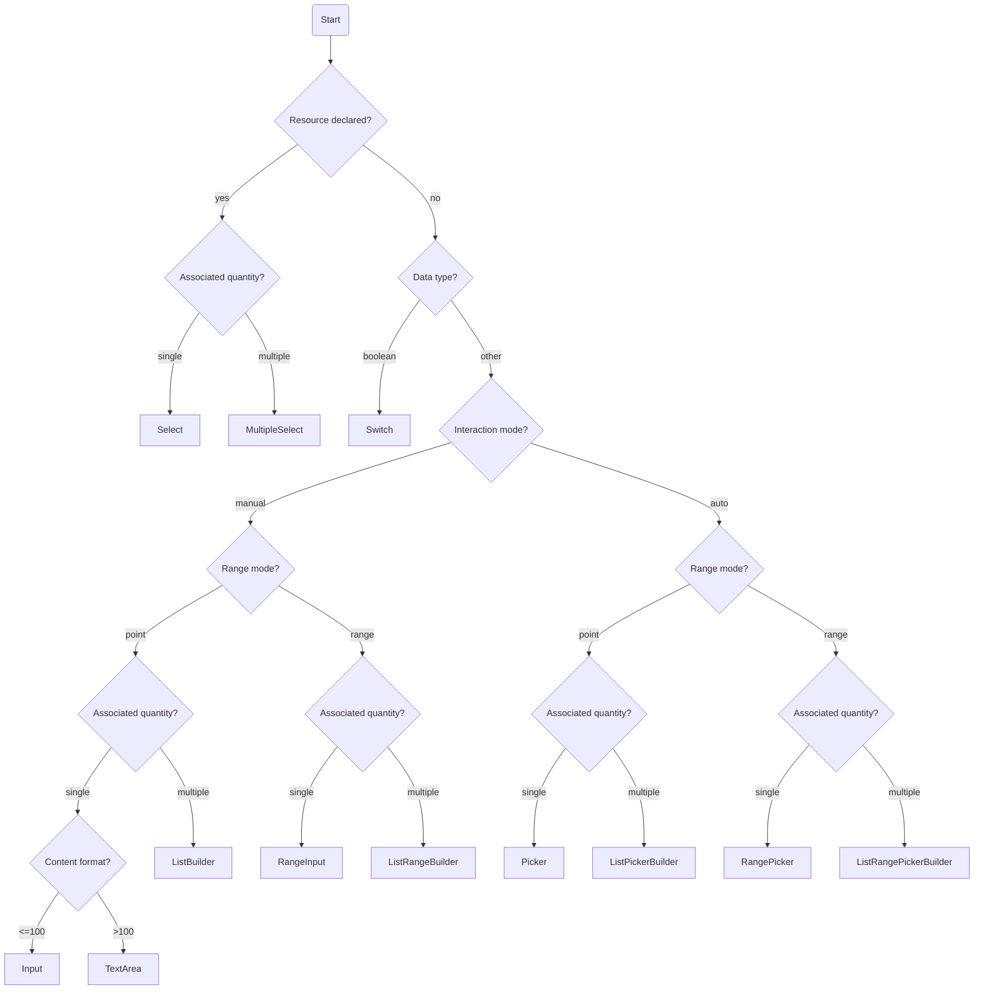

# Rule Factor Interpreter

Defines the implementation mechanism of the interpreter and clarifies how the DSL is transformed from abstract form into concrete runtime entities.

## Prerequisites

- [Rule factor specification](./spec.md)

## Terminology

- **FactorResource**: a DSL-level declarative definition that describes the features and source of a resource. See [Rule factor specification](./spec.md).
- **Resource**: a runtime encapsulated entity that contains `Signal` state and interaction methods.

## Resource Design

### Resource Design Goal

Encapsulate the original `FactorResource` into a `Resource` domain entity and hide the original DSL definition and data-fetching details.

### Resource Design Rules

- Options use reactive `Signal<FieldDataSource>` data.
- Interaction methods use `onXXX` event-binding style.

### Resource Encapsulation

```ts
import { type FieldDataSource } from './spec.md';

/**
 * Static resource - preset options, no dynamic loading required
 */
interface StaticResource<T extends FieldDataSource> {
  /**
   * Resource identifier
   */
  readonly name: string;
  /**
   * Signal holding the option list
   */
  readonly options: Signal<readonly T[]>;
  /**
   * Filter the matching option locally by value
   */
  onFiltrate: (value: string | number) => void;
}

/**
 * Dynamic resource - no pagination, no server-side filtering
 */
interface ElementaryDynamicResource<T extends FieldDataSource> {
  /**
   * Resource identifier
   */
  readonly name: string;
  /**
   * Loading state signal
   */
  readonly loading: Signal<boolean>;
  /**
   * Signal holding the option list
   */
  readonly options: Signal<readonly T[]>;
  /**
   * Reload the data
   */
  onRefresh: () => void;
  /**
   * Filter the matching option locally by value
   */
  onFiltrate: (value: string | number) => void;
}

/**
 * Dynamic resource - supports pagination, no server-side filtering
 */
interface Pagination {
  page: number;
  pageSize: number;
  total: number;
}

interface PaginatedDynamicResource<T extends FieldDataSource> {
  /**
   * Resource identifier
   */
  readonly name: string;
  /**
   * Loading state signal
   */
  readonly loading: Signal<boolean>;
  /**
   * Signal holding the option list
   */
  readonly options: Signal<readonly T[]>;
  /**
   * Pagination state signal
   */
  readonly pagination: Signal<Pagination>;
  /**
   * Pagination action
   */
  onFlip: (page: number) => void;
  /**
   * Reload the data
   */
  onRefresh: () => void;
}

/**
 * Dynamic resource - no pagination, supports server-side filtering
 */
interface FilterableDynamicResource<T extends FieldDataSource> {
  /**
   * Resource identifier
   */
  readonly name: string;
  /**
   * Loading state signal
   */
  readonly loading: Signal<boolean>;
  /**
   * Signal holding the option list
   */
  readonly options: Signal<readonly T[]>;
  /**
   * Execute filtering search
   */
  onFilter: (keyword: string) => void;
  /**
   * Reload the data
   */
  onRefresh: () => void;
}

/**
 * Dynamic resource - supports pagination and server-side filtering
 */
interface PaginatedFilterableDynamicResource<T extends FieldDataSource> {
  /**
   * Resource identifier
   */
  readonly name: string;
  /**
   * Loading state signal
   */
  readonly loading: Signal<boolean>;
  /**
   * Signal holding the option list
   */
  readonly options: Signal<readonly T[]>;
  /**
   * Pagination state signal
   */
  readonly pagination: Signal<Pagination>;
  /**
   * Keyword signal
   */
  readonly keyword: Signal<string>;
  /**
   * Pagination action
   */
  onFlip: (page: number) => void;
  /**
   * Execute filtering search
   */
  onFilter: (keyword: string) => void;
  /**
   * Reload the data
   */
  onRefresh: () => void;
}
```

## Inferring Rule Factor Operators

The inference logic uses only `dataType` to determine the "data domain", then combines `mode` (point / range) and `quantity` (single / multiple) to determine the "operation domain", thereby narrowing the available `operator` list. `semantic` is a refinement of `dataType` and **does not participate in operator inference at the current stage**.

### Data Type Inference DataType

| dataType | mode  | quantity | Inferred operator semantics                                       |
| :------- | :---- | :------- | :---------------------------------------------------------------- |
| number   | point | single   | `=`, `≠`, `>`, `>=`, `<`, `<=`                                    |
| number   | point | multiple | `in`, `not in`                                                    |
| number   | range | single   | `between`, `not between`                                          |
| number   | range | multiple | `between any`, `betwen all`, `not between any`, `not between all` |
| string   | point | single   | `=`, `≠`, `contains`, `within`, `starts_with`, `ends_with`        |
| string   | point | multiple | `in`, `not in`                                                    |
| boolean  | point | single   | `is`                                                              |

## Inferring Form Components Intermediate Representation

Infer the intermediate form component and form component properties from the DSL to help adapters (framework + component library) implement efficiently.



Component descriptions:

- `Input`: single-line text or numeric input
- `TextArea`: long-text input
- `RangeInput`: range input
- `Select`: single select
- `MultipleSelect`: multi select
- `Picker`: numeric or date picker
- `RangePicker`: numeric or date range picker
- `ListBuilder`: list builder
- `ListRangeBuilder`: range list builder

## Form Component Design

### Form Component Design Goal

Define the properties of the **form components** used by `ThresholdRenderer` to render threshold input controls, while hiding the original DSL definition.

### Form Component Design Rules

- Avoid framework-specific details by using `Properties` as the suffix consistently.
- Avoid component implementation details. Do not expose interaction properties of form controls unnecessarily; use implicit inheritance where appropriate.

### Form Component Property Definitions

Abstract form components all inherit `BaseProperties`. Component-specific properties are extended as needed. **Important: the property definitions below describe the final properties passed to the abstract component, not the properties used during inference.**

```ts
import { DataType, Semantic } from './spec.md';

/**
 * Base properties for abstract form components
 */
interface BaseProperties {
  /** Field identifier */
  name: string;
  /** Field title */
  title: string;
  /** Data type */
  dataType: DataType;
  /** Semantic scenario */
  semantic?: Semantic;
  /** Data constraints */
  constraints?: FieldConstraints;
}

/**
 * Constraint definition
 */
interface FieldConstraints {
  /** Minimum value / minimum length */
  min?: number | string;
  /** Maximum value / maximum length */
  max?: number | string;
  /** Exclusive lower bound */
  exclusiveMinimum?: number | string;
  /** Exclusive upper bound */
  exclusiveMaximum?: number | string;
  /** Step size */
  step?: number;
  /** Decimal precision */
  precision?: number;
  /** String format */
  format?: string;
  /** Regular expression */
  pattern?: string;
  /** Minimum count for multi-value scenarios */
  minItems?: number;
  /** Maximum count for multi-value scenarios */
  maxItems?: number;
}
```

### InputProperties - Single-line Input

Suitable for short text input scenarios (length <= 100):

```ts
interface InputProperties extends BaseProperties {
  /** Component type identifier */
  readonly type: 'Input';
}
```

### TextAreaProperties - Multi-line Text Input

Suitable for long text input scenarios (length > 100):

```ts
interface TextAreaProperties extends BaseProperties {
  /** Component type identifier */
  readonly type: 'TextArea';
}
```

### RangeInputProperties - Range Input

Suitable for range input scenarios:

```ts
interface RangeInputProperties extends BaseProperties {
  /** Component type identifier */
  readonly type: 'RangeInput';
}
```

### SwitchProperties - Toggle Switch

Suitable for boolean scenarios:

```ts
interface SwitchProperties extends BaseProperties {
  /** Component type identifier */
  readonly type: 'Switch';
}
```

### SelectProperties - Single Select

Suitable for constrained single-select scenarios (associated with a runtime `Resource`):

```ts
interface SelectProperties extends BaseProperties {
  /** Component type identifier */
  readonly type: 'Select';
  /** Data resource (runtime Resource wrapper) */
  readonly resource: StaticResource<any> | ElementaryDynamicResource<any>;
}
```

### MultipleSelectProperties - Multi Select

Suitable for constrained multi-select scenarios (associated with a runtime `Resource`):

```ts
interface MultipleSelectProperties extends BaseProperties {
  /** Component type identifier */
  readonly type: 'MultipleSelect';
  /** Data resource (runtime Resource wrapper) */
  readonly resource: StaticResource<any> | ElementaryDynamicResource<any>;
}
```

### PickerProperties - Picker

Suitable for automatic selection scenarios such as date picking or numeric selection:

```ts
interface PickerProperties extends BaseProperties {
  /** Component type identifier */
  readonly type: 'Picker';
}
```

### RangePickerProperties - Range Picker

Suitable for range selection scenarios such as date ranges:

```ts
interface RangePickerProperties extends BaseProperties {
  /** Component type identifier */
  readonly type: 'RangePicker';
}
```

### ListBuilderProperties - List Builder

Suitable for multi-value point-input scenarios, used to build multiple point values:

```ts
import { DataType, Semantic } from './spec.md';

/** Item-level properties */
interface ListBuilderItemProperties {
  /** Item component type */
  readonly type: 'Input' | 'Picker';
  /** Item data type */
  readonly dataType: DataType;
  /** Item semantic scenario (optional) */
  readonly semantic?: Semantic;
  /** Item constraints (optional) */
  readonly constraints?: FieldConstraints;
}

/** List-level properties */
interface ListBuilderBaseProperties {
  /** Field identifier */
  readonly name: string;
  /** Field title */
  readonly title: string;
  /** Constraints on list item count */
  readonly constraints?: {
    /** Minimum count */
    minItems?: number;
    /** Maximum count */
    maxItems?: number;
  };
}

interface ListBuilderProperties extends ListBuilderBaseProperties {
  /** Component type identifier */
  readonly type: 'ListBuilder';
  /** Item property object */
  readonly item: ListBuilderItemProperties;
}
```

### ListRangeBuilderProperties - Range List Builder

Suitable for multi-value range-input scenarios, used to build multiple range values:

```ts
import { DataType, Semantic } from './spec.md';

/** Item-level properties */
interface ListRangeBuilderItemProperties {
  /** Item component type */
  readonly type: 'RangeInput' | 'RangePicker';
  /** Item data type */
  readonly dataType: DataType;
  /** Item semantic scenario (optional) */
  readonly semantic?: Semantic;
  /** Item constraints (optional) */
  readonly constraints?: FieldConstraints;
}

/** List-level properties */
interface ListRangeBuilderBaseProperties {
  /** Field identifier */
  readonly name: string;
  /** Field title */
  readonly title: string;
  /** Constraints on list item count */
  readonly constraints?: {
    /** Minimum count */
    minItems?: number;
    /** Maximum count */
    maxItems?: number;
  };
}

interface ListRangeBuilderProperties extends ListRangeBuilderBaseProperties {
  /** Component type identifier */
  readonly type: 'ListRangeBuilder';
  /** Item property object */
  readonly item: ListRangeBuilderItemProperties;
}
```

### Form Component Property Type Alias

```ts
type ThresholdComponentProperties =
  | InputProperties
  | TextAreaProperties
  | RangeInputProperties
  | SwitchProperties
  | SelectProperties
  | MultipleSelectProperties
  | PickerProperties
  | RangePickerProperties
  | ListBuilderProperties
  | ListRangeBuilderProperties;
```

### Source of Form Component Properties

| Property category | Source description                                                   |
| :---------------- | :------------------------------------------------------------------- |
| `dataType`        | Directly inherited from the DSL                                      |
| `semantic`        | Directly inherited from the DSL                                      |
| `constraints`     | Derived from DSL `constraints`, with component-specific selection    |
| `resource`        | Interpreted from DSL `resource`; exclusive to Select-like components |
| `itemType`        | Determined by inference rules for list builder components            |
